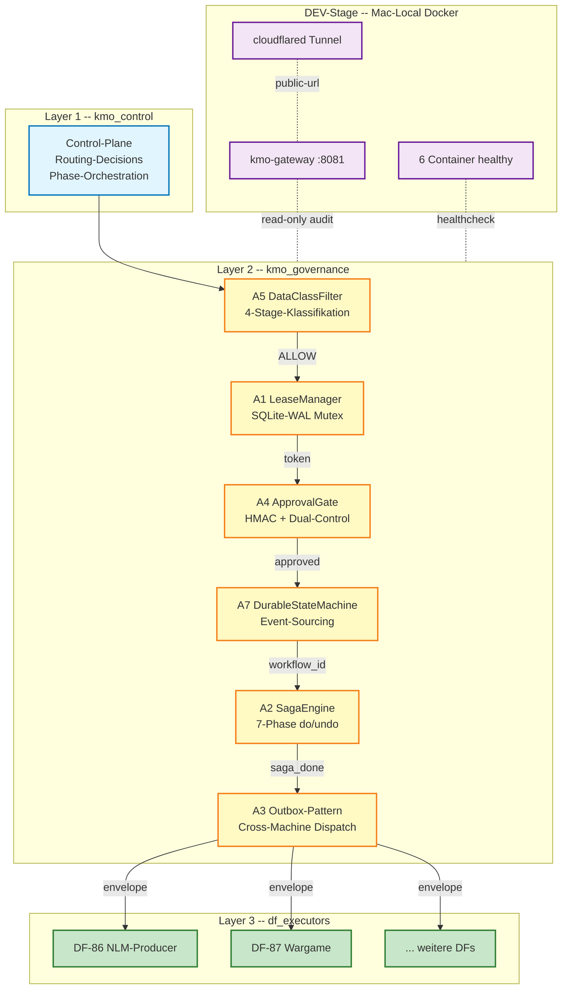

# KMO Architecture [CRUX-MK]

KMO = **Kemmer-Master-Orchestrator**. 3-Layer-System fuer governance-konformes Routing
zwischen Dark-Factories, LLM-Providern und K_0/Q_0-relevanten Resourcen.

Querverweise:
- [02-PIPELINE-FLOWS.md](02-PIPELINE-FLOWS.md) -- End-to-End-Sequenzen
- [03-API-REFERENCE.md](03-API-REFERENCE.md) -- Module-API

---

## 1. Drei-Schichten-Hierarchie

KMO trennt **Steuerung** (was geschieht), **Governance** (darf das geschehen) und
**Ausfuehrung** (Engine die es macht). DEV-Stage ist die isolierte Spielwiese.



**Layer-Boundary-Regel:** Layer N ruft NIE Layer N-1. Control orchestriert nur
nach unten, Governance haelt Invarianten ohne Aufrufer-Kenntnis, Executors sind
Datenklienten.

---

## 2. Komponenten-Diagramm (Patches A1-A7)

```mermaid
graph LR
    subgraph A5_FILTER[A5 DataClassFilter]
        DCF_E[DataClass Enum<br/>PUBLIC/INT/CONF/SECRET]
        DCF_M[Provider-Compat-Matrix<br/>YAML]
        DCF_F[DataClassFilter<br/>classify + check]
    end

    subgraph A1_LEASE[A1 LeaseManager]
        A1_RT[ResourceType Enum<br/>DF/PORT/TOKEN/PATH/TUNNEL]
        A1_DB[(SQLite-WAL<br/>UNIQUE constraint)]
        A1_M[LeaseManager<br/>acquire/release/heartbeat]
        A1_D[with_lease Decorator<br/>auto-heartbeat-thread]
    end

    subgraph A4_APPROVAL[A4 ApprovalGate]
        A4_T[ApprovalToken<br/>HMAC-SHA256]
        A4_DT[DualApprovalToken<br/>3-way disjoint]
        A4_G[ApprovalGate<br/>request/verify/atomic]
        A4_AL[AuditLog<br/>SHA256 hash-chain]
    end

    subgraph A7_DURABLE[A7 DurableStateMachine]
        A7_E[Event Dataclass<br/>+ EventType Enum]
        A7_W[WorkflowRun<br/>materialized view]
        A7_S[DurableStateMachine<br/>append+replay+snapshot]
        A7_LOG[(events.jsonl<br/>+snapshots/)]
    end

    subgraph A2_SAGA[A2 SagaEngine]
        A2_P[SagaPhase<br/>do/undo/exit_criteria]
        A2_R[SagaRun<br/>7 phases]
        A2_E[SagaEngine<br/>execute/resume/compensate]
        A2_REG[phase_registry<br/>KMO-7-Phasen]
    end

    subgraph A3_OUTBOX[A3 Outbox-Pattern]
        A3_E[EventEnvelope<br/>UUID4-event_id]
        A3_P[OutboxProducer<br/>publish + republish]
        A3_C[OutboxConsumer<br/>subscribe + idempotent]
        A3_DLQ[DLQ after 3 retries]
    end

    A5_FILTER -.audit.- A4_APPROVAL
    A1_LEASE -.STOP.flag.- A4_APPROVAL
    A4_APPROVAL -.workflow-id.- A7_DURABLE
    A7_DURABLE -.event-log.- A2_SAGA
    A2_SAGA -.publish-result.- A3_OUTBOX

    classDef patchA fill:#ffebee,stroke:#c62828
    classDef patchB fill:#e3f2fd,stroke:#1565c0
    classDef patchC fill:#fff8e1,stroke:#ef6c00
    class A5_FILTER patchA
    class A1_LEASE,A4_APPROVAL patchB
    class A7_DURABLE,A2_SAGA,A3_OUTBOX patchC
```

---

## 3. Datenfluss-Uebersicht (welche Module rufen welche)

| Aufrufer | Aufgerufen | Methode | Zweck |
|---|---|---|---|
| Control-Plane | `DataClassFilter` | `pre_routing_check()` | Eingangs-Klassifikation |
| Control-Plane | `LeaseManager` | `acquire()` / `release()` | Resource-Lock |
| Control-Plane | `ApprovalGate` | `request_dual_approval()` / `pre_deploy_atomic()` | Production-Gate |
| `ApprovalGate` (atomic) | `AuditLog` | `append_within_transaction()` | Hash-Chain im TX |
| Control-Plane | `DurableStateMachine` | `start_workflow()` / `transition_phase()` | Workflow-Lifecycle |
| Control-Plane | `SagaEngine` | `register_kmo_phases()` / `execute()` | 7-Phasen-Pipeline |
| `SagaEngine` (intern) | `_atomic_write_state()` | `os.replace()` | Crash-Save State |
| Control-Plane | `OutboxProducer` | `publish()` | Cross-Machine Dispatch |
| `OutboxConsumer` (DF-side) | `subscribe()` + `poll_and_process()` | (Handler-Funktion) | Event-Verarbeitung |

**Nicht-Aufrufe (Layer-Disziplin):**
- `DataClassFilter` ruft NIE `LeaseManager` (Filter ist zustandslos pro Call).
- `SagaEngine` ruft NIE `OutboxProducer` direkt (Outbox ist Result-Sink, nicht Phase).
- `AuditLog` ruft NIE `ApprovalGate` (Audit ist append-only, kein Backlink).

---

## 4. Repo-Struktur (Tree mit Erklaerung)

```
kmo/
├── docs/                              # Diese Doku (3 Files)
│   ├── 01-ARCHITECTURE.md              # diese Datei
│   ├── 02-PIPELINE-FLOWS.md            # End-to-End-Sequenzen
│   └── 03-API-REFERENCE.md             # Module-API-Reference
│
├── kmo_control/                       # Layer 1: Control-Plane (heute Stub, A1-Erweiterung)
│   └── __init__.py                     # Reserved fuer Routing-Logik
│
├── kmo_governance/                    # Layer 2: Governance (6 Module)
│   ├── data-class-filter/              # A5: PUBLIC/INTERNAL/CONFIDENTIAL/SECRET
│   │   ├── kmo_data_class_filter.py    # 267 LoC
│   │   ├── provider_compat.yaml        # 9 Provider, max_data_class
│   │   ├── Dockerfile                  # DEV-Stage-Container
│   │   ├── README.md
│   │   └── tests/                      # 14 Tests
│   │
│   ├── lease-manager/                  # A1: SQLite-WAL Mutex
│   │   ├── kmo_lease_manager.py        # 352 LoC
│   │   ├── kmo_lease_decorator.py      # 136 LoC, with_lease()
│   │   ├── schema.sql                  # leases-Tabelle + Indices
│   │   ├── Dockerfile
│   │   ├── README.md
│   │   └── tests/                      # Acquire/Release/Stale/STOP-flag
│   │
│   ├── approval-gate/                  # A4: HMAC-Tokens + Dual-Control
│   │   ├── kmo_approval_gate.py        # 537 LoC
│   │   ├── kmo_audit_log.py            # 260 LoC, SHA256-chain
│   │   ├── Dockerfile
│   │   ├── README.md
│   │   └── tests/                      # Single + Dual + Atomic-Pipeline
│   │
│   ├── durable-execution/              # A7: Event-Sourcing State-Machine
│   │   ├── kmo_durable_state_machine.py  # 437 LoC
│   │   ├── event_types.py              # 209 LoC, 7 EventTypes
│   │   ├── README.md
│   │   └── tests/                      # 15 Tests, crash-recovery
│   │
│   ├── saga-pattern/                   # A2: 7-Phase do/undo Engine
│   │   ├── kmo_saga_engine.py          # 350 LoC
│   │   ├── phase_registry.py           # 102 LoC, KMO-7-Phasen
│   │   ├── Dockerfile
│   │   ├── README.md
│   │   └── tests/                      # 9 Tests, compensate-chain
│   │
│   └── outbox-pattern/                 # A3: Cross-Machine Dispatch
│       ├── kmo_outbox_producer.py      # 185 LoC
│       ├── kmo_outbox_consumer.py      # 276 LoC
│       ├── Dockerfile
│       ├── README.md
│       └── tests/                      # 6 Tests, idempotency + DLQ
│
├── df_executors/                      # Layer 3: DF-Adapter (heute Stub)
│   └── __init__.py                     # Spaeter: DF-86 / DF-87 Adapter
│
├── dev-stage/                         # DEV-Stage Mac-Local Docker
│   ├── docker-compose.kmo-dev.yml      # 6 Container + cloudflared
│   ├── Dockerfile.gateway              # FastAPI-Gateway
│   ├── kmo_gateway_stub.py             # /health + /audit endpoints
│   ├── requirements.txt
│   ├── setup-cloudflared.sh            # Tunnel-Init
│   └── README.md
│
└── tests/                             # Cross-Module E2E
    └── test_pre3_e2e_full_pipeline.py  # 5 Tests, alle 6 Patches
```

**Total LoC (Patches A1-A7):** ~3.111 Zeilen Python (ohne Tests + Docker).

---

## 5. Tech-Stack

| Schicht | Technologie | Version | Begruendung |
|---|---|---|---|
| Sprache | Python | 3.14 | strict typing, dataclasses, IntEnum |
| Persistenz | SQLite | >= 3.7 mit WAL | atomic UNIQUE-Constraint, lokaler Mutex |
| Cross-Machine | JSONL + Drive-Sync | -- | Append-only, fsync, idempotent |
| Atomic-Write | tempfile + os.replace + os.fsync | stdlib | partial-write-safe |
| Hash | SHA256 (HMAC + chain) | stdlib | tamper-evident audit |
| Test | pytest | >= 7.0 | parametrize + fixtures |
| Container | Docker Compose | 3.9 | 6 Services + cloudflared |
| Tunnel | Cloudflare Tunnel | latest | DEV-Public-URL |
| Crypto | hmac + hashlib + secrets | stdlib | constant-time + nonce |
| Concurrency | threading.RLock + mkdir-Mutex | stdlib | proc-local + cross-process |
| Config | YAML (PyYAML) | >= 6.0 | provider_compat + identities |

**Bewusste Vermeidungen:**
- KEIN Temporal.io (Conservative-Pick A7: self-built JSON-State-Machine).
- KEIN Redis/Kafka (Outbox via Drive-Sync ausreichend bei Lambda).
- KEIN Kubernetes (DEV-Stage = Mac-Local Docker, nicht prod).
- KEIN Postgres (SQLite-WAL fuer Lease + Approval reicht bei Single-Owner).

---

## 6. SAE-Isomorphie (Querverweise zur SAE v8 Architektur)

Die KMO-Patches sind nicht ad-hoc, sondern Realisierungen bekannter SAE-Patterns:

| KMO-Patch | SAE-Aequivalent | Isomorphie |
|---|---|---|
| **A5 DataClassFilter** | COSMOS Compliance-Layer | 4-Stage-Klassifikation = q-Tier-Trennung; SECRET-Fail-Closed = Bounded-Veto |
| **A1 LeaseManager** | Trinity-Slot-Lock | Atomic UNIQUE-Constraint = Optimistic-Lock pro Slot; Heartbeat = `state.py` Atomic-Heartbeat |
| **A4 ApprovalGate** | MHC + Bounded-Veto | Dual-Control = 3-way disjoint identities; Audit-Chain = AuditEntry frozen dataclass |
| **A7 DurableStateMachine** | MYZ-32 Event-State-Tracker | Event-Sourcing = Myzel-Layer-Bus; Snapshot = Trinity-Promotion-Boundary |
| **A2 SagaEngine** | 7-Phasen Pentagon erweitert | do/undo = forward+compensation; reverse-chain = Bounded-Veto-Rollback |
| **A3 Outbox** | Myzel-Layer-Event-Bus | Append-only mit UUID4-Idempotenz; Cross-Machine = Branch-Hub-Pattern |

**Trinity-Pattern auf Action-Ebene:**
- Conservative = Lease + Approval verweigern (warten)
- Aggressive = Saga starten (forward)
- Contrarian = Compensate ausloesen (rollback)

Best-of-3-Logik: SagaEngine waehlt automatisch nach Exit-Criteria.

**CRUX-Bindung pro Patch:** siehe README.md je Modul; alle K_0/Q_0/I_min/W_0 markiert.

---

## 7. Pre-Production-Bedingungen (Status PRE-1 bis PRE-5)

| Pre | Bedingung | Status | Beleg |
|---|---|---|---|
| PRE-1 | A5 SECRET-Fail-Closed | ERFUELLT | `provider_compat.yaml` kein Provider mit `max_data_class: SECRET` |
| PRE-2 | A4 Dual-Control + Atomic-Pipeline | ERFUELLT | `pre_deploy_atomic()` BEGIN IMMEDIATE / COMMIT / ROLLBACK |
| PRE-3 | E2E aller 6 Patches | ERFUELLT | `test_pre3_e2e_full_pipeline.py` 5/5 PASS |
| PRE-4 | A2 reverse-chain Compensation | ERFUELLT | `_compensate()` iteriert reverse, idempotent undo |
| PRE-5 | A7 Crash-Recovery | ERFUELLT | `recover()` Snapshot + Replay; T5-Test bestaetigt |

**Cross-LLM-Wargames:** 3 unabhaengige Wargames (Codex GPT-5.4 + Gemini 2.5 + Claude Opus)
konvergent ADOPT-PILOT-ONLY. Verdict: CROSS-LLM-2OF3-HARDENED fuer DEV-Stage,
PRE-PRODUCTION fuer prod (Approval-Gate-Token Pflicht).

---

## 8. Open-Questions (Offen, NICHT TBD)

**OQ-1 Retention-Policy fuer events.jsonl + audit-chain.jsonl:**
Aktuell append-only ohne Compaction. Bei Lambda 100/Tag waechst events.jsonl
~500KB/Monat pro Workflow. Open: Wann/Wie Compaction (Snapshot-only-keep)?

**OQ-2 Cross-Machine-Lease-Mismatch:**
LeaseManager ist Mac-lokal (SQLite-File). Wenn DF-86 auf Mac und Pendant auf
Windows simultan starten: kein Cross-Machine-Lock. Open: Drive-Sync-basierter
Mutex via Outbox-Lease-Topic?

**OQ-3 ApprovalGate Identity-Federation:**
`authorized_identities.yaml` ist Mac-lokal. Bei Multi-Device: zentrale Identity-Quelle?
Aktuell akzeptiert (Single-Family-System), aber bei Skalierung > 5 Identities offen.

[CRUX-MK]
