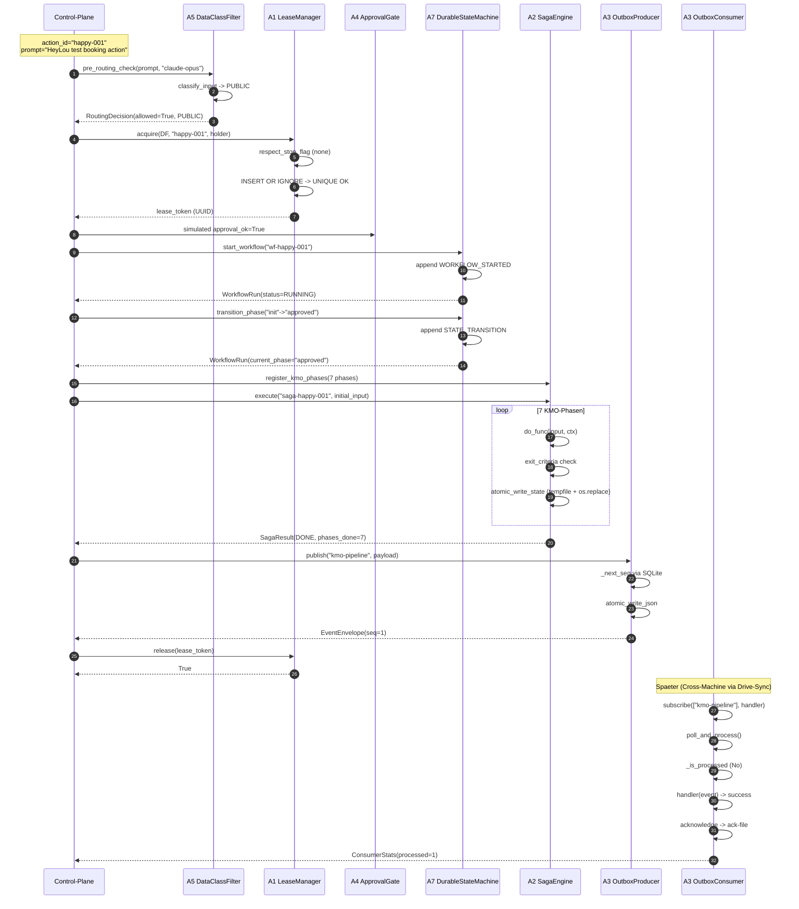
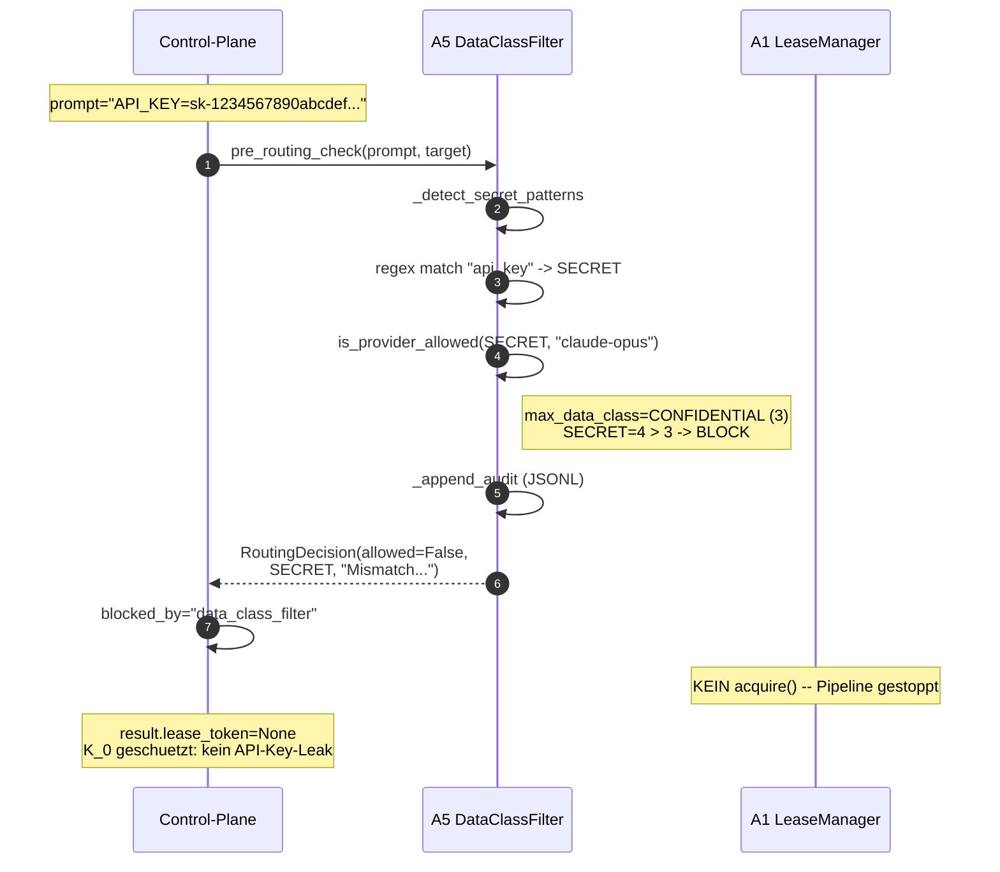
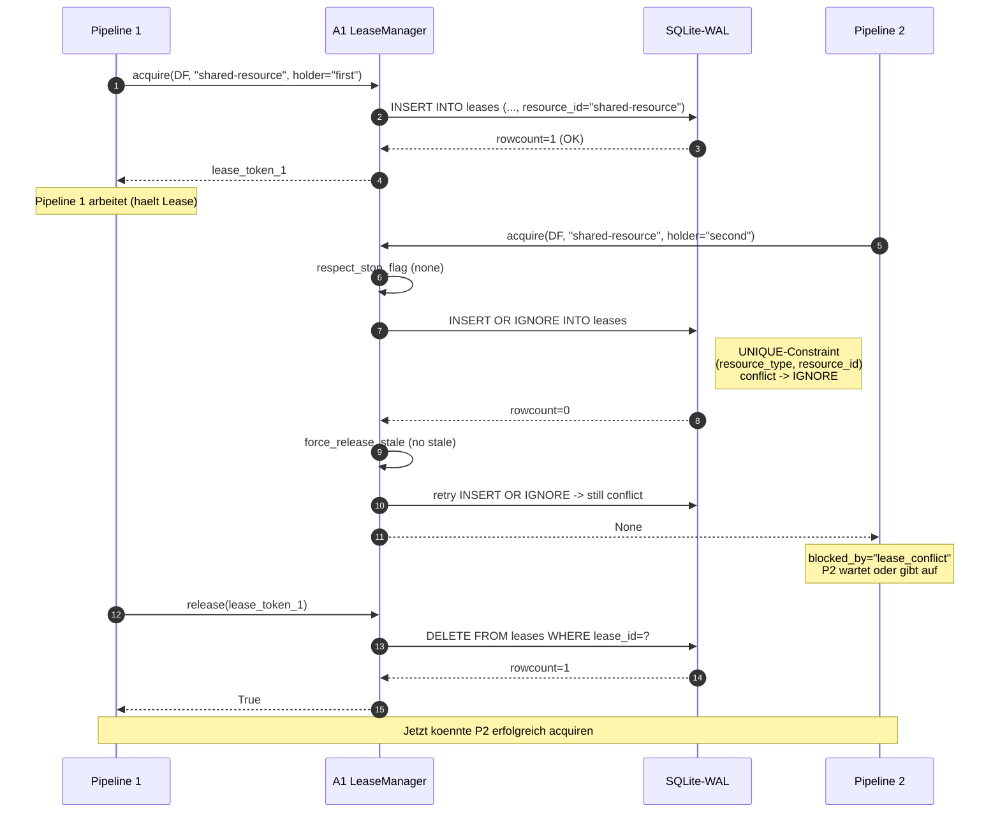
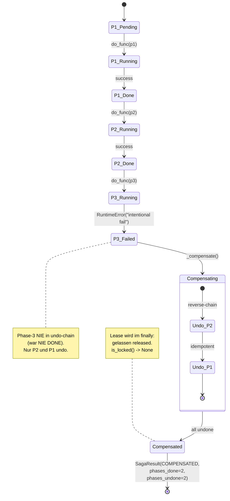
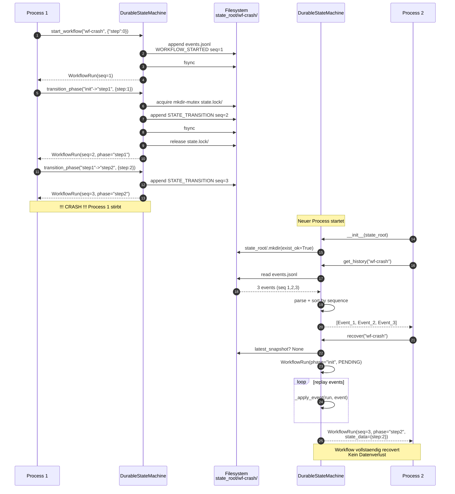
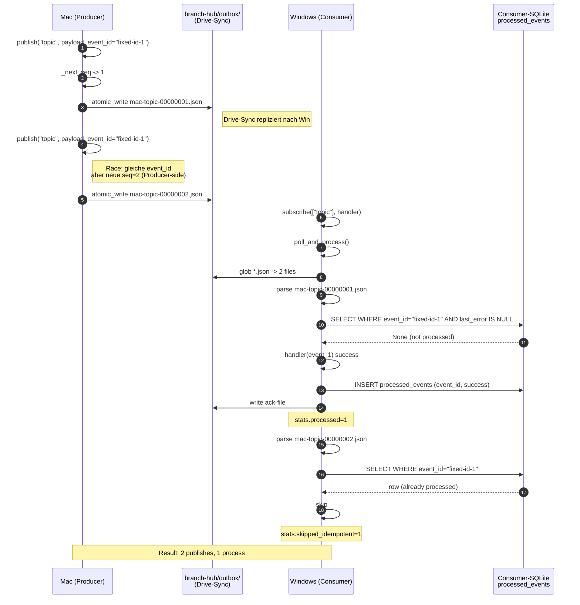
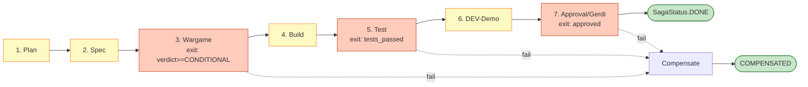

# KMO Pipeline Flows [CRUX-MK]

End-to-End-Sequenzen + Failure-Modes der 6-Patch-Pipeline. Jeder Flow ist 1:1
gegen einen pytest-Test in `tests/test_pre3_e2e_full_pipeline.py` validiert.

Querverweise:
- [01-ARCHITECTURE.md](01-ARCHITECTURE.md) -- Komponenten-Hierarchie
- [03-API-REFERENCE.md](03-API-REFERENCE.md) -- Module-API

---

## 1. Happy-Path E2E (T1)

**Test:** `test_pre3_t1_happy_path_all_6_patches`
**Erwartung:** Alle 7 Saga-Phasen DONE, Outbox-Consumer empfaengt 1 Event.



**Dauer typisch:** ~50ms (alle 6 Patches in tmp_path-Test). Production-Latenz mit
Drive-Sync-Delay: 2-30s je nach Outbox-Polling-Intervall.

---

## 2. Failure-Mode: SECRET-Block (T2)

**Test:** `test_pre3_t2_data_class_filter_blocks_secret`
**Erwartung:** Pipeline stoppt nach DataClassFilter, kein Lease, kein Saga.



**Audit-Trail:** Jeder Block wird in
`branch-hub/audit/kmo-routing-decisions.jsonl` appended mit
`{"decision":"BLOCK","data_class":"SECRET","detected_patterns":["api_key"]}`.

---

## 3. Failure-Mode: Lease-Conflict (T3)

**Test:** `test_pre3_t3_lease_conflict_blocks_second_pipeline`
**Erwartung:** Zweite Pipeline auf gleicher Resource bekommt `lease_token=None`.



**Stale-Lease-Recovery:** Wenn P1 crasht ohne release, expires_at < now wird vom
naechsten `acquire()` automatisch via `force_release_stale()` bereinigt. TTL-Default
300s.

---

## 4. Failure-Mode: Saga-Phase-Fail + Compensate (T4)

**Test:** `test_pre3_t4_saga_phase_fail_compensate_lease_released`
**Erwartung:** Phase-3 failt, Phase-2 + Phase-1 werden in Reverse-Order undo'd,
Lease wird in `finally` released.



**Reverse-Chain-Regel:** Nur Phasen mit `status == DONE` werden undo'd. RUNNING/FAILED
werden uebersprungen. Bei Undo-Exception: Status `UNDO_FAILED`, Saga endet
`PARTIAL_COMPENSATION` (Audit-Trail im State).

**Lease-Release-Garantie:** `finally` block in Pipeline-Code (siehe
`_run_full_pipeline`) ruft `release(token)` auch nach Saga-Fail. Test verifiziert
`assert pipeline["lease"].is_locked(...) is None`.

---

## 5. Failure-Mode: Crash-Recovery (T5)

**Test:** `test_pre3_t5_crash_recovery_durable_state_resume`
**Erwartung:** Neue StateMachine-Instanz auf gleichem `state_root` recovert
vollstaendige History.



**Snapshot-Strategie:** Default alle 10 Events. Snapshot-Pfad
`state_root/<wf-id>/snapshots/<seq:010d>.json`. Replay nur Events mit
`seq > snapshot.sequence`.

**Konkurrenz-Schutz:** `_acquire_fs_lock()` via `mkdir(exist_ok=False)`. Bei
`FileExistsError` Stale-Check via `mtime > 300s` -> claim. Sonst
`ConcurrentTransitionError`.

---

## 6. Outbox-Idempotency-Flow

**Test:** Implizit in T1 + T5; explizit `test_outbox.py::test_idempotency`.
**Erwartung:** Gleiches Event (gleiche `event_id`) wird zweimal publiziert,
aber nur einmal verarbeitet.



**Retry-Logik bei Handler-Fail:**
```
attempt 1: handler raises -> retry_count=1, last_error="..."
attempt 2: same event polled -> _is_processed=False (last_error NOT NULL)
attempt 3: retry_count=2
attempt 4: retry_count=3 -> move_to_dlq() -> dlq-file
```

DLQ-File enthaelt vollstaendigen Envelope + reason + retry_count fuer
manuelle Re-Inspection.

---

## 7. Cross-Reference: Test-Mapping

| Test | Validiert | Pipeline-Pfad |
|---|---|---|
| `test_pre3_t1_happy_path_all_6_patches` | Happy-Path E2E | [§1](#1-happy-path-e2e-t1) |
| `test_pre3_t2_data_class_filter_blocks_secret` | A5 SECRET-Block | [§2](#2-failure-mode-secret-block-t2) |
| `test_pre3_t3_lease_conflict_blocks_second_pipeline` | A1 UNIQUE-Conflict | [§3](#3-failure-mode-lease-conflict-t3) |
| `test_pre3_t4_saga_phase_fail_compensate_lease_released` | A2 Compensate + Lease-Release | [§4](#4-failure-mode-saga-phase-fail--compensate-t4) |
| `test_pre3_t5_crash_recovery_durable_state_resume` | A7 Replay nach Crash | [§5](#5-failure-mode-crash-recovery-t5) |
| Implicit T1+T5 | A3 Outbox-Idempotency | [§6](#6-outbox-idempotency-flow) |

**Reproduzierbarkeit:**
```bash
cd /Users/make/Projects/dark-factories/kmo
pytest tests/test_pre3_e2e_full_pipeline.py -v
# Erwartung: 5 passed
```

---

## 8. Saga-Phase-Reihenfolge (KMO-7-Phasen)

Aus `phase_registry.py`:



**Exit-Criteria-Gates** (3 Gates in 7 Phasen):
- **Wargame (P3):** `verdict in {CONDITIONAL, SIM-HARDENED, 2OF3-HARDENED, HARDENED}`
- **Test (P5):** `tests_passed == True`
- **Approval (P7):** `approved == True`

Bei Gate-Fail: Compensate-Chain via `_compensate()`, alle vorherigen DONE-Phasen
werden in Reverse-Order undo'd.

[CRUX-MK]
