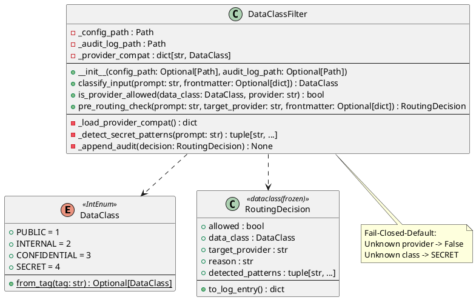
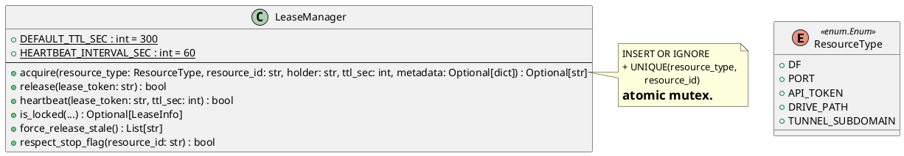
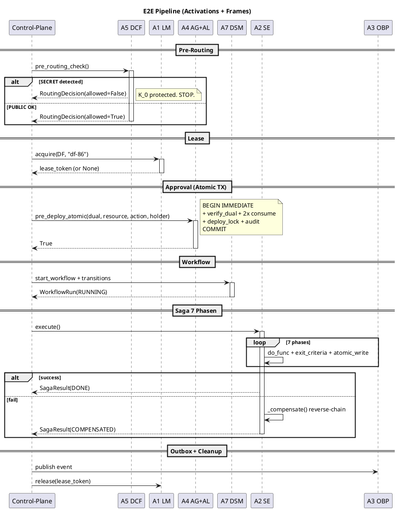
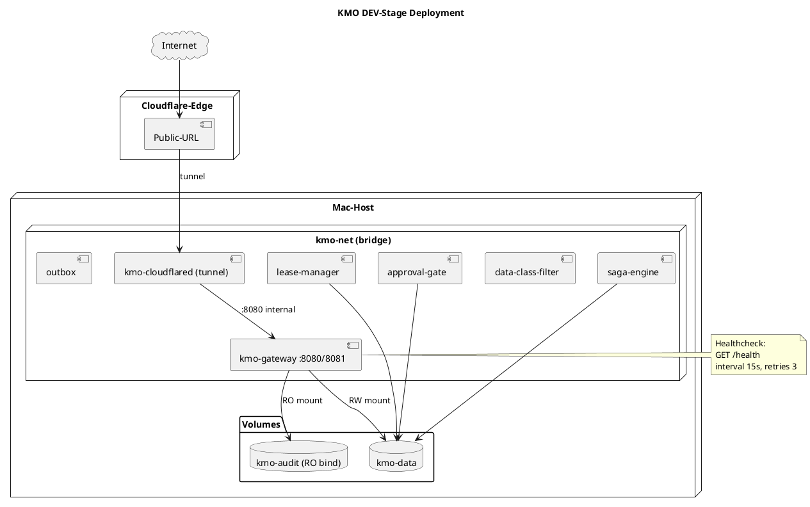
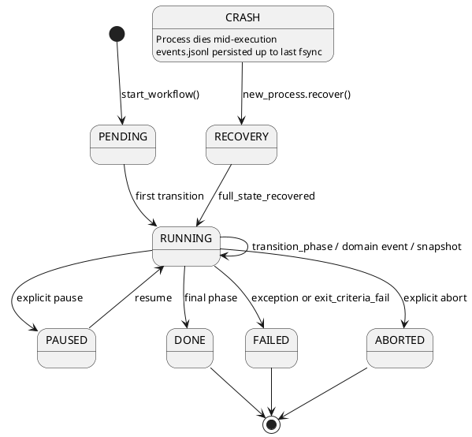
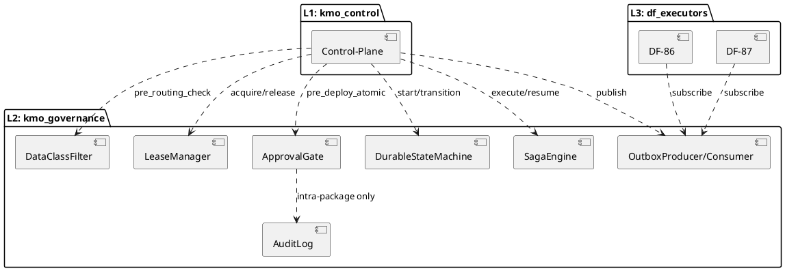
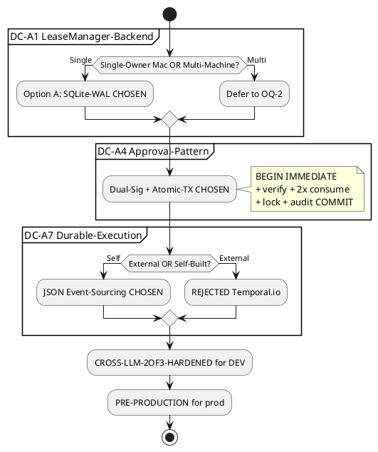
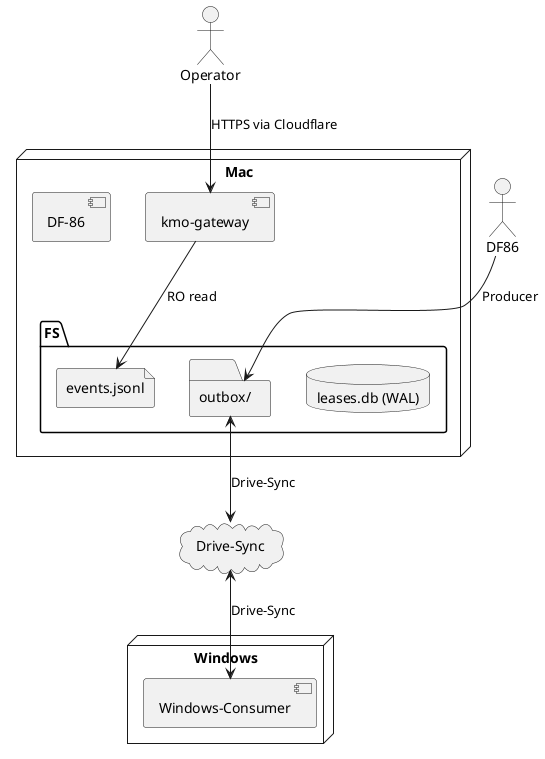
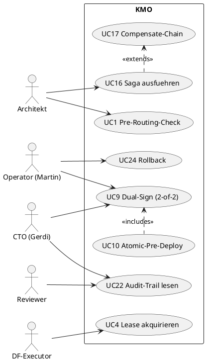
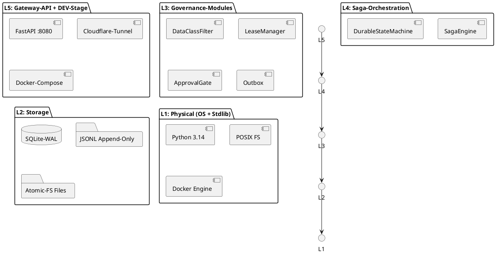

# KMO Technische Zeichnungen [CRUX-MK]

UML / PlantUML / ER / State-Machine / Activity / Use-Case / Layered-Architecture
fuer **Board + CTO Audit**. Tiefer als Mermaid: Klassen-Methoden mit Type-Hints,
Sequence-Diagramme mit Activations + Frames, State-Machines mit Trigger-Conditions,
ER mit Constraints + Indices.

Querverweise:
- [01-ARCHITECTURE.md](01-ARCHITECTURE.md) -- High-Level Layer-Hierarchie (Mermaid)
- [02-PIPELINE-FLOWS.md](02-PIPELINE-FLOWS.md) -- E2E-Flows (Mermaid)
- [03-API-REFERENCE.md](03-API-REFERENCE.md) -- API-Reference pro Modul
- [diagrams/](diagrams/) -- 16 PlantUML-Source-Files (rendering: `plantuml *.puml`)

**Render-Befehl** (lokal):
```bash
cd /Users/make/Projects/dark-factories/kmo/docs/diagrams
plantuml -tsvg *.puml      # SVG-Output je Diagramm
plantuml -tpng *.puml      # PNG-Output je Diagramm
```

---

## 1. UML Klassen-Diagramm: A5 DataClassFilter

**Quelle:** [diagrams/01-class-data-class-filter.puml](diagrams/01-class-data-class-filter.puml)
**Zweck:** Erkennen wie der **Pre-Routing-Hook** Daten klassifiziert. Fuer CTO-Review der **Fail-Closed-Default-Logik**.
**Kern-Erkenntnis:** `DataClassFilter` ist zustandslos pro Call. `RoutingDecision` ist immutable (frozen dataclass). 10 SECRET-Patterns (regex) als Fallback wenn Frontmatter-Tag fehlt.



---

## 2. UML Klassen-Diagramm: A1 LeaseManager + with_lease-Decorator

**Quelle:** [diagrams/02-class-lease-manager.puml](diagrams/02-class-lease-manager.puml)
**Zweck:** **Atomic-Mutex via SQLite-WAL** sichtbar machen. CTO-Review der `INSERT OR IGNORE`-Race-Freiheit.
**Kern-Erkenntnis:** `LeaseManager` ist Mac-lokal (Single-Owner-Annahme). `with_lease`-Decorator komponiert Auto-Heartbeat-Daemon. `LeaseAcquireFailed` als Default-Raise.



---

## 3. UML Klassen-Diagramm: A4 ApprovalGate + AuditLog (Hash-Chain)

**Quelle:** [diagrams/03-class-approval-gate.puml](diagrams/03-class-approval-gate.puml)
**Zweck:** **HMAC-Tokens + Dual-Control + tamper-evident Hash-Chain** in einer UML-Karte. Fuer Board-Review der **K_0-Schutz-Garantien** bei Production-Deployments.
**Kern-Erkenntnis:** `pre_deploy_atomic()` packt **Verify + 2x Token-Consume + Lock + Audit** in EINE `BEGIN IMMEDIATE`-Transaction -> partial-commit unmoeglich. `AuditEntry.block_hash = SHA256(prev_hash || entry)` = tamper-evident.

```plantuml
@startuml
class ApprovalGate {
    + request_dual_approval(resource, action, requester, primary, secondary) : DualApprovalToken
    + verify_dual_token(dual, resource, action) : bool
    + pre_deploy_atomic(dual, resource, action, holder) : bool
}

class DualApprovalToken <<frozen>> {
    + primary : ApprovalToken
    + secondary : ApprovalToken
    + requester : str
    --
    + assert_three_way_disjoint() : None
}

class AuditLog {
    + append_within_transaction(conn, action, resource, requester, nonce) : AuditEntry
    + verify_chain() : bool
}

note top of ApprovalGate::pre_deploy_atomic
    BEGIN IMMEDIATE
      + verify_dual + consume_primary
      + consume_secondary + acquire_lock
      + audit_append (TX)
    COMMIT (or ROLLBACK)
end note

ApprovalGate *-- DualApprovalToken
ApprovalGate ..> AuditLog
@enduml
```

---

## 4. UML Klassen-Diagramm: A7 DurableStateMachine

**Quelle:** [diagrams/04-class-durable-state-machine.puml](diagrams/04-class-durable-state-machine.puml)
**Zweck:** **Self-built Event-Sourcing** statt Temporal.io-Dependency. Fuer CTO-Review des Conservative-Picks.
**Kern-Erkenntnis:** 7 EventTypes (4 KMO-Domain + 3 System). `recover()` = Snapshot + Replay. Filesystem-Mutex via `mkdir(exist_ok=False)` mit Stale-TTL 300s.

```plantuml
@startuml
enum WorkflowStatus { PENDING RUNNING PAUSED DONE FAILED ABORTED }
enum EventType { ROUTING_DECISION DF_STATUS_CHANGE STOP_FLAG_TRANSITION APPROVAL_STATE WORKFLOW_STARTED STATE_TRANSITION SNAPSHOT_TAKEN }

class DurableStateMachine {
    + start_workflow(workflow_id: str, initial_state: dict, initial_phase: str) : WorkflowRun
    + transition(workflow_id: str, event_type: EventType, payload: dict, ...) : WorkflowRun
    + transition_phase(workflow_id, from_phase, to_phase, state_patch) : WorkflowRun
    + recover(workflow_id: str) : WorkflowRun
    + snapshot(workflow_id: str) : WorkflowRun
    + get_history(workflow_id: str) : list[Event]
}

note bottom of DurableStateMachine::recover
    1. Read latest snapshot
    2. Read events.jsonl
    3. Filter seq > snapshot.sequence
    4. Replay via _apply_event()
end note
@enduml
```

---

## 5. UML Klassen-Diagramm: A2 SagaEngine

**Quelle:** [diagrams/05-class-saga-engine.puml](diagrams/05-class-saga-engine.puml)
**Zweck:** **do/undo-Saga + Reverse-Chain Compensation** sichtbar. Fuer Board-Review wie K_0 bei Phase-Fail geschuetzt wird.
**Kern-Erkenntnis:** 8 PhaseStatus + 7 SagaStatus enums. `_compensate()` iteriert REVERSED, undo'd nur Phasen mit `status==DONE`. `PARTIAL_COMPENSATION` bei Undo-Exception (Audit-Trail im State).

```plantuml
@startuml
enum PhaseStatus { PENDING RUNNING DONE FAILED UNDOING UNDONE UNDO_FAILED SKIPPED }
enum SagaStatus { PENDING RUNNING DONE FAILED COMPENSATING COMPENSATED PARTIAL_COMPENSATION }

class SagaEngine {
    + register_phase(phase_id, name, do_func, undo_func, exit_criteria_func) : None
    + execute(saga_run_id: str, initial_input: Any) : SagaResult
    + resume(saga_run_id: str) : SagaResult
    --
    - _compensate(run: SagaRun) : SagaResult
    - _atomic_write_state(run: SagaRun) : None
}

note right of SagaEngine::_compensate
    Reverse-Chain-Regel:
    - Iteriere phases REVERSED
    - Nur Status==DONE undo'd
    - Idempotent undo expected
    - UNDO_FAILED -> PARTIAL_COMPENSATION
end note
@enduml
```

---

## 6. UML Klassen-Diagramm: A3 Outbox-Producer/Consumer

**Quelle:** [diagrams/06-class-outbox-pattern.puml](diagrams/06-class-outbox-pattern.puml)
**Zweck:** **Cross-Machine Event-Dispatch via Drive-Sync** mit UUID4-Idempotenz + DLQ. Fuer CTO-Review der **at-most-once-Garantie** trotz Drive-Sync-Race.
**Kern-Erkenntnis:** `event_id` (UUID4) ist Idempotenz-Key. Producer schreibt atomic via `tempfile + fsync + os.replace`. Consumer trackt via SQLite `processed_events`. `MAX_RETRIES=3` -> DLQ.

```plantuml
@startuml
class OutboxProducer {
    + publish(machine_id: str, topic: str, payload: dict, event_id: str | None) : EventEnvelope
    + republish_failed_acks() : list[EventEnvelope]
}

class OutboxConsumer {
    + {static} MAX_RETRIES : int = 3
    --
    + subscribe(topics: list[str], handler_func: Callable[[EventEnvelope], None]) : None
    + poll_and_process() : ConsumerStats
    + acknowledge(event_id: str) : Path
    + move_to_dlq(event_id: str, reason: str) : Path | None
}

note bottom of OutboxConsumer::poll_and_process
    Per file: Parse -> _is_processed?
    handler() call -> ack OR retry++
    retry >= 3 -> DLQ
end note
@enduml
```

---

## 7. Sequence-Diagram: E2E Pipeline mit Activations + Alt/Opt-Frames

**Quelle:** [diagrams/07-sequence-e2e-pipeline.puml](diagrams/07-sequence-e2e-pipeline.puml)
**Zweck:** **TIEFER als Mermaid** in 02-PIPELINE-FLOWS.md §1. Activations + alt/opt-Frames + Cross-Machine-Group fuer Board-Demo.
**Kern-Erkenntnis:** Alle 6 Patches in einer durchgaengigen Sequenz. SECRET-Block stoppt Pipeline VOR Lease. Lease-Conflict laesst Pipeline aussetzen. Compensate-Chain in `finally`. Outbox-Consumer ist asynchron via Drive-Sync.



**Open-Question OQ-1:** Aktivations-Lebensdauer waehrend Sub-Saga-Calls -- aktuell als
flache Activations modelliert; bei tieferer Composition (Saga ruft Saga) waere
nested Activations darstellbar.

---

## 8. Deployment-Diagram: Docker-Compose + Cloudflare-Tunnel

**Quelle:** [diagrams/08-deployment-docker.puml](diagrams/08-deployment-docker.puml)
**Zweck:** **Container-Topologie + Volumes + Healthchecks + Tunnel-Pfad** fuer Board-Demo. Reflektiert `docker-compose.kmo-dev.yml` 1:1.
**Kern-Erkenntnis:** 7 Container in `kmo-net` (bridge). Audit-Volume bind-mount **read-only** von Drive. Cloudflared `depends_on: kmo-gateway healthy`. Public-URL auf `*.trycloudflare.com`.



---

## 9. State-Machine-Diagram: WorkflowStatus Transitions

**Quelle:** [diagrams/09-state-machine-workflow.puml](diagrams/09-state-machine-workflow.puml)
**Zweck:** **Alle Transitions zwischen 6 WorkflowStatus + Recovery-Branch** fuer CTO-Review der Crash-Resilience.
**Kern-Erkenntnis:** Crash kann an JEDEM Punkt in `RUNNING` auftreten. Recovery via `recover()` = Snapshot + Replay. `state.lock/` mkdir-mutex mit Stale-TTL 300s -> `ConcurrentTransitionError` wenn aktiv anderer Prozess.



---

## 10. Activity-Diagram: Saga Forward + Compensate-Chain

**Quelle:** [diagrams/10-activity-saga-compensate.puml](diagrams/10-activity-saga-compensate.puml)
**Zweck:** **Decision-Punkte im Forward-Pass + Reverse-Chain mit Idempotency-Check** fuer CTO-Review des Compensation-Algorithmus.
**Kern-Erkenntnis:** Reverse-Chain undo'd NUR Phasen mit `status==DONE`. SKIPPED bei nie ausgefuehrten Phasen. `UNDO_FAILED` bei Undo-Exception -> Saga endet `PARTIAL_COMPENSATION` (manuelle Intervention noetig). Atomic-Write nach JEDEM Phase-Wechsel.

```plantuml
@startuml
start
:execute(saga_run_id, initial_input);
partition "Forward (do)" {
    repeat
        :phase.status = RUNNING;
        :do_func(input, ctx);
        if (Exception?) then (yes)
            :phase.status = FAILED;
            stop_forward
        endif
        if (exit_criteria fail?) then (yes)
            :phase.status = FAILED;
            stop_forward
        endif
        :phase.status = DONE;
    repeat while (more phases?) is (yes)
    :overall_status = DONE;
    stop
}
label stop_forward
:overall_status = COMPENSATING;
partition "Reverse (undo)" {
    repeat
        if (phase.status == DONE?) then (yes)
            :phase.status = UNDOING;
            :undo_func(input, output, ctx);
            if (Exception?) then (yes)
                :phase.status = UNDO_FAILED;
            else (no)
                :phase.status = UNDONE;
            endif
        else (no)
            :SKIPPED;
        endif
    repeat while (idx >= 0?) is (yes)
}
:overall_status = COMPENSATED or PARTIAL_COMPENSATION;
stop
@enduml
```

---

## 11. ER-Diagram: SQLite-Schemas + JSONL + Filesystem-Layout

**Quelle:** [diagrams/11-er-diagram-storage.puml](diagrams/11-er-diagram-storage.puml)
**Zweck:** **Vollstaendiges Persistence-Modell mit Cardinalitaeten + Constraints + Indices** fuer CTO-Review der Datenintegritaets-Garantien.
**Kern-Erkenntnis:** UNIQUE-Constraint `(resource_type, resource_id)` ist der Lease-Mutex. Audit-Chain ist linear, kein Zyklus. Outbox events idempotent via `event_id (UUID4)`. State_root: 1 dir pro `workflow_id` (kein Nesting).

```plantuml
@startuml
!define table(x) entity x << (T,#FFAAAA) >>
!define jsonl(x) entity x << (J,#AAAAFF) >>

package "lease-manager: leases.db" {
    table(leases) {
        + lease_id : TEXT PK
        --
        # resource_type, resource_id, holder
        --
        acquired_at, expires_at, last_heartbeat, metadata
    }
    note right of leases : UNIQUE(type, id)\n= Atomic-Mutex
}

package "approval-gate: approval_gate.db" {
    table(tokens) { + nonce : PK }
    table(dual_tokens) { + dual_id : PK }
    table(deploy_locks) { + (resource, action) : PK }
    table(audit_chain) {
        + block_index : PK
        + block_hash : TEXT (UNIQUE, hash-chain)
        + prev_hash : TEXT
    }
}

package "outbox-pattern" {
    table(producer_counters) { + (machine_id, topic) PK, last_seq }
    table(processed_events) { + event_id : PK, success, attempts }
}

jsonl(approval_chain_jsonl)
jsonl(routing_decisions_jsonl)
jsonl(events_jsonl)

audit_chain ||--|| approval_chain_jsonl
producer_counters ||--o{ processed_events
@enduml
```

---

## 12. Component-Diagram: 3-Layer-Hierarchie (Tiefer als Mermaid)

**Quelle:** [diagrams/12-component-3-layer.puml](diagrams/12-component-3-layer.puml)
**Zweck:** **ALLE Inter-Dependencies (Imports, Function-Calls, Data-Flows)** zwischen Layer 1, 2, 3 + DEV-Stage. Fuer Board-Review der **Layer-Boundary-Disziplin**.
**Kern-Erkenntnis:** Layer N ruft NIE Layer N-1. Cross-L2-Calls sind dokumentiert (z.B. `ApprovalGate -> AuditLog`). DEV-Stage ist read-only auf Audit-Files.



---

## 13. Decision-Tree: 3 ARCHITEKT-DECIDED-DCs mit Trade-off-Vektoren

**Quelle:** [diagrams/13-decision-tree-architekt.puml](diagrams/13-decision-tree-architekt.puml)
**Zweck:** **Trade-off-Analyse der 3 Architektur-Entscheidungen (DC-A1/A4/A7)** fuer Board-Audit.
**Kern-Erkenntnis:** SQLite-WAL gewaehlt fuer Single-Owner Mac (Cross-Machine offen, OQ-2). Dual-Sig + Atomic-TX gewaehlt fuer Production-K_0-Schutz. Self-Built JSON-EventStore gewaehlt statt Temporal.io (Conservative-Pick, Zero-deps).



---

## 14. Network/Communication-Diagram: Wer ruft wen

**Quelle:** [diagrams/14-network-communication.puml](diagrams/14-network-communication.puml)
**Zweck:** **8 Channel-Types** mit Aktor-Topologie + Filesystem-Boundary. Fuer CTO-Review der **Cross-Machine-Replikation** via Drive-Sync.
**Kern-Erkenntnis:** Mac-Outbox <-> Win-Outbox via Google-Drive-Cloud (asynchron, 2-30s Latenz). Gateway ist read-only outward auf Internet. SQLite/JSONL sind same-host.

Channels:
1. HTTPS (CF-Edge -> Mac)
2. HTTP-internal :8080 (kmo-net bridge)
3. SQLite-WAL (same-host file lock)
4. JSONL append + fsync
5. tempfile + os.replace (atomic)
6. mkdir-mutex (FS coordination)
7. Drive-Sync OS-replication
8. Subprocess (Container spawn)



---

## 15. Use-Case-Diagram: Aktor-Rollen

**Quelle:** [diagrams/15-use-case-diagram.puml](diagrams/15-use-case-diagram.puml)
**Zweck:** **Wer macht was im KMO?** 6 Aktoren, 24 Use-Cases. Fuer Board-Review der **Rollen-Disziplin**.
**Kern-Erkenntnis:** Architekt + Operator + CTO + DF-Executor + Reviewer + Subagent. Reviewer ist READ-ONLY (keine Deploy-Rechte). Operator (Martin) haelt KMO_APPROVAL_SECRET + STOP.flag-Rechte. CTO (Gerdi) signiert als Secondary.



---

## 16. Layered-Architecture-Diagram: 5-Layer-Stack (Bottom-Up)

**Quelle:** [diagrams/16-layered-architecture.puml](diagrams/16-layered-architecture.puml)
**Zweck:** **Vollstaendige Stack-Darstellung von OS bis Gateway** fuer Board-Audit der Layer-Discipline + Security-Boundaries.
**Kern-Erkenntnis:** L1 (Phys/OS) -> L2 (Storage) -> L3 (Governance) -> L4 (Saga-Orchestration) -> L5 (Gateway/UI). Zero-Deps-Patches: alle 6 nutzen nur stdlib + yaml + sqlite3 + pytest.



---

## OPEN-QUESTIONS

**OQ-1 Sequence-Diagram-Tiefe (§7):** Aktivations bei Sub-Saga-Composition (Saga ruft Saga) waeren via nested Activations darstellbar; aktuell flach modelliert.

**OQ-2 ER-Diagram-Cardinalities (§11):** `dual_tokens.primary_nonce + secondary_nonce` als FK auf `tokens.nonce` ist im Diagram als ||--|{ dargestellt -- semantisch korrekter waere ||--|| (genau 2 Tokens pro Dual). PlantUML-Limitation bei Kompositions-Cardinality.

**OQ-3 Network-Diagram-Coverage (§14):** DLQ-Inspection-Channel fehlt aktuell -- bei Production-Hardening sollte DLQ-Read-Channel vom Gateway aus modelliert werden (RO).

**OQ-4 Use-Case-Diagram-Trust-Boundary (§15):** Reviewer-Rolle ist als Aktor modelliert; bei strenger Sicherheits-Modellierung waere Trust-Boundary-Linie zwischen Reviewer und KMO-Rectangle praeziser.

---

## Cross-Reference auf 03-API-REFERENCE.md

| Diagramm | API-Reference-Sektion |
|---|---|
| 01-class-data-class-filter | [Module 1: data-class-filter (A5)](03-API-REFERENCE.md#module-1-data-class-filter-a5) |
| 02-class-lease-manager | [Module 2: lease-manager (A1)](03-API-REFERENCE.md#module-2-lease-manager-a1) |
| 03-class-approval-gate | [Module 3: approval-gate (A4)](03-API-REFERENCE.md#module-3-approval-gate-a4) |
| 04-class-durable-state-machine | [Module 4: durable-execution (A7)](03-API-REFERENCE.md#module-4-durable-execution-a7) |
| 05-class-saga-engine | [Module 5: saga-pattern (A2)](03-API-REFERENCE.md#module-5-saga-pattern-a2) |
| 06-class-outbox-pattern | [Module 6: outbox-pattern (A3)](03-API-REFERENCE.md#module-6-outbox-pattern-a3) |

## Cross-Reference auf 02-PIPELINE-FLOWS.md

| Diagramm | Pipeline-Flow-Sektion |
|---|---|
| 07-sequence-e2e-pipeline | [§1 Happy-Path E2E](02-PIPELINE-FLOWS.md#1-happy-path-e2e-t1) (Mermaid -- diese Datei tiefer mit Activations) |
| 09-state-machine-workflow | [§5 Crash-Recovery](02-PIPELINE-FLOWS.md#5-failure-mode-crash-recovery-t5) |
| 10-activity-saga-compensate | [§4 Saga-Phase-Fail + Compensate](02-PIPELINE-FLOWS.md#4-failure-mode-saga-phase-fail--compensate-t4) |

[CRUX-MK]
