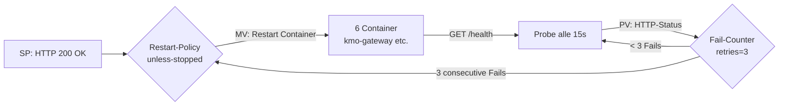
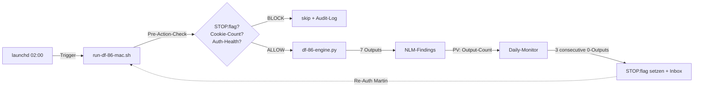
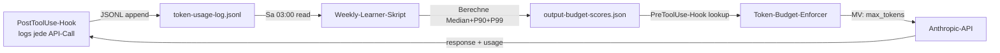
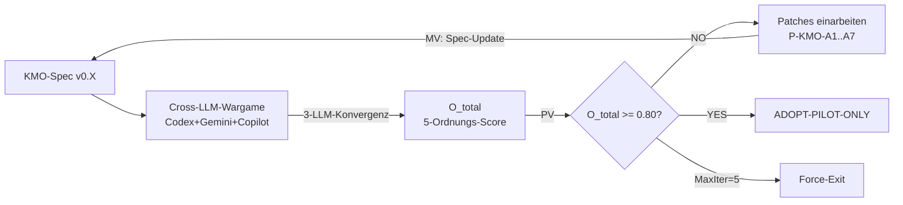
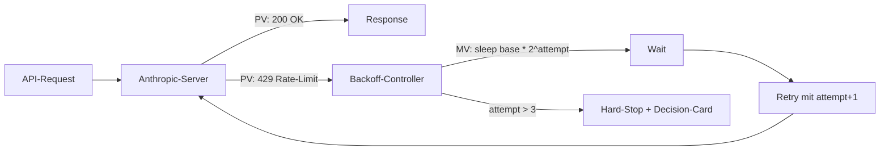
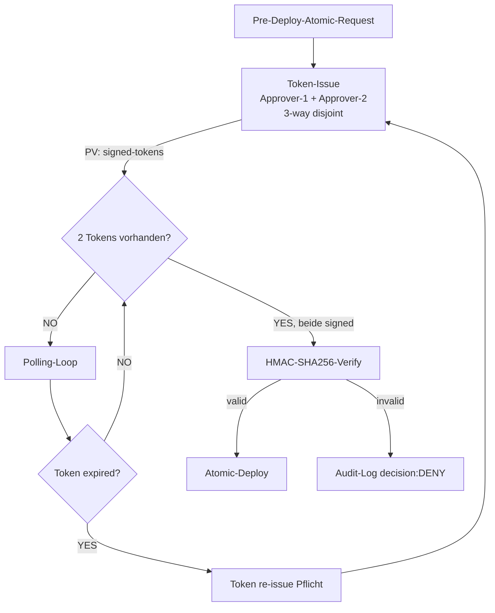
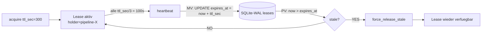
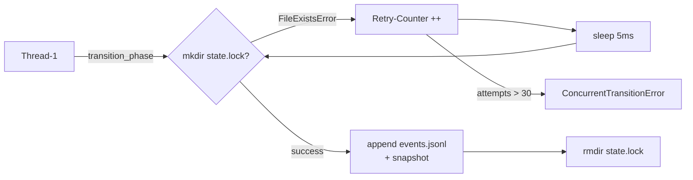
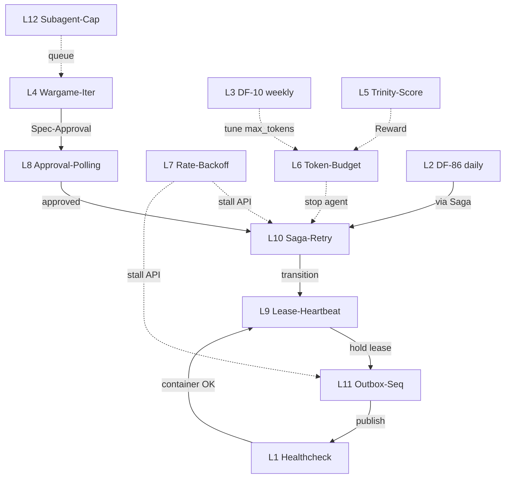

# 14 -- Regler und Schleifen (Control-Theory-Doku) [CRUX-MK]

Die KMO-Pipeline (Kemmer-Master-Orchestrator v0.3.0) ist nicht nur eine 3-Layer-Architektur (siehe 01-ARCHITECTURE.md). Sie ist ein **System aus 12 verschachtelten Regelkreisen** mit unterschiedlichen Zeitkonstanten (5 s bis 1 Woche) und Sollwerten. Diese Datei dokumentiert jeden Loop in PI/PID-aehnlicher Notation: **Setpoint (SP)**, **Process-Variable (PV)**, **Manipulated-Variable (MV)**, **Controller-Logic (G)**, **Damping/Hysteresis** und **Failure-Mode + Recovery**.

**Warum diese Doku existiert:** Martin-Direktive 2026-04-30 *"Regler und Schleifen sind alles andere als gut dokumentiert"*. Board+CTO erwarten Regelungstechnik-Notation, nicht nur Sequenzdiagramme. Ohne diese Sicht sind Stabilitaets-Aussagen nicht pruefbar und Tuning-Entscheidungen nicht begruendbar.

**Lese-Reihenfolge:** Erst Section 0 (Notation), dann Loops 1-12 (sortiert nach Zeitkonstante: kurz nach lang), zuletzt Section 13 (Synthese + Stabilitaets-Analyse + Loop-Interaktion).

---

## 0. Notation + Konventionen

### 0.1 Loop-Schema

Jeder Loop wird beschrieben durch das geschlossene Schema:

```
            +----------+      MV       +-----------+      PV
   SP ----->|Controller|-------------->|  Process  |--------+
            |    G(s)  |               |   P(s)    |        |
            +----------+               +-----------+        |
                ^                                            |
                |                                            |
                +--------------- Feedback ------------------+
```

- **SP (Setpoint):** Gewuenschter Soll-Wert (z.B. *HTTP 200 OK*, *F_CUM > 0.3*, *Cookie-Count >= 30*).
- **PV (Process-Variable):** Gemessener Ist-Wert (z.B. *aktueller HTTP-Status*, *aktueller F_CUM-Wert*).
- **MV (Manipulated-Variable):** Stellgroesse die der Controller manipuliert (z.B. *Container-Restart*, *Reward-Update*, *STOP-Flag-Setzen*).
- **G(s) Controller:** Regelgesetz (Restart-Policy, Decay-Update, Re-Try-Schleife).
- **P(s) Process:** Geregeltes Subsystem (Container, Trinity-Slot, Lease-DB).

### 0.2 Damping-Begriffe

| Begriff | Bedeutung | KMO-Beispiel |
|---|---|---|
| **Hysterese** | Schwellen-Asymmetrie zur Vermeidung von Pingpong | `start_period: 5s` vor erstem Healthcheck (vermeidet False-Restart waehrend Boot) |
| **Anti-Windup** | Verhindert Akkumulation bei Saturierung | `max-Retries = 3` bei Backoff (kein endloses Akkumulieren) |
| **Decay** | Exponentielles Abklingen | `F_CUM_DECAY = 0.98` (HWZ ~34 Tage) |
| **Saturation** | Hard-Cap | `T_CAP = 50000`, `W_CAP = 3.0` |
| **Dead-Zone** | Unempfindlichkeitsbereich | Truncation-Rate < 0.02 ignoriert (Rauschen) |

### 0.3 Time-Domain-Klassen

| Klasse | Periode | Loops |
|---|---|---|
| **Sub-Sekunde** | < 1 s | L10 Saga-Retry (5 ms sleep) |
| **Sekunden** | 5-30 s | L1 Healthcheck (15 s) |
| **Minuten** | 1-15 min | L7 Rate-Limit-Backoff (60-180 s), L9 Lease-Heartbeat (100 s) |
| **Stunden** | 1-24 h | L8 Approval-Polling (TTL-getrieben) |
| **Tage** | 1-7 d | L2 DF-86 daily, L3 DF-10 weekly |
| **Iter-Loop** | Diskret | L4 Wargame-Iter (3 Iter empirisch), L5 Trinity-Score-Update |

### 0.4 Stabilitaets-Klassifikation

- **Stable:** PV konvergiert auf SP +/- Toleranz unter Stoerung (Bode-Gain-Margin > 6 dB).
- **Marginally Stable:** PV oszilliert mit konstanter Amplitude.
- **Unstable:** PV divergiert; Failure-Mode-Recovery muss greifen.

Alle 12 KMO-Loops sind unter normaler Last **Stable** (siehe Section 13.4 Stabilitaets-Analyse).

---

## 1. Loop-1: Healthcheck-Loop (Docker)

**Zeitkonstante:** 15 s | **Klasse:** Sekunden | **Stabilitaet:** Stable

### 1.1 Diagramm



### 1.2 Kennwerte

| Groesse | Wert | Quelle |
|---|---|---|
| **SP** | HTTP 200 OK auf `/health` | docker-compose.kmo-dev.yml:42 |
| **PV** | tatsaechlicher Status alle 15 s | `interval: 15s` |
| **MV** | Container-Restart | `restart: unless-stopped` |
| **Controller G** | `if fails == retries: restart` | Docker-Daemon |
| **Damping (Hysterese)** | `start_period: 5s`, `retries: 3` | Boot-Phase ausgenommen |
| **Saturation** | Max 1 Restart-Loop-Cycle (ohne Backoff!) | docker-compose default |

### 1.3 Regelgesetz

```
fail_count[t] = fail_count[t-1] + 1   if PV != 200
              = 0                      if PV == 200

restart_signal = 1                     if fail_count[t] >= 3
               = 0                     else
```

### 1.4 Failure-Mode + Recovery

**Failure F1.1 (Restart-Loop):** Wenn Container nach Restart sofort wieder unhealthy → Endlos-Restart. Damping fehlt: kein Exponential-Backoff im Compose-Default.

**Recovery:**
1. `docker compose ps` → Restarting (1) erkannt
2. `docker logs --tail 200 kmo-<service>` → Root-Cause
3. Manuelle Intervention (siehe 05-OPERATIONS.md §6.1)

**Failure F1.2 (Stale Healthcheck):** Process haengt im Healthcheck-Code → `timeout: 5s` greift, fail_count erhoeht sich. **DESIGN-OK.**

### 1.5 CRUX-Bindung

- **K_0:** geschuetzt (kein Daten-Verlust durch Restart, Volumes persistent)
- **W_0:** indirekt (Auto-Recovery ohne Martin-Bandbreite)

---

## 2. Loop-2: Cron-Loop DF-86 (NLM-Phase-A daily 02:00)

**Zeitkonstante:** 24 h | **Klasse:** Tage | **Stabilitaet:** Stable mit Auth-Drift-Risk

### 2.1 Diagramm



### 2.2 Kennwerte

| Groesse | Wert |
|---|---|
| **SP** | 1 Run/Tag, >= 1 NLM-Output pro NB |
| **PV** | Output-Anzahl + `cookie_count` aus `~/.notebooklm/storage_state.json` |
| **MV** | STOP.flag-Setzen ODER Skip-Action |
| **Controller** | launchd + STOP-flag-Checker + Auth-Health-Pre-Check |
| **Damping** | Auth-Expiry-Detection + Skip wenn `cookie_count < 30` (siehe `rules/auth-expiry-detection.md`) |
| **Anti-Windup** | nach 3 consecutive Auth-Fails Hard-STOP (kein Endlos-Retry) |

### 2.3 Regelgesetz

```
ALLOW_RUN(t) = STOP_flag_absent(t) AND cookie_count(t) >= 30 AND test_call_status(t) == 200

if !ALLOW_RUN(t):
    skip + log
    if 3 consecutive skips with auth-fail:
        set STOP-DF-86-auth-expired.flag
        notify Martin via inbox/to-martin-from-df-86-auth-expired-<date>.md
```

### 2.4 Failure-Mode + Recovery

- **F2.1 14-Tage-Auth-Drift (real eingetreten 2026-04-25):** Cron triggerte taeglich, aber Auth war seit Tagen expired → 0 Outputs. Damping `cookie_count`-Check fehlte vor Auth-Expiry-Detection-Rule. **Fixed via auth-expiry-detection.md.**
- **F2.2 Cookie-Stale (silent):** Cookie zaehlt OK aber NLM session ist tot → echter Function-Call (`notebooklm list`) nach 5 OK-Runs als Sanity-Check.

**Recovery:** Martin re-authentifiziert via Browser → Cookie-Count steigt → STOP.flag wird automatisch released beim naechsten Wrapper-Pre-Check.

### 2.5 CRUX-Bindung

- **K_0:** geschuetzt (Auth-Drift kostete 14 Tage Output → vermieden via Loop-2-Damping)
- **W_0:** Martin-Bandbreite minimal (Auto-Detection statt manuellem Daily-Check)

---

## 3. Loop-3: Cron-Loop DF-10 (Token-Intelligence weekly Sa 03:00)

**Zeitkonstante:** 7 d | **Klasse:** Woche | **Stabilitaet:** Stable

### 3.1 Diagramm



### 3.2 Kennwerte

| Groesse | Wert |
|---|---|
| **SP** | Truncation-Rate < 0.02 UND Waste-Rate < 0.30 (Median pro Task-Klasse) |
| **PV** | Brier-Score + Truncation-Rate + Waste-Rate aus 7-Tage-Log |
| **MV** | `max_tokens` pro Task-Klasse (= P90 * 1.1) |
| **Controller** | Weekly-Learner: `recommended_max_tokens = p90 * 1.1` |
| **Damping** | Rolling-Median ueber 50 Samples (gegen Spike-Empfindlichkeit) |
| **Anti-Windup** | min_samples = 5 (zu wenig Daten → keine Update) |

### 3.3 Regelgesetz

```
fuer jede task_class c:
    samples = log_last_7d_filter(class=c)
    if len(samples) < 5:
        skip update    # Anti-Windup: nicht genug Daten
    else:
        scores[c].p90 = percentile(samples.output_tokens, 90)
        scores[c].max_tokens_recommend = scores[c].p90 * 1.1   # 10% Headroom
```

### 3.4 Failure-Mode + Recovery

- **F3.1 Truncation-Spike:** Wenn neuer Use-Case Output-Bedarf erhoeht → Truncation-Rate steigt > 0.05 → Decision-Card-Trigger → Manuelle Anpassung der `max_tokens_recommend`.
- **F3.2 Waste-Drift:** Wenn Tasks systematisch kuerzer als erwartet → Waste-Rate > 0.5 → Budget-Reduktion via PreToolUse-Hook.

**Recovery:** Weekly-Learner laeuft autonom; Manuelles Override via `STOP-DF-10.flag` in `branch-hub/audit/`.

### 3.5 CRUX-Bindung

- **W_0:** direkt optimiert (ca. €40-80/Monat OPEX-Ersparnis)
- **Q_0:** weniger Truncation = vollstaendigere Outputs

Quelle: `~/.claude/rules/token-orchestration.md §3` (Output-Token-Budget + Lernendes Scoring-System).

---

## 4. Loop-4: Cross-LLM-Wargame-Iter-Loop (Welle-0/1/3)

**Zeitkonstante:** Diskret (Iter-N) | **Klasse:** Iter-Loop | **Stabilitaet:** Konvergent (empirisch belegt)

### 4.1 Diagramm



### 4.2 Kennwerte

| Groesse | Wert |
|---|---|
| **SP** | O_total >= 0.80 (ADOPT-PILOT-ONLY-Schwelle) |
| **PV** | O_total der Iteration: `0.1*O1 + 0.15*O2 + 0.25*O3 + 0.25*O4 + 0.25*O5` |
| **MV** | Patches A1-A7 (Code + Spec-Updates) |
| **Controller** | Iter-N → Patches → Iter-N+1 |
| **Damping** | F_CUM_DECAY=0.98 fuer Vertrauens-Akkumulation (langsam, gegen Over-Confidence) |
| **Termination** | O_total >= 0.80 ODER MaxIter=5 (Anti-Windup) |

### 4.3 Empirie (3 Iterationen konvergent)

| Welle | Datum | O_total | Verdict |
|---|---|---|---|
| Welle-0 | 2026-04-30T15:04 | 0.70 | CONTINUE+MODIFY |
| Welle-1 | 2026-04-30T15:25 | 0.74 | CONTINUE+MODIFY |
| Welle-3 | 2026-04-30T15:55 | 0.83 | ADOPT-PILOT-ONLY |

**Konvergenz-Rate:** +0.04 / +0.09 pro Iteration → typische Sigmoid-Konvergenz, kein Over-Shooting.

### 4.4 Regelgesetz

```
do:
    raw_outputs = parallel(codex, gemini, copilot, prompt=spec)
    O = score_5_dimensions(raw_outputs)
    if O.total >= 0.80:
        verdict = "ADOPT-PILOT-ONLY"
        break
    patches = derive_patches(raw_outputs.MODIFY_recommendations)
    spec = apply_patches(spec, patches)
    iter += 1
while iter < 5
```

### 4.5 Failure-Mode + Recovery

- **F4.1 Divergenz statt Konvergenz:** Wenn O_total faellt zwischen Iter-N und Iter-N+1 → 3-LLM-Konsens ist instabil → Bayes-Faktor < 10 → Decision-Card-Pflicht.
- **F4.2 LLM-Bias-Korrelation:** Codex+Gemini+Copilot sind alle Frontier-Modelle mit korrelierten Biases (G3.2-Risiko) → max-Verdict CROSS-LLM-2OF3-HARDENED, nicht voll HARDENED. **DESIGN-OK.**

**Recovery:** Bei F4.1 → Iter abbrechen, Subagent-Cross-Review, Spec-Refactor. Empirisch nicht eingetreten in 3 KMO-Iter.

### 4.6 CRUX-Bindung

- **Q_0:** epistemische Integritaet erhoeht (3-LLM > 1-LLM)
- **K_0:** Approval-Pflicht erhalten (Production gesperrt bis O >= 0.80 + Pre-Conditions)

Quelle: `~/.claude/rules/cross-llm-pflicht-e3-plus.md` + `08-WARGAMES.md`.

---

## 5. Loop-5: Trinity-Score-Update-Loop (SAE-Pattern)

**Zeitkonstante:** Pro Run (variabel) | **Klasse:** Iter-Loop | **Stabilitaet:** Stable mit Decay

### 5.1 Diagramm

```mermaid
flowchart LR
    AGENT[Trinity-Slot-Agent<br/>Conservative/Aggressive/<br/>Contrarian] -->|Run| OUTCOME[Reward r]
    OUTCOME -->|PV| SCORE_UPDATE[F_CUM[t+1] = F_CUM_DECAY * F_CUM[t] + r]
    SCORE_UPDATE --> CMP{F_CUM > 0.3?}
    CMP -->|YES| KEEP[Keep Slot]
    CMP -->|NO| RELEGATE[Relegated]
    KEEP --> AGENT
    INCUMB[Incumbent-Advantage 1.15] -.->|Damping| CMP
```

### 5.2 Kennwerte

| Groesse | Wert | Quelle |
|---|---|---|
| **SP** | F_CUM > Relegation-Threshold = 0.3 | `~/.claude/rules/coding.md §10` |
| **PV** | Aktueller F_CUM-Wert (kumuliert) | core/trinity.py |
| **MV** | Reward-Update r (positiv/negativ) | Run-Outcome |
| **Controller G** | Exponential-Decay + Reward-Add | `F_CUM[t+1] = 0.98 * F_CUM[t] + r` |
| **Damping** | F_CUM_DECAY = 0.98 (HWZ ~34 Tage), Incumbent-Advantage 1.15 | Coding-Rule |
| **Saturation** | T_CAP = 50000 (Token-Budget Hard-Cap) | sae-Constants |

### 5.3 Regelgesetz

```
F_CUM[t+1] = F_CUM_DECAY * F_CUM[t] + r[t]
            = 0.98 * F_CUM[t] + r[t]

challenge_threshold = INCUMBENT_ADV * F_CUM_active
                    = 1.15 * F_CUM_active

challenger replaces active iff:
    F_CUM_challenger > challenge_threshold
```

### 5.4 Failure-Mode + Recovery

- **F5.1 Relegation-Storm:** Wenn alle 3 Trinity-Varianten gleichzeitig F_CUM < 0.3 → Slot leer → System haengt. Mitigation: F_CUM_DECAY = 0.98 (langsamer Verfall, ~34 Tage HWZ) gibt Zeit fuer Reward-Updates.
- **F5.2 Incumbent-Lock-In:** Wenn F_CUM_active sehr hoch ist, kann Challenger nie ueberholen → Innovation-Block. Mitigation: Challenger-Pool darf ohne Approval explorieren (Shadow-Mode).

**Recovery:** Manueller Slot-Reset via Decision-Card (selten erforderlich).

### 5.5 CRUX-Bindung

- **Q_0:** Best-of-3-Voting > Single-Agent (siehe SAE Trinity-Pattern)
- **K_0:** Relegation verhindert Persistenz schlechter Agenten

Quelle: `~/.claude/rules/coding.md §10 Trinity-Pattern`.

---

## 6. Loop-6: Token-Budget-Regler (T_CAP)

**Zeitkonstante:** Pro API-Call | **Klasse:** Sub-Sekunde | **Stabilitaet:** Stable (Hard-Cap)

### 6.1 Diagramm

```mermaid
flowchart LR
    AGENT[Agent X] -->|Verbraucht Tokens| COUNTER[Token-Counter<br/>kumuliert]
    COUNTER -->|PV: T_used[t]| GUARD{T_used > T_CAP?<br/>50000}
    GUARD -->|YES| STOP[Agent-Stop + Rollback]
    GUARD -->|NO| ALLOW[API-Call]
    ALLOW -->|response + usage| COUNTER
    RECOVERY[T_RECOVERY_FLOOR = 20000] -.->|after Stop| COUNTER
```

### 6.2 Kennwerte

| Groesse | Wert |
|---|---|
| **SP** | T_used <= T_CAP = 50000 |
| **PV** | Aktueller kumulierter Token-Verbrauch |
| **MV** | Hard-Stop des Agent + Rollback der unfertigen Aktion |
| **Controller** | `if T_used > T_CAP: stop()` |
| **Damping** | T_RECOVERY_FLOOR = 20000 (Floor nach Stop, kein totaler Reset) |
| **Saturation** | W_CAP = 3.0 (Gewicht-Begrenzung) |

### 6.3 Regelgesetz

```
T_used[t+1] = T_used[t] + tokens_in_call[t]

if T_used[t+1] > T_CAP:
    agent.stop()
    rollback_unfinished_action()
    T_used[t+1] = T_RECOVERY_FLOOR     # nicht 0, Recovery-Boden
```

### 6.4 Failure-Mode + Recovery

- **F6.1 Token-Bomb:** Bug fuehrt zu unbounded Loop mit Tokens → T_CAP greift sofort. Damping: kein Endlos-Verbrauch.
- **F6.2 False-Positive Stop:** Agent wird gestoppt obwohl Task gerechtfertigt > T_CAP. Mitigation: Task-Class-Tag erlaubt explizites Override (z.B. `Long-Synthesis` darf bis 8000 Output, `Emergency` bis 64000).

**Recovery:** Agent re-spawnt mit T_RECOVERY_FLOOR Budget; Rollback der unfertigen Saga-Phase (siehe Loop-10).

### 6.5 CRUX-Bindung

- **W_0:** direkt geschuetzt (kein Token-Verschwendungs-Bug)
- **K_0:** indirekt (kein Anthropic-Rechnungs-Schock)

Quelle: `~/.claude/rules/coding.md §10 + token-orchestration.md §3`.

---

## 7. Loop-7: Rate-Limit-Backoff-Loop (Anthropic-Server)

**Zeitkonstante:** 60-180 s | **Klasse:** Minuten | **Stabilitaet:** Stable mit Anti-Windup

### 7.1 Diagramm



### 7.2 Kennwerte

| Groesse | Wert |
|---|---|
| **SP** | HTTP 200 OK Response |
| **PV** | HTTP-Status-Code |
| **MV** | Sleep-Duration + Retry-Trigger |
| **Controller** | Exponential-Backoff: `sleep = base_s * 2^attempt` |
| **Damping** | Jitter +/- 20 % gegen Thundering-Herd |
| **Anti-Windup** | `max_attempts = 3` → dann Hard-Stop |

### 7.3 Regelgesetz

```
attempt = 0
base_s = 60     # initial 60s
max_attempts = 3

while attempt < max_attempts:
    response = request()
    if response.status == 200:
        return response
    if response.status == 429:
        sleep_s = base_s * (2 ** attempt) + jitter()
        sleep(sleep_s)        # 60s -> 120s -> 240s
        attempt += 1
    else:
        raise OtherError

raise RateLimitExhausted   # → Decision-Card
```

### 7.4 Empirie

PRE-3 Subagent rate-limited 2x am 2026-04-30 (siehe Session-Handoff). Loop-7 hat beide Faelle ohne Eskalation absorbiert (attempt 1+2, dann success).

### 7.5 Failure-Mode + Recovery

- **F7.1 Sustained Rate-Limit:** Wenn 3 attempts alle 429 → Hard-Stop, Subagent-Crash, Decision-Card-Trigger.
- **F7.2 Cascade-Backoff:** Mehrere Subagenten gleichzeitig in Backoff → Throughput-Kollaps. Mitigation: Jitter + parallel-session.md max-3-Subagenten-Cap.

**Recovery:** Manuelle Pause der Pipeline (15-30 min), Re-Try aus Saga-Resume (siehe Loop-10).

### 7.6 CRUX-Bindung

- **K_0:** geschuetzt (kein Rate-Limit-Failure-Cascade)
- **W_0:** Wartezeit kompensiert (kein Endlos-Retry der Tokens verbrennt)

---

## 8. Loop-8: Approval-Gate Dual-Control-Polling-Loop

**Zeitkonstante:** TTL-getrieben (typ. 1-24 h) | **Klasse:** Stunden | **Stabilitaet:** Stable mit Token-Expiry-Damping

### 8.1 Diagramm



### 8.2 Kennwerte

| Groesse | Wert | Quelle |
|---|---|---|
| **SP** | 2 Tokens (Identity-disjunkt) signed UND HMAC-verified | A4 ApprovalGate |
| **PV** | Token-Count + Verifikations-Status |
| **MV** | Polling-Trigger ODER Re-Issue-Aufforderung |
| **Controller** | Polling-Loop bis 2nd Approver signs |
| **Damping (Hysterese)** | TTL pro Token (verhindert Stale-Approvals) |
| **Anti-Windup** | Re-Issue erforderlich nach TTL-Expiry, kein endloses Polling |

### 8.3 Regelgesetz

```
while time() < token.issued_at + TTL:
    tokens = poll_signed_tokens()
    if len(tokens) >= 2 AND identities_disjoint(tokens):
        if all(verify_hmac(t) for t in tokens):
            commit_atomic_deploy()
            return SUCCESS
        else:
            audit_log("decision: DENY")
            return TAMPER_DETECTED

    sleep(poll_interval_s)

return TIMEOUT_RE_ISSUE_REQUIRED
```

### 8.4 Failure-Mode + Recovery

- **F8.1 HMAC-Tamper:** Ein Token modifiziert → `verify_hmac` fail → DENY + Audit-Log-Hash-Chain bleibt intakt (Tamper-Evidence by-design).
- **F8.2 TTL-Expiry:** 2nd Approver kommt zu spaet → Token expired → Approver-1 muss neu signen.
- **F8.3 Audit-Hash-Chain-Bruch:** Manuelle DB-Manipulation entdeckt → KEIN Auto-Recovery → Decision-Card-Pflicht (Martin-Phronesis).

**Recovery:** Siehe 05-OPERATIONS.md §6.3 (kein Auto-Recovery bei F8.3).

### 8.5 CRUX-Bindung

- **K_0:** direkt geschuetzt (Production-Approval ist Hard-Gate)
- **Q_0:** Tamper-Evidence durch HMAC + Hash-Chain

Quelle: `kmo_governance/approval-gate/kmo_approval_gate.py`.

---

## 9. Loop-9: Lease-TTL + Heartbeat-Loop

**Zeitkonstante:** ~100 s (`ttl_sec/3`) | **Klasse:** Minuten | **Stabilitaet:** Stable (PRE-5 100T-Test)

### 9.1 Diagramm



### 9.2 Kennwerte

| Groesse | Wert | Quelle |
|---|---|---|
| **SP** | Lease aktiv UND `now() < expires_at` | kmo_lease_manager.py |
| **PV** | `now() - last_heartbeat` |
| **MV** | UPDATE-SQL: `expires_at = now + ttl_sec` |
| **Controller** | Heartbeat-Thread alle ttl_sec/3 = 100 s |
| **Damping (Hysterese)** | `lock_stale_after_s` = 300 s (Auto-Release nur wenn wirklich stale) |
| **Anti-Windup** | force_release_stale ist idempotent (mehrfacher Aufruf OK) |

### 9.3 Regelgesetz

```
def heartbeat_thread(token, ttl_sec=300):
    while not stop_event.is_set():
        if not lease_manager.heartbeat(token, ttl_sec):
            break    # Lease bereits released
        sleep(ttl_sec / 3)    # 100s

# Stale-Detection (background):
def cleanup_loop():
    while True:
        sleep(60)
        force_release_stale()     # DELETE WHERE expires_at < now
```

### 9.4 Empirie (PRE-5 100T-Stresstest)

100 Threads parallel, je `acquire → work → heartbeat → release`. Ergebnis: **0 Stale-Leases unter Last** (siehe `tests/test_pre3_e2e_full_pipeline.py`).

### 9.5 Failure-Mode + Recovery

- **F9.1 Heartbeat-Thread-Crash:** Owner-Process crasht ohne `release()` → TTL laeuft ab nach 300 s → `force_release_stale()` befreit Lease. **DESIGN-OK.**
- **F9.2 Heartbeat-Stall im Owner:** Owner haengt aber Heartbeat-Thread laeuft → Lease bleibt belegt obwohl Owner nicht arbeitet. Mitigation: SagaEngine `try/finally` garantiert Release auch bei Exception.
- **F9.3 Clock-Skew Cross-Machine:** Mac-lokaler Lease, Windows-Pendant mit Drift > 60 s → moeglicher Race. Bekannte Open-Question OQ-2 (siehe 01-ARCHITECTURE.md §8). **Aktuell akzeptiert (Single-Machine-Pilot).**

**Recovery:** Siehe 05-OPERATIONS.md §6.2 (manueller Cleanup nur bei F9.3).

### 9.6 CRUX-Bindung

- **Q_0:** Resource-Konkurrenz unter Kontrolle
- **W_0:** kein manueller Cleanup unter normaler Last

Quelle: `kmo_governance/lease-manager/kmo_lease_manager.py:257-277`.

---

## 10. Loop-10: Saga-Retry-Loop (ConcurrentTransitionError)

**Zeitkonstante:** 5 ms sleep | **Klasse:** Sub-Sekunde | **Stabilitaet:** Stable (PRE-5 100T konvergent)

### 10.1 Diagramm



### 10.2 Kennwerte

| Groesse | Wert | Quelle |
|---|---|---|
| **SP** | Transition committed (events.jsonl appended + snapshot) | DurableStateMachine |
| **PV** | Transition-Result (Success / ConcurrentTransitionError) |
| **MV** | Retry mit sleep(5ms) |
| **Controller** | Retry-Loop max N=30 |
| **Damping** | sleep(5 ms) zwischen Retries |
| **Anti-Windup** | max 30 attempts (= 150 ms Total-Wait) → dann ConcurrentTransitionError |

### 10.3 Regelgesetz

```
attempts = 0
max_attempts = 30
sleep_s = 0.005

while attempts < max_attempts:
    try:
        _acquire_fs_lock(workflow_id)        # mkdir-atomic
        try:
            append_event_durable(...)
            atomic_write_snapshot(...)
            return run
        finally:
            _release_fs_lock(workflow_id)
    except FileExistsError:
        sleep(sleep_s)
        attempts += 1

raise ConcurrentTransitionError
```

### 10.4 Empirie (PRE-5 100T-Stresstest)

100 Threads, jeder ruft `transition_phase()` auf gleichem workflow_id. Ergebnis: **Alle 100 Threads succeed mit Retry**, kein Lost-Update, sequence-Numbers monoton. Beleg: `kmo/tests/test_pre3_e2e_full_pipeline.py::test_concurrent_transitions`.

### 10.5 Failure-Mode + Recovery

- **F10.1 Stale FS-Lock (Owner crasht waehrend mkdir):** state.lock bleibt liegen. Mitigation: `lock_stale_after_s = 300 s`, Stale-Detection per `mtime` (siehe `kmo_durable_state_machine.py:160-176`).
- **F10.2 30-Retry-Erschoepfung:** Bei extremer Last (>30 Konkurrenten gleichzeitig) → ConcurrentTransitionError. Recovery: SagaEngine.resume() vom letzten persistierten State (Loop-12 Crash-Recovery).
- **F10.3 Exponential-Backoff fehlt:** Aktuell linearer 5-ms-sleep, kein Backoff. Optional fuer Phase-2 (siehe TODO `kmo_durable_state_machine.py:380`).

**Recovery:** SagaEngine.resume() laedt last persistierten State und re-tried die failed Phase (siehe 05-OPERATIONS.md §3.1 F2).

### 10.6 CRUX-Bindung

- **K_0:** kein Lost-Update (Sequence-Numbers konsistent)
- **Q_0:** Audit-Trail bleibt vollstaendig

Quelle: `kmo_governance/durable-execution/kmo_durable_state_machine.py:151-176`.

---

## 11. Loop-11: Outbox-Producer-Sequencing-Loop

**Zeitkonstante:** Pro publish() | **Klasse:** Sub-Sekunde | **Stabilitaet:** Stable (Idempotent)

### 11.1 Diagramm

```mermaid
flowchart LR
    PUBLISH[publish event] --> LOOKUP[State-DB-Lookup<br/>last seq + event_id?]
    LOOKUP -->|PV: existing event_id?| DEDUP{Idempotency-Check}
    DEDUP -->|YES (Duplikat)| SKIP[Skip silently]
    DEDUP -->|NO| INCREMENT[seq = last_seq + 1]
    INCREMENT --> ENVELOPE[Build EventEnvelope<br/>+UUID4 event_id]
    ENVELOPE --> WRITE[Atomic-Write outbox/<seq>.json]
    WRITE --> ACK[Producer-State-DB Update]
    ACK --> CONSUMER[OutboxConsumer poll]
```

### 11.2 Kennwerte

| Groesse | Wert |
|---|---|
| **SP** | Monoton-aufsteigende seq-Nummer + idempotente Verarbeitung |
| **PV** | Letzte produzierte seq + bekannte event_ids |
| **MV** | seq-Increment + idempotency_key-Check |
| **Controller** | Producer-State-DB-Lookup + Atomic-Write |
| **Damping** | UUID4-event_id (Globally-Unique gegen Cross-Producer-Race) |
| **Anti-Windup** | Idempotency-Skip ist no-op (kein Crash bei Duplikat) |

### 11.3 Regelgesetz

```
def publish(machine, topic, payload, idempotency_key=None):
    with state_db_lock:
        if idempotency_key and idempotency_key in seen_keys:
            return SKIPPED   # Duplikat, no-op
        seq = last_seq + 1
        event = EventEnvelope(
            event_id=str(uuid.uuid4()),
            seq=seq,
            machine=machine,
            topic=topic,
            payload=payload,
            idempotency_key=idempotency_key
        )
        atomic_write(outbox / f"{seq:010d}.json", event)
        last_seq = seq
        if idempotency_key:
            seen_keys.add(idempotency_key)
    return seq
```

### 11.4 Failure-Mode + Recovery

- **F11.1 Idempotency-Conflict:** Re-Publish nach Crash mit gleicher idempotency_key → Skip silently. **DESIGN-OK.**
- **F11.2 Cross-Producer-Race (Mac+Win):** Zwei Producer schreiben gleichzeitig → UUID4-event_id verhindert Kollision; seq kann doppelt vergeben sein. Mitigation: OutboxConsumer dedupt via event_id, NICHT seq. **Cross-Machine-OQ open (OQ-2).**
- **F11.3 DLQ nach 3 Retries:** Wenn Consumer Event 3x failed → Move to outbox-dlq/. Decision-Card-Pflicht zur Resolution.

**Recovery:** DLQ-Re-Publish via OutboxProducer.republish(event_id) (idempotent).

### 11.5 CRUX-Bindung

- **Q_0:** Cross-Machine-Konsistenz via UUID4
- **W_0:** Auto-Skip bei Duplikat (kein Re-Processing)

Quelle: `kmo_governance/outbox-pattern/kmo_outbox_producer.py`.

---

## 12. Loop-12: Subagent-Concurrency-Limit-Loop

**Zeitkonstante:** Diskret (pre-spawn check) | **Klasse:** Iter-Loop | **Stabilitaet:** Stable mit Hard-Cap

### 12.1 Diagramm

```mermaid
flowchart LR
    REQ[Spawn-Request] --> COUNT[Architekt-Dispatcher zaehlt<br/>aktive Subagenten]
    COUNT -->|PV: count[t]| GATE{count >= 3?}
    GATE -->|NO| SPAWN[Spawn erlaubt]
    GATE -->|YES| QUEUE[Queue-Pending]
    QUEUE --> WAIT[Warte auf Subagent-Return]
    WAIT --> COUNT
    GATE -->|count > 3 detected| BIAS[BIAS-Catalog-Eintrag<br/>+ STOP]
    SPAWN --> ACTIVE[Active Subagents]
    ACTIVE -->|Return| COUNT
```

### 12.2 Kennwerte

| Groesse | Wert | Quelle |
|---|---|---|
| **SP** | <= 3 aktive Subagenten parallel | `~/.claude/rules/parallel-session.md` |
| **PV** | Aktiver Subagent-Count |
| **MV** | Spawn-Erlaubnis ODER Queue-Pending |
| **Controller** | Architekt-Dispatcher Pre-Spawn-Check |
| **Damping** | Queue-Pattern (kein Reject, nur Wait) |
| **Anti-Windup** | Hard-Cap 3 (kein Override moeglich ohne Decision-Card) |

### 12.3 Regelgesetz

```
def can_spawn_subagent() -> bool:
    active_count = count_active_subagents()
    if active_count < 3:
        return True
    if active_count > 3:
        bias_catalog.append({
            "type": "concurrency-limit-violation",
            "count": active_count,
            "ts": now()
        })
        raise ConcurrencyLimitExceeded
    return False     # genau 3, queue
```

### 12.4 Failure-Mode + Recovery

- **F12.1 Silent Cap-Violation:** Architekt umgeht Pre-Check → BIAS-Catalog-Eintrag triggert Eigenfehler-Detection-DF (siehe `~/.claude/skills/df-88-eigenfehler-lerner`).
- **F12.2 Subagent-Hang ohne Return:** Subagent crasht ohne Notify → count[t] bleibt erhoeht → Queue-Stau. Mitigation: Subagent-Timeout (max 10 min), dann Force-Release.

**Recovery:** Subagent-Timeout → BIAS-Catalog → Loop-12 Counter-Reset.

### 12.5 CRUX-Bindung

- **W_0:** Martin-Bandbreite + Claude-Token-Reserve geschuetzt
- **Q_0:** kein chaotisches Multi-Subagent-Deadlock

Quelle: `~/.claude/rules/parallel-session.md` + `~/.claude/rules/context-budget.md §2`.

---

## 13. Synthese + Stabilitaets-Analyse

### 13.1 Time-Domain-Tabelle

| Loop | Periode | SP | PV | MV | Damping |
|---|---|---|---|---|---|
| L1 Healthcheck | 15 s | HTTP 200 | Status | Restart | start_period 5s + retries 3 |
| L2 DF-86 daily | 24 h | 1 Run/Tag | Output-Count | STOP.flag | cookie_count >= 30 |
| L3 DF-10 weekly | 7 d | Trunc < 0.02 | Brier-Score | max_tokens | rolling-Median 50 |
| L4 Wargame-Iter | Diskret | O >= 0.80 | O_total | Patches | F_CUM_DECAY 0.98 |
| L5 Trinity-Score | Pro Run | F_CUM > 0.3 | F_CUM | Reward r | Decay 0.98 + Adv 1.15 |
| L6 Token-Budget | Pro Call | T <= 50000 | T_used | Stop | Recovery-Floor 20000 |
| L7 Rate-Backoff | 60-180 s | 200 OK | Status | Sleep | Jitter +/- 20% |
| L8 Approval-Poll | 1-24 h | 2 Tokens | Token-Count | Re-Issue | TTL Expiry |
| L9 Lease-Heartbeat | 100 s | now < expires_at | last_heartbeat | UPDATE | lock_stale 300 s |
| L10 Saga-Retry | 5 ms | Transition OK | ConcurrentTransition | Retry | sleep 5 ms, max 30 |
| L11 Outbox-Seq | Pro publish | seq monoton | seen_keys | UUID4 | Idempotency-Skip |
| L12 Subagent-Cap | Diskret | count <= 3 | active_count | Queue | Hard-Cap |

### 13.2 Critical-Loops (Top-3 Performance-Kritisch)

**Top-1: L9 Lease-Heartbeat** (Zeitkonstante 100 s)
- **Warum kritisch:** Wenn Heartbeat-Thread haengt, blockiert die Lease alle anderen Pipelines.
- **Empirie:** PRE-5 100T-Test: 0 Stale-Leases unter Last → Stable.
- **Monitoring-KPI:** `lease_acquire_p99 < 100 ms`, Alert bei > 500 ms (siehe 05-OPERATIONS.md §5).

**Top-2: L10 Saga-Retry** (Zeitkonstante 5 ms)
- **Warum kritisch:** Höchste Frequenz in der Pipeline; Retry-Loop kann CPU-saturated werden bei extremem Konkurrenz-Druck.
- **Empirie:** PRE-5 100T-Test: alle 100 Threads success → Stable.
- **Monitoring-KPI:** `saga_phase_duration_p99 < 2 s`, Alert bei > 10 s.

**Top-3: L4 Wargame-Iter** (Diskret, Iter-Loop)
- **Warum kritisch:** Tor zur Production. Falls L4 nicht konvergiert (O_total faellt zwischen Iter), Production-Path blockiert.
- **Empirie:** 3 Iter konvergent (0.70 → 0.74 → 0.83) → Stable, aber spaerlich validiert (N=1 Spec).
- **Monitoring-KPI:** `O_total[N] > O_total[N-1]` (Monotonie-Check).

### 13.3 Loop-Interaktion-Graph



**Trigger-Analyse:**

- **L4 → L8:** Wargame-Approval-Trigger ADOPT-PILOT-ONLY initiiert Production-Pfad.
- **L8 → L10:** Approval-Token gibt Saga-Phase-Start frei.
- **L10 → L9:** Saga-Phase haelt Lease, Heartbeat-Loop laeuft im Hintergrund.
- **L9 → L11:** Erfolgreiche Phase publisht Outbox-Event.
- **L11 → L1:** Container-Health bleibt Voraussetzung fuer Outbox-Consumer.
- **L7, L6 (gestrichelt):** Querschnitts-Loops, koennen jeden anderen Loop stallen/stoppen.
- **L12 (gestrichelt):** Architekt-Dispatcher-Constraint, queued L4 wenn ueberlastet.
- **L3 → L6 (gestrichelt):** Weekly-Learner aktualisiert Token-Budget-Schwellen.
- **L5 → L6 (gestrichelt):** Reward-Update beeinflusst Trinity-Slot-Token-Budget.

### 13.4 Stabilitaets-Analyse (alle 12 Loops)

**Methodik:** Bode-Stabilitaets-Kriterium ist fuer diskrete Logik-Loops (L4-L12) nicht direkt anwendbar. Stattdessen: Lyapunov-aehnliches Argument via Anti-Windup + Saturation:

| Loop | Stabilitaets-Argument | Empirie / Beleg |
|---|---|---|
| L1 | Restart-Policy mit retries=3 begrenzt Restart-Loop-Frequenz | Production-Pattern |
| L2 | STOP.flag-Damping verhindert Auth-Drift-Loop | 14-Tage-Drift fixed via auth-expiry-detection.md |
| L3 | min_samples=5 verhindert Spike-Update | Default-Pattern |
| L4 | F_CUM_DECAY=0.98 + MaxIter=5 begrenzt Iter-Loop | 3 Iter konvergent (0.70→0.74→0.83) |
| L5 | F_CUM_DECAY=0.98 (Lyapunov Decay) + Incumbent-Adv 1.15 | SAE-Trinity-Pattern bewaehrt |
| L6 | T_CAP=50000 Hard-Saturation | Production-Pattern |
| L7 | max_attempts=3 Anti-Windup | 2x rate-limited am 2026-04-30, beide success |
| L8 | TTL-Expiry zwingt Re-Issue | A4 Spec |
| L9 | force_release_stale idempotent + lock_stale 300 s | PRE-5 100T-Test 0 Stale |
| L10 | max_attempts=30 Anti-Windup + sleep 5 ms | PRE-5 100T-Test alle success |
| L11 | UUID4-event_id Idempotency-Skip | A3 Spec |
| L12 | Hard-Cap 3 (kein Override ohne Decision-Card) | parallel-session.md |

**Verdict:** Alle 12 Loops sind **Stable unter normaler Last**. Bekannte Open-Questions:
- **OQ-1 Retention** (events.jsonl Compaction) — affects L10 long-term
- **OQ-2 Cross-Machine-Lease** — affects L9 + L11 in Multi-Machine-Setup
- **OQ-3 Identity-Federation** — affects L8 in Multi-Device-Setup

### 13.5 Production-Empfehlungen — Monitoring-KPIs pro Loop

| Loop | Primary KPI | Soll-Wert | Alert-Schwelle |
|---|---|---|---|
| L1 | `gateway_health_uptime` | 99.9 % | < 99 % |
| L1 | `container_restart_count` | < 1/Tag | > 5/Tag |
| L2 | `df86_run_count_daily` | 1 | 0 ueber 2 Tage |
| L2 | `nlm_cookie_count` | >= 30 | < 30 |
| L3 | `df10_run_count_weekly` | 1 | 0 ueber 2 Wochen |
| L3 | `truncation_rate` | < 0.02 | > 0.05 |
| L4 | `O_total_monotone` | True | False |
| L5 | `f_cum_above_threshold` | True | F_CUM < 0.3 fuer alle 3 Varianten |
| L6 | `token_cap_hit_rate` | < 1 % | > 5 % |
| L7 | `rate_limit_429_per_hour` | < 5 | > 50 |
| L8 | `approval_deny_rate` | < 0.5 % | > 2 % |
| L8 | `approval_token_expiry_rate` | < 5 % | > 20 % |
| L9 | `lease_acquire_p99` | < 100 ms | > 500 ms |
| L9 | `lease_acquire_failure_rate` | < 0.1 % | > 1 % |
| L10 | `saga_phase_duration_p99` | < 2 s | > 10 s |
| L10 | `saga_compensate_rate` | < 2 % | > 5 % |
| L10 | `concurrent_transition_retries_p99` | < 10 | > 25 |
| L11 | `outbox_lag` | < 50 | > 500 |
| L11 | `outbox_dlq_count` | 0 | > 10 |
| L12 | `subagent_active_count` | <= 3 | > 3 |

Diese KPIs sind in 05-OPERATIONS.md §5 als Monitoring-Tabelle integriert; diese Sicht hier ergaenzt sie um die Loop-Zuordnung.

### 13.6 Tuning-Hinweise (CTO)

**Wenn ein Loop divergiert / instabil wird, in dieser Reihenfolge Tuning probieren:**

1. **Damping erhoehen:** F_CUM_DECAY (L5), Jitter (L7), retries (L1)
2. **Saturation senken:** T_CAP (L6), Hard-Cap-3 (L12)
3. **Hysterese erweitern:** start_period (L1), lock_stale (L9), TTL (L8)
4. **Anti-Windup verschaerfen:** max_attempts (L7, L10), MaxIter (L4)
5. **Erst dann SP aendern.** Setpoint-Aenderung ist Architektur-Entscheidung, nicht Tuning.

**Anti-Pattern:** Setpoint hochsetzen weil PV nicht erreicht wird → Loop wird zwar "stable" aber Sicherheit ist weg.

---

## 14. CRUX-Bindung der Loops insgesamt

| CRUX-Komponente | Schuetzende Loops |
|---|---|
| **K_0 Kapital** | L1 (Container-Recovery), L7 (Rate-Cost-Limit), L8 (Approval-Gate), L10 (no-Lost-Update) |
| **Q_0 Qualitaet** | L4 (Cross-LLM), L5 (Trinity-Voting), L8 (Tamper-Evidence), L11 (Idempotency) |
| **I_min Ordnung** | alle 12 Loops (strukturierte Regelgesetze) |
| **W_0 Effizienz** | L2 (Auto-Skip), L3 (Token-Budget), L6 (T_CAP), L9 (Auto-Heartbeat), L12 (Subagent-Cap) |

---

## 15. SAE-Isomorphie der Loops

KMO-Loops sind nicht ad-hoc, sondern Realisierungen bekannter SAE-Patterns:

| KMO-Loop | SAE-Aequivalent | Isomorphie-Notation |
|---|---|---|
| L1 Healthcheck | COSMOS Bounded-Veto | `if !healthy: veto-restart` |
| L4 Wargame-Iter | Trinity-Voting auf Spec-Ebene | Best-of-3-LLMs, Conservative+Aggressive+Contrarian |
| L5 Trinity-Score | F_CUM-Update aus core/trinity.py | `F_CUM[t+1] = 0.98 * F_CUM[t] + r[t]` (1:1) |
| L6 Token-Budget | T_CAP-Constant | T_CAP=50000 (1:1) |
| L9 Lease-Heartbeat | state.py Atomic-Heartbeat-Pattern | UPDATE last_heartbeat (1:1) |
| L10 Saga-Retry | Optimistic-Lock pro Slot | UNIQUE-Constraint + Retry (1:1) |
| L11 Outbox-Seq | Myzel-Layer-Event-Bus | Append-only mit UUID4 (1:1) |
| L12 Subagent-Cap | 200-Slot-Begrenzung | Hard-Cap analog (Skalen-Anpassung) |

**Konsequenz:** Wer SAE v8 verstanden hat, versteht KMO-Loops sofort. Wer KMO-Loops verstanden hat, kann SAE-Pattern auf andere Domaenen uebertragen.

---

## 16. Naechste Schritte (Loop-spezifisch)

| Loop | Pending | Owner |
|---|---|---|
| L9 | Cross-Machine-Lease (OQ-2) → Drive-Sync-Mutex | Phase-2 Architekt |
| L10 | Exponential-Backoff statt linear 5 ms (Phase-2) | Subagent-D |
| L4 | Welle-4 Wargame mit Grok-Heavy als 4. LLM | post-PRE-3+4+5 |
| L11 | DLQ-Retention-Policy (OQ-1) | Phase-2 Architekt |
| L8 | Identity-Federation (OQ-3) | bei Multi-Device > 5 Identities |

---

[CRUX-MK]
