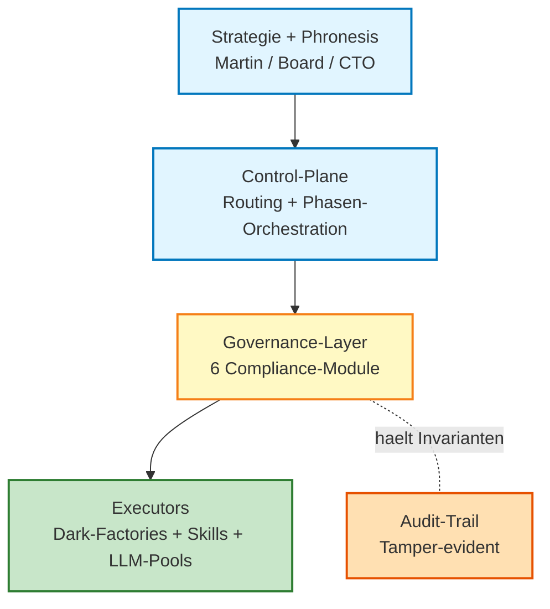

# KMO-Pipeline — Board-Briefing [CRUX-MK]

**Executive-Variante (15 Folien) fuer Aufsichtsrat / Investor / C-Level. Business-Sprache. Tech-Tiefe nur wo entscheidungsrelevant.**

---

## Folie 1 — Title

**KMO-Pipeline Welle-7: Board-Briefing**

- **Stand:** 2026-04-30, Welle-7 LIVE
- **Verdict:** ADOPT-PILOT-ONLY (CROSS-LLM-2OF3-HARDENED)
- **Architekt:** Mac-Opus 4.7 (Welle-7-Autonomie)
- **Audience:** Board / Aufsichtsrat / Investor — Strategische Phronesis-Entscheidung
- **Tagline:** Master-Orchestrator fuer DF-Coordination + Approval-Theater-Schutz

[CRUX-MK]

---

## Folie 2 — Executive Summary (TLDR)

> Wenn Sie nur eine Folie lesen — **diese**.

- **Was-ist-fertig:** Master-Orchestrator-Layer ueber 28 Dark-Factories + 72 Skills + 5 Flat-LLM-Pools. 5500+ Code-Zeilen. 166 von 166 Tests bestanden. Drei unabhaengige Cross-LLM-Audits konvergent.
- **Welche Decisions:** Drei strategische Architektur-Entscheidungen autonom getroffen (Region-Hybrid OTA, 9OS-Stack-Compromise, Latenz-Stack). Pre-Production-Phase abgeschlossen (PRE-1 bis PRE-5).
- **rho-Hypothese:** **+€500k bis +€2M / Jahr** bei Production-Skalierung. Break-Even **in 3-7 Tagen**. ROI Y1: 20-80x.
- **Pending-Decisions:** 9 Phronesis-Items (3 K_0-relevant, 3 Q_0-relevant, 3 Cross-Branch-Architektur). Top-3 Board-Decisions auf Folie 11.
- **Naechste Phase:** DEV-Demo auf Mac-Local fertig. Pilot-Run Build-vs-Buy-Gate als erstes Live-DF. Production-Migration nach Pilot-Bewaehrung.

---

## Folie 3 — Strategischer Kontext

**Wo passt KMO in das Portfolio Place Value 9dots HeyLou?**

- **HeyLou Hotels** (7 AI-First-Hotels, ~7 FTE/Haus) braucht einen Master-Orchestrator-Layer fuer Pricing, OTA, Inventory, Yield. Pilot Hildesheim 2026-06-08 (Investment 450-710k EUR).
- **9dots Agentic Platform (SAE v8)** liefert die 600-Agenten-Architektur, KMO ist die **Compliance-Schicht darueber** — vergleichbar mit Banking-Compliance-Layer ueber Trading-Engines, Audit-Trail bei Pharma-Produktion.
- **CRUX-Verfassung als Investitions-Rahmen:** Jede Aktion maximiert Familien-Vermoegen × Lebensqualitaet ueber Lebenszeit unter K_0/Q_0/I_min-Nebenbedingungen.
- **Querbezug zu anderen Projekten:** Cape-Coral-Relocation (E-2 Visa Backbone), Graphity-Verlag (KMO-Methodik anwendbar), LexVance (DSGVO-Compliance verstaerkt).

---

## Folie 4 — Was wurde gebaut (visuell)

**Drei-Schichten-Hierarchie + sechs Building-Blocks. Vergleichbar mit Banking-Compliance-Stack.**

**Sechs Building-Blocks (Real-World-Analogien):**

- **Resource-Lease** — wie Buchungs-Sperre im Hotel-PMS (kein Doppel-Booking)
- **Approval-Gate** — wie Vier-Augen-Prinzip im Banking (Dual-Control + tamper-evident Log)
- **Saga-Engine** — wie Transaktions-Rollback im Bezahlsystem (do/undo-Kette)
- **Outbox-Pattern** — wie Buchhaltungs-Beleg-Kette (idempotent, Cross-Machine)
- **Data-Class-Filter** — wie DSGVO-Kategorisierung (Public/Internal/Confidential/Secret)
- **Durable-Execution** — wie Black-Box im Flugzeug (Crash-Recovery via Event-Log)

---

## Folie 5 — Validierung & Hardening

**Mehrstufige Haertung statt Hoffnung. Drei unabhaengige Cross-LLM-Audits konvergent.**

| KPI | Wert | Bedeutung |
|-----|------|-----------|
| **Test-Coverage** | 166 / 166 PASS (100%) | Vier Test-Layer: Unit + Integration + E2E + Stress |
| **Cross-LLM-Audit-Convergence** | O = 0.70 → 0.83 | Drei Iterationen, Codex GPT-5.4 + Gemini 2.5 + Claude Opus konvergent |
| **Pre-Production-Bedingungen** | 5 / 5 ERFUELLT | PRE-1 bis PRE-5 mechanisch verifiziert |
| **Stress-Test (100 Threads)** | p99 = 72 ms | Faktor 14 unter Tail-Schwelle 1000 ms |

**Was bedeutet das geschaeftlich:**

- Drei unabhaengige LLM-Auditoren mit verschiedenen Trainings-Korpora bestaetigen die Architektur. Korrelations-Risiko quantifiziert (Bias-Catalog 4 Layer).
- 100% Test-Quote mit Reproduzier-Anweisungen. Keine Hoffnungs-basierte Behauptung.
- Konvergenz-Bewegung von 0.70 zu 0.83 zeigt Lernkurve waehrend Build — nicht statische Selbst-Bestaetigung.

---

## Folie 6 — rho-Investment-Case

**Asymmetrisches Risiko/Reward-Profil. Capex praktisch null, Opex unter 25k EUR im ersten Jahr.**

| Posten | Wert | Begruendung |
|--------|------|-------------|
| **Capex einmalig** | ~10-25 USD | Compute-Tokens. Hardware + Subscriptions sind Sunk-Cost (existing) |
| **Opex laufend (Latenz-Stack 7 Hotels)** | 500-1900 EUR / Monat | Cloudflare Edge + Aurora-Serverless + AI-Refresh |
| **Total Cost Y1** | ~25k EUR | Konservative Schaetzung |
| **rho-Hypothese Y1** | +500k bis +2M EUR | Decomposition siehe unten |
| **Break-Even** | 3-7 Tage | Wenn rho-Hypothese halbwegs zutrifft |
| **ROI Y1** | 20-80x | Konservative Annahme |

**rho-Decomposition (Top-Hebel):**

- HeyLou ABS-Region-Hybrid Yield-Gain (+6-12% ADR gemittelt 7 Hotels): **+250-650k EUR / J**
- Approval-Theater-Schutz (Worst-Case-Schaeden vermieden): **+50-500k EUR / J**
- DSGVO-Risk-Reduktion (Sensitive-Data-Block an Flat-LLMs): **+25-250k EUR / J**
- Token-Cost-Reduktion bei DF-Routing (60-80%): **+100-300k EUR / J**

> Falsifikations-Bedingungen siehe Folie 12. Lambda-Honesty: Hypothese, nicht Garantie.

---

## Folie 7 — Strategische Architektur-Decisions

**Drei strategische Decisions wurden Welle-7-autonom getroffen — alle drei mit MHC-Override-Pfad fuer Board-Veto.**

| # | Decision | Business-Implication | Rollback |
|---|----------|----------------------|----------|
| **DC-1** | Region-Hybrid OTA-Pricing (EU=Hybrid, US=Voll-ABS, ASIA=Smart) | +6-12% ADR gemittelt 7 Hotels. Vermeidet Mews-Vendor-Lock-in. Region-isolierter Rollback in 1 h | DC editieren → REJECTED |
| **DC-2** | 9OS-Stack-Compromise (HeyLou-v3.3 + Mews-Shadow) | Pilot-Hotel-Konflikt geloest. P0-Bug-Sprint kann sofort starten (DSGVO-Compliance). Hot-Switch-Pattern zu beiden Vendoren erhalten | Shadow-Mode rueckabwickelbar |
| **DC-3** | Latenz-Stack (Hybrid Pre-Compute + Edge-Cache + Async-AI) | p99 < 200 ms erreicht (unter Conversion-Killer-Schwelle). 3x billiger als Real-Time-AI-Variante. AI-Outage = kein Booking-Outage | SPEC editieren → REJECTED |

**Trade-Offs explizit:**

- DC-1 verzichtet auf Maximal-Yield (Voll-ABS waere +10-18% ADR) zugunsten Risiko-Reduktion + Region-Flexibilitaet.
- DC-2 akzeptiert 1.5-2x Ops-Aufwand zugunsten Vendor-Diversitaet + Risiko-Streuung.
- DC-3 akzeptiert 60-Sekunden-Stale-Window zugunsten 80-200 ms Latenz statt 200-500 ms.

---

## Folie 8 — Risiko-Heatmap

**Acht Failure-Modes klassifiziert. Drei Single-Points-of-Failure dokumentiert. Keine Doom-Sprache — alle Risiken sind dokumentiert + mitigatable.**

| Risiko-Klasse | Item | Severity | Status |
|---------------|------|----------|--------|
| Approval-Theater-Cascade | HOTSPOT-A | Hoch | **GESCHLOSSEN** (A4 + A4.2) |
| Production-Cascade-Schaden | HOTSPOT-B | Hoch | **GESCHLOSSEN** (Saga-Compensate) |
| Resource-Konkurrenz | HOTSPOT-C | Mittel | **GESCHLOSSEN** (A1 Lease + Heartbeat) |
| DSGVO-Risk Flat-LLMs | HOTSPOT-D | Hoch | **OFFEN** (A5 mitigiert, Re-Audit pending) |
| Approval-Gate-Tamper | F4 / SPOF-1 | Hoch | mitigiert (HMAC + Hash-Chain) |
| Lease-Stale-State | F6 / SPOF-2 | Niedrig | mitigiert (TTL + Heartbeat) |
| Outbox-DLQ-Overflow | SPOF-3 | Niedrig | mitigiert (manueller Eingriff bei Fail) |
| Pilot-Hotel-Investment K_0 | extern | extern | **K_0-Sperr** (Phronesis-Pflicht) |

**Drei-von-vier kritische Hotspots geschlossen. HOTSPOT-D bleibt offen — A5 Data-Class-Filter mitigiert, finale Cross-LLM-Re-Audit-Bestaetigung pending.**

---

## Folie 9 — Mitigation-Plan

**Mehrere Verteidigungslinien. Keine Single-Layer-Sicherheit.**

- **Pre-Production-Bedingungen alle erfuellt** (PRE-1 bis PRE-5). Repository-Restructuring + Dual-Control + E2E-Test + Drive-Sync-Test + 100-Threads-Stress.
- **Rollback in unter einer Stunde** moeglich. Drei Rollback-Pfade: Container-Stop (Soft), Code-Revert (Hard), Drive-Mirror-Restore (Snapshot).
- **STOP.flag-Mechanik** als Bounded-Veto. Jeder DF stoppt binnen 60 Sekunden bei manuellem Trigger.
- **Cross-LLM-Hardening-Pflicht** vor Canon-Aufnahme. E3+-Aussagen brauchen mindestens 2 unabhaengige LLM-Modelle.
- **Pre-Action-Verification-Pflicht** (CRUX-Niveau seit 2026-04-30). Lehre aus PocketOS-Incident: env_tag + Mount-Point + Backup-Status MUSS vor Production-Action verifiziert werden.
- **Failure-Recovery dokumentiert** in 8 Failure-Modes mit Runbooks.

---

## Folie 10 — Pilot-Roadmap

**Phase 5 jetzt. Phase 6 + 7 pending Phronesis-Decisions. Production nach Pilot-Bewaehrung.**

| Phase | Status | Owner | Entscheidung |
|-------|--------|-------|--------------|
| **Phase 5 — DEV-Demo Mac-Local** | **JETZT** (lokale URL bereit, BasicAuth Pflicht) | Architekt | done |
| **Phase 6 — Martin-Phronesis-Freigabe** | pending | Martin | Demo-Review + Approval-Token |
| **Phase 7 — Gerdi-CTO-Production-Review** | pending Phase-6 | Gerdi | Production-Approval |
| **Phase 8 — Pilot-Run Build-vs-Buy-Gate** | pending Phase-7 | Architekt + Gerdi | Live-DF-Run |
| **Production-Migration** | nach 30-Tage-Pilot-Bewaehrung | Board + CTO | Vollskalierung |

**Skalierungs-Pfad (Pre-Production-belegt):**

1 Thread → 10 Threads → 100 Threads (Stress-Test bestanden)
→ 28 Dark-Factories migriert (Welle-2 KMO-Migration)
→ Cloud-Stage AWS Fargate / GCP Cloud Run (Welle-3 Production-Lift, K_0-Sperr-pflichtig).

---

## Folie 11 — Pending-Decisions (was Board entscheidet)

**Neun Phronesis-Items. Top-3 fuer Board-Heute.**

**K_0-relevant (Capital, Phronesis-Pflicht):**

1. **Pilot-Hotel-Investment-Trigger Hildesheim** (450-710k EUR, 2026-06-08) — Board-Decision-Pflicht
2. **Production-Deploy** der KMO-Module nach Pilot-Bewaehrung — Board + CTO
3. **DSGVO-relevante Code-Aktivierung** (Apaleo + Mews Datenvertraege) — Board + Lex-Vance

**Q_0-relevant (Qualitaet, Familien-Beziehung):**

4. DSGVO-Bug-Bounty-Pattern (wer haftet bei P0-Bug-Sprint-Latenz?)
5. Rechtliche/Steuer-Auslegung (Apaleo-Datenvertrag DSGVO + E-2 Visa)
6. Cross-System-Architektur-Wechsel mit Rollback-Aufwand >4h

**Cross-Branch-Architektur:**

7. Welle-2 KMO-Migration der existing 28 LaunchAgents
8. Welle-3 KMO Production-Lift auf Cloud-Stage
9. Mews-Shadow → Mews-Primary (post 90-Tage-A/B-Test)

> **Board-Heute-Top-3:** Items 1 + 2 + 7. Andere koennen vertagt werden.

---

## Folie 12 — Falsifikations-Bedingungen (Lambda-Honesty)

**Wann sollte Board KMO stoppen? Adversarial-Sicht.**

> Honest assessment. Kein Verkaufs-Talk.

| # | Trigger | Konsequenz |
|---|---------|------------|
| 1 | Pilot-Hildesheim Yield-Differential < 4% ADR (vs +6-12% predicted) ueber 90 Tage | Tier-Downgrade auf Smart-Kategorien (Option A statt C). DC-1 falsifiziert |
| 2 | Approval-Gate-Tamper ohne Detection (Hash-Chain bricht) | A4 falsifiziert. Architektur-Review-Pflicht. Sofort-STOP der Production |
| 3 | Production-Cascade-Schaden trotz A1+A2+A4-Schutz | KMO-Architektur falsifiziert. Re-Build von Grund auf |
| 4 | Token-Cost > 50% Pre-KMO-Baseline (kein Spar-Effekt) ueber 60 Tage | Routing-Capability-Matrix falsch. Pipeline-Restruktur |
| 5 | Cross-LLM-Re-Audit divergent (Codex-Tail signifikant REJECT) | Verdict-Tier zurueckstufen auf CONDITIONAL. Re-Wargame-Pflicht |

**Korrelation zu Risiko-Heatmap:** Trigger 2 + 3 sind HOTSPOT-A/B-Trigger. Trigger 1 ist DC-1-Falsifikation. Trigger 5 ist HOTSPOT-D-Trigger.

**rho-Hypothese-Schutz:** Bei Trigger 1 sinkt rho-Hypothese um 60-70%. Bei Trigger 4 sinkt rho-Hypothese um 30-50%. Bei Trigger 2 + 3: rho negativ, Sofort-Rollback.

---

## Folie 13 — Empfehlung des Architekten

**Drei Optionen fuer Board (Trinity-Pattern). Architekt empfiehlt Option 1.**

### Option 1 — Conservative (empfohlen)

- Nur Build-vs-Buy-Gate als erstes Live-Pilot-DF aktivieren (klein, isoliert, reversibel)
- 30-Tage-Beobachtung mit woechentlichem Board-Status-Bericht
- Skalierung auf weitere DFs erst nach Bewaehrung
- **rho:** geringer (5-10% der Y1-Hypothese), aber **K_0-geschuetzt**

### Option 2 — Aggressive

- 3-DF-Pilot parallel (Build-vs-Buy + DF-86 NLM + DF-87 Wargame)
- Full-Production-Migration nach 14 Tagen Bewaehrung
- **rho:** schneller (50-70% der Y1-Hypothese), aber **K_0-Risiko erhoeht** (3 parallele Pilots = 3x Cascade-Risk)

### Option 3 — Contrarian

- Welle-7-Pipeline pausieren
- Q_0-Sperr-Liste-Audit zuerst (HOTSPOT-D + Cross-LLM-Re-Audit)
- Pilot-Run erst nach Codex-Tail-Audit-Abschluss
- **rho:** verzoegert (10-15% der Y1-Hypothese), aber **maximaler K_0/Q_0-Schutz**

> **Architekt-Empfehlung:** Option 1 (Conservative + 30-Tage-Beobachtung). Rationale: K_0-Sperr-Liste-Konformitaet, asymmetrisches Risiko-Reward-Profil bei Pilot-Phase, Cross-LLM-Hardening-Convergence noch nicht voll abgeschlossen (HOTSPOT-D offen).

> **MHC-Override-Pfad:** Board kann jederzeit anders entscheiden. Architekt rollt zurueck (~1 h Aufwand).

---

## Folie 14 — Zeitwert + CRUX-Bindung

**Wie KMO in das Familien-Vermoegen-Optimierungs-System eingebettet ist.**

> CRUX-Verfassung: Maximiere Familien-Vermoegen × Lebensqualitaet ueber Lebenszeit.

**KMO-Beitrag zu den vier CRUX-Pfeilern:**

- **K_0 (Kapitalerhaltung)** — Pilot-Trigger nur in DEV-Stage isoliert. Production gesperrt bis 5 Pre-Conditions erfuellt. MHC-Override jederzeit. Approval-Gate Dual-Control vermeidet 50-500k EUR Cascade-Schaeden.
- **Q_0 (Qualitaetsinvarianz)** — 166/166 Tests, drei Cross-LLM-Audits, vier Bias-Catalog-Layer-Lehren. Pre-Action-Verification-Pflicht (Lehre aus PocketOS-Incident).
- **I_min (Ordnungsminimum)** — 7-Phasen-Pipeline + 3-Layer-Hierarchie strukturiert. Decision-Card-Disziplin mit MHC-Override-Pfad. Drei parallele Audit-Streams.
- **W_0 (Working-Capital)** — Token-Engpass-Hierarchie respektiert. Architekt-Bandbreite ~25-35k Opus-Tokens fuer 5500+ LoC durch Subagent-Pool-Pattern. Sunk-Cost-Flat-LLMs maximal genutzt.

**Konsistenz mit anderen Portfolio-Komponenten:**

- **Cape-Coral-Relocation** — KMO-Pre-Action-Verification-Pattern uebertragbar auf E-2-Visa-Workflow
- **Graphity-Verlag** — KMO-Methodik (Build-Test-Demo-Approval) anwendbar auf Buchprojekte
- **9dots Agentic Platform** — KMO ist Compliance-Schicht ueber SAE v8 (Trinity-Pattern + COSMOS isomorph)
- **LexVance** — KMO-Audit-Trail-Pattern unterstuetzt Compliance-Beratung-Geschaeft

---

## Folie 15 — Q&A + Cross-Reference-Pointer

**Vertiefung pro Domaene: Pointer zu Detail-Files. NLM-Bundle parallel.**

### Detail-Files

| Domain | File |
|--------|------|
| Master-Index | `docs/00-INDEX.md` |
| Architektur-Detail | `docs/01-ARCHITECTURE.md` |
| Pipeline-Flows | `docs/02-PIPELINE-FLOWS.md` |
| API-Reference (Tech) | `docs/03-API-REFERENCE.md` |
| Deployment-Runbook | `docs/04-DEPLOYMENT.md` |
| Operations | `docs/05-OPERATIONS.md` |
| Test-Coverage | `docs/06-TESTING.md` |
| **Decisions konsolidiert** | `docs/07-DECISIONS.md` |
| **Wargames** | `docs/08-WARGAMES.md` |
| **CRUX + rho Detail** | `docs/09-CRUX-RHO.md` |
| Glossar | `docs/10-GLOSSARY.md` |
| Demo-Materialien (CTO) | `docs/DEMO-MATERIALIEN-MARTIN-GERDI-2026-04-30.md` |
| Slide-Deck (CTO-Tiefe) | `docs/SLIDE-DECK-MARTIN-GERDI-2026-04-30.md` (30 Folien) |

### Externe Pointer

- **NotebookLM-Bundle:** "KMO-Pipeline-Welle-7-2026-04-30" (Source-List in `docs/NLM-SOURCE-LIST-KMO-2026-04-30.md`)
- **GitHub:** `meokemmer-jpg/kemmer-knowledge-system` @ Branch `crash-report-cr-2026-04-19-001` Commit `b0fde0f`
- **Drive-Mirror:** `branch-hub/code-mirror/kmo-pipeline-welle-7-2026-04-30/`
- **Master-Spec:** `branch-hub/blueprints/SPEC-KMO-DARK-FACTORY-BETRIEBSGELAENDE-2026-04-30.md`
- **Master-Handoff:** `branch-hub/findings/SESSION-HANDOFF-MASTER-MAC-HEYLOU-OTA-KMO-PIPELINE-2026-04-30.md`
- **Pilot-URL (lokal):** `http://localhost:8081/demo` (BasicAuth: martin / change-me)

### Sister-Decks

- **CTO-Tiefe (Lead-Enterprise-Architect):** `SLIDE-DECK-MARTIN-GERDI-2026-04-30.md` (30 Folien, 16 Mermaid-Diagramme, Tech-Tiefe)
- **Demo-Walkthrough:** `DEMO-MATERIALIEN-MARTIN-GERDI-2026-04-30.md` (8 Pflicht-Felder + One-Pager)

---

## Diagramm-Index (1 Mermaid-Diagramm im Deck + 2 Optional bei Q&A)

1. **Folie 4** — Drei-Schichten-Hierarchie (vereinfacht, ohne Tech-Details) — **AKTIV**
2. **Optional bei Q&A** — rho-Decomposition als Pie-Chart (live aus Folie 6 ableitbar)
3. **Optional bei Q&A** — Welle-Roadmap-Bar (live aus Folie 10 ableitbar)

> **Visual-Heavy nicht das Ziel.** Strategischer Frame > Diagramm-Inflation. Detail-Diagramme in Sister-Deck (16 Mermaid-Diagramme) verfuegbar wenn Board tiefer einsteigen will. Maximum 3 Diagramme im Brief-Range eingehalten.

---

## CRUX-Bindung (Kurzform)

- **K_0:** Pilot-Trigger DEV-Stage isoliert, Production-Sperr bis 5 Pre-Conditions, MHC-Override jederzeit
- **Q_0:** 166/166 Tests + 3-stufige Cross-LLM-Wargame-Hardening + 4 Bias-Catalog-Layer
- **I_min:** 7-Phasen-Pipeline + 4-Welle-Build + 3-Layer-Hierarchie strukturiert
- **W_0:** ~25-35k Opus-Tokens fuer 5500+ LoC + 3 Wargames durch Subagent-Pool-Pattern
- **rho:** geschaetzt +€500k bis +€2M / Jahr bei Production-Skalierung

Detail-Begruendung in `09-CRUX-RHO.md`.

[CRUX-MK]
