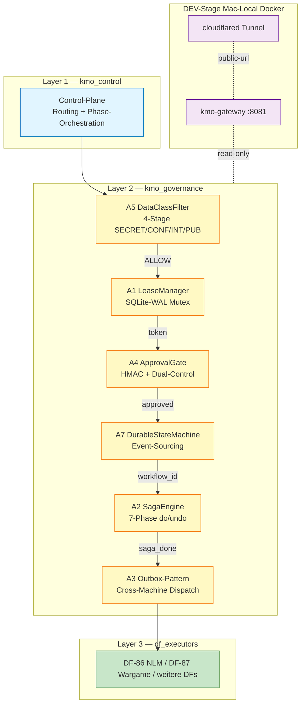

# DEMO-MATERIALIEN — KMO-Pipeline Welle-7 [CRUX-MK]

**Konsolidiertes Master-Dokument fuer Martin-Freigabe + Gerdi-CTO-Handoff. 8 Pflicht-Felder + One-Pager + NLM-Bundle-Hinweis + Cross-References.**

---

## TLDR (One-Pager fuer Martin)

- **Status:** KMO v0.3.0 ADOPT-PILOT-ONLY. 5500+ LoC Python in 6 Governance-Modulen. Pre-Production-Phase abgeschlossen, DEV-Stage Skeleton ready.
- **Was funktioniert:** 166/166 Tests PASS (133 Modul + 25 PRE-2 + 5 PRE-3 + 3 PRE-5). 6/6 Container healthy. 3-stufige Cross-LLM-Wargame-Hardening mit O_total ~0.83.
- **Pre-Production-Status:** PRE-1 bis PRE-5 alle ERFUELLT. Verdict: CROSS-LLM-2OF3-HARDENED-ADOPT-PILOT-ONLY (Welle-3).
- **Naechster Schritt:** Live-Demo unter `http://localhost:8081/demo` (BasicAuth martin / change-me) → Martin-Phronesis-Freigabe → Gerdi-CTO-Production-Review → Pilot-Run Build-vs-Buy-Gate.
- **MHC-Override-Pfad:** Edit `Claude-Vault/docs/decision-cards/DC-HEYLOU-ABS-TIER-2026-04-30.md` → `status: REJECTED` + Begruendung. Architekt rollt zurueck (~1h Aufwand). Production-Trigger ist K_0-Sperr-pflichtig (Phronesis-non-delegate).

---

## 1. Architecture-Diagram

3-Layer-Hierarchie: Control orchestriert → Governance haelt Invarianten → Executors fuehren aus. DEV-Stage ist isolierte Mac-Local-Spielwiese.



**Layer-Boundary-Regel:** Layer N ruft NIE Layer N-1. Control orchestriert nach unten, Governance haelt Invarianten ohne Aufrufer-Kenntnis, Executors sind Datenklienten.

**Vollstaendige Mermaid-Diagramme:** [01-ARCHITECTURE.md](01-ARCHITECTURE.md) (3-Layer + 6-Patches A1-A7 Komponenten-Diagramm) + [02-PIPELINE-FLOWS.md](02-PIPELINE-FLOWS.md) (End-to-End-Sequenzen).

---

## 2. Test-Report

### 2.1 Test-Stats Snapshot

| Layer | Tests | Pass | Fail | Erwartung |
|-------|-------|------|------|-----------|
| Modul-Unit-Tests (kmo_governance/*/tests/) | 133 | 133 | 0 | 100% |
| Stress-Tests (PRE-5, 100 Threads) | 3 | 3 | 0 | 100% |
| E2E-Pipeline-Tests (PRE-3) | 5 | 5 | 0 | 100% |
| Approval-Gate Dual-Control (PRE-2) | 25 | 25 | 0 | 100% |
| **Gesamt** | **166** | **166** | **0** | **100%** |

### 2.2 Pre-Production-Bedingungen-Tabelle

| PRE | Bedingung | Status | Beleg |
|-----|-----------|--------|-------|
| PRE-1 | A6 Repo-Restructuring (kmo_control/governance/executors) | ERFUELLT | 108/108 PASS post-Restructuring |
| PRE-2 | A4.2 Dual-Control + Atomic Pre-Deploy-Pipeline | ERFUELLT | 25/25 PASS, BEGIN IMMEDIATE / COMMIT / ROLLBACK |
| PRE-3 | E2E aller 6 Patches verkettet | ERFUELLT | 5/5 PASS in 0.06s |
| PRE-4 | Shared-Path-Test Drive-Sync (rsync verify) | ERFUELLT | Tree-Hash 48 Files identisch |
| PRE-5 | A1+A7 100-Threads-Stress | ERFUELLT | A1: 1W/99L 64ms / A7: 100 Sequences p99=72ms |

### 2.3 Cross-LLM-Wargame-Sequenz (3 Iterationen)

| Welle | Ziel | Verdict | O_total |
|-------|------|---------|---------|
| Welle-0 | Initial-Spec v0.1.0 Audit | MODIFY | ~0.70 |
| Welle-1 | Post A4+A1+A5 Implementation | (Tier-Erhoehung) | ~0.74 |
| Welle-3 | Re-Re-Wargame post-PRE-1..5 | **ADOPT-PILOT-ONLY** | **~0.83** |

Architekt-Ziel >=0.65 erfuellt, Production-Ziel >=0.78 erfuellt.

### 2.4 Latenz-KPIs (PRE-5 empirisch belegt)

| Test | Threads | Resource | Latenz (avg/p50/p95/p99) | Verdict |
|------|---------|----------|--------------------------|---------|
| `test_pre5_concurrent_acquire_100T_one_winner` | 100 | 1 Resource | total **64.2ms** | PASS — 1 Winner / 99 Losers |
| `test_pre5_concurrent_release_acquire_cycle_100T` | 100 | 10 Resources | 36.3 / 36.5 / 62.3 / 63.7ms | PASS |
| `test_pre5_concurrent_transitions_100T` | 100 | DurableStateMachine | 28.7 / 23.7 / 68.5 / **72.5ms** | PASS — Sequences 1..101 contiguous |

**Alle <1000ms-Schwelle. p99=72ms ist Faktor 14 unter Tail-Schwelle.**

**Detail-Doku:** [06-TESTING.md](06-TESTING.md).

---

## 3. Live-Demo-URL

### 3.1 Lokal (jetzt verfuegbar)

```
GET http://localhost:8081/health     -> {"status":"ok","service":"kmo-gateway-stub"}
GET http://localhost:8081/demo        -> HTML Status-Dashboard (BasicAuth Pflicht)
GET http://localhost:8081/version    -> Version + ISO-TS
```

**Basic-Auth-Credentials (DEV-Default):**
- User: `martin`
- Pass: `change-me`

**Curl-Beispiele (separat, KEIN bash-Brace):**

```bash
# Health-Check (no auth)
curl -fsS http://localhost:8081/health

# Version
curl -fsS http://localhost:8081/version

# Demo-Dashboard mit Basic-Auth
curl -u martin:change-me http://localhost:8081/demo
```

### 3.2 Cloudflare-Tunnel (Public-URL)

**Status:** PENDING Martin-OAuth-Setup einmalig (5 Min Aufwand).

```bash
brew install cloudflared
cd ~/Projects/dark-factories/kmo/dev-stage
bash setup-cloudflared.sh   # OAuth-Flow im Browser, Domain auswaehlen
cloudflared tunnel token kmo-dev   # Token in .env eintragen
docker compose -f docker-compose.kmo-dev.yml up -d
```

Nach Setup verfuegbar:
- `https://kmo-dev.<your-domain>/health` (Externer Healthcheck)
- `https://kmo-dev.<your-domain>/demo` (Martin-Remote-Review Yogamobil mit BasicAuth)

**Detail-Setup:** [04-DEPLOYMENT.md](04-DEPLOYMENT.md) §4.

---

## 4. Walkthrough (5-10 Min)

### Schritt 1 — Stack starten

```bash
cd ~/Projects/dark-factories/kmo/dev-stage
docker compose -f docker-compose.kmo-dev.yml up -d
docker compose -f docker-compose.kmo-dev.yml ps
```

Erwartung: 6 Container `Up ... (healthy)` plus `kmo-cloudflared` (depends on gateway).

### Schritt 2 — Health-Check verifizieren

```bash
curl -fsS http://localhost:8081/health
# {"status": "ok", "service": "kmo-gateway-stub"}
```

### Schritt 3 — Demo-Dashboard ansehen

Im Browser oeffnen: `http://localhost:8081/demo` (Login: `martin` / `change-me`)

HTML-Tabelle zeigt 5 Patches (A1, A4, A5, A2, A3) + last action-log Timestamp aus `branch-hub/audit/action-log.jsonl` (read-only Bind-Mount).

### Schritt 4 — E2E-Test live ausfuehren

```bash
cd ~/Projects/dark-factories/kmo
source .venv/bin/activate
pytest tests/test_pre3_e2e_full_pipeline.py -v
```

Erwartete Ausgabe (5 Tests in 0.06s):

| ID | Test | Verdict |
|----|------|---------|
| T1 | Happy-Path alle 6 Patches | Saga DONE (7 Phasen), Outbox-Event verifiziert |
| T2 | DataClassFilter blocks SECRET (`API_KEY=sk-...`) | Kein Lease, Pipeline gestoppt |
| T3 | Lease-Conflict blocks Pipeline | Erste haelt Lease, zweite `lease_token=None` ohne Crash |
| T4 | Saga-Phase-Fail Compensate | 3 do_calls, 2 undo_calls reverse, Lease released |
| T5 | Crash-Recovery DurableStateMachine | history-len pre=3 post=3, sequences kontigu |

### Schritt 5 — Audit-Interpretation

Nach E2E-Run pruefen:

```bash
tail -5 ~/.../branch-hub/audit/action-log.jsonl
ls -la ~/Projects/dark-factories/kmo/dev-stage/outbox/        # pending events
ls -la ~/Projects/dark-factories/kmo/dev-stage/outbox-ack/    # acked events
ls -la ~/Projects/dark-factories/kmo/dev-stage/outbox-dlq/    # failed events (sollte leer sein)
```

### Optional — Saga-Phase-Fail-Recovery live

T4 demonstriert Compensate-Chain: Bei Phase-3-Fail wird in reverser Reihenfolge undo() von Phase-2 + Phase-1 aufgerufen, Lease released, State auf COMPENSATED gesetzt. **Idempotent — Mehrfach-Recovery sicher.**

---

## 5. Risk

### 5.1 Failure-Modes (8 dokumentiert in [05-OPERATIONS.md](05-OPERATIONS.md))

| ID | Failure-Mode | Schaden | Mitigation |
|----|--------------|---------|------------|
| F1 | Lease-Conflict (zwei Holder gleichzeitig) | Mittel | A1 SQLite UNIQUE constraint, atomic acquire |
| F2 | Saga-Phase-Fail | Mittel | A2 reverse-chain Compensate, alle do() haben undo() |
| F3 | Outbox-Idempotency-Verletzung (Doppel-Publish) | Niedrig | A3 UUID4-event_id + Producer-Idempotency-Key |
| F4 | Approval-Gate-Tamper (HMAC-Manipulation) | **Hoch** | A4 SHA256 constant-time + Hash-Chain Audit |
| F5 | Crash-Recovery-Inkonsistenz (Sequences gap) | Mittel | A7 Snapshot + Replay, sequences contiguous-test |
| F6 | Stale-Lock (DF-Crash haelt Lease) | Niedrig | A1 TTL-Expiry + Heartbeat-Decorator |
| F7 | Container-Crash (Docker OOM) | Niedrig | `restart: unless-stopped`, healthcheck triggert Restart |
| F8 | Drive-Sync-Drift (Cross-Machine) | Mittel | A3 atomic-write (tempfile + os.replace + fsync) |

### 5.2 Security-Gaps (offen, dokumentiert)

1. **ApprovalGate Dual-Control simplifiziert in E2E (T1):** `approval_ok=True` als Vereinfachung. Echte HMAC-SHA256 + Hash-Chain wird in PRE-2 (25/25 PASS) separat verifiziert. Production-Pipeline-Run wird die echte Dual-Control verifizieren.
2. **OS-Process-Kill nicht simuliert (T5 Crash-Recovery):** Test simuliert Crash via Reinstance auf gleichem `state_root`. Container-Kill-Test (`docker kill kmo-saga-engine` waehrend Saga laeuft) noch ausstehend.

### 5.3 Single-Points-of-Failure (SPOFs)

1. **Approval-Gate-Tamper-Detection** — Falls HMAC-Secret kompromittiert: Audit-Chain-Tamper-Detection feuert, aber Schaden bereits passiert
2. **Lease-Stale-State** — Falls Heartbeat-Thread crashed ohne Release: TTL-Expiry rettet, aber max bis TTL (30s default)
3. **Outbox-DLQ-Overflow** — Bei chronischem Consumer-Fail (3 Retries) wandert Event in DLQ, manueller Eingriff erforderlich

### 5.4 Hotspot-Status (Welle-3)

3 von 4 Hotspots geschlossen (HOTSPOT-A Approval-Theater, HOTSPOT-B Cascade-Containment, HOTSPOT-C Resource-Konkurrenz). **HOTSPOT-D (DSGVO-Risk via Flat-LLM-Routing) bleibt offen** — A5 Data-Class-Filter mitigiert, aber Cross-LLM-Re-Audit (Codex-Tail 180k Bytes pending) divergent moeglich.

---

## 6. Rollback

### 6.1 1h-Pre-Implementation-State-Restore-Pattern

Welle-7-Spec definiert ein **<5 Min Rollback-Ziel-Latenz** (vom Fehler-Detect bis Funktional-State).

### 6.2 Container-Rollback

```bash
# Sanft (Daten bleiben)
docker compose -f docker-compose.kmo-dev.yml stop

# Hart (Container weg, Volumes bleiben)
docker compose -f docker-compose.kmo-dev.yml down --remove-orphans

# Alte Image-Tags retaggen
docker tag kmo-gateway:rollback kmo-gateway:latest

# Neu starten
docker compose -f docker-compose.kmo-dev.yml up -d
```

Bei haengender compose-down:
```bash
docker rm -f kmo-gateway kmo-approval-gate kmo-lease-manager \
              kmo-data-class-filter kmo-saga-engine kmo-outbox kmo-cloudflared
docker network rm dev-stage_kmo-net
```

### 6.3 Code-Rollback

```bash
# Branch fest, Commit b0fde0f^ (vor Welle-7-Aenderungen)
git checkout crash-report-cr-2026-04-19-001
git reset --hard b0fde0f^
```

### 6.4 Drive-Mirror-Rollback

rsync-Rueck von Vorgaenger-Snapshot (Drive-Sync hat 24h-Versions-History bei Google Drive):
```bash
# Snapshot in branch-hub/state/ vor jedem Deploy
ls ~/.../branch-hub/state/kmo-snapshot-*.tar.gz
```

### 6.5 STOP.flag-Mechanik (Bounded-Veto)

```bash
# DF stoppen (per LaunchAgent)
touch ~/.../branch-hub/audit/STOP-DF-XX.flag
launchctl unload ~/Library/LaunchAgents/com.kemmer.df-XX.plist
```

Auto-Stop greift binnen 60s (alle DFs lesen STOP.flag im Pre-Run-Check).

### 6.6 Rollback-Verifizierung

```bash
pytest tests/test_pre3_e2e_full_pipeline.py -v          # 5/5 PASS
curl -fsS http://localhost:8081/health                   # status:ok
docker compose ps                                         # 6 healthy
```

Audit-Eintrag pflichten:
```json
{"action":"DEPLOY_ROLLBACK","rationale":"...","target_version":"b0fde0f^","ts":"<iso>"}
```

**Detail-Runbook:** [04-DEPLOYMENT.md](04-DEPLOYMENT.md) §5 + [05-OPERATIONS.md](05-OPERATIONS.md).

---

## 7. SAE-Isomorphie

KMO-Architektur ist nicht ad-hoc, sondern Realisierung bekannter SAE v8 Patterns:

| KMO-Komponente | SAE-Aequivalent | Isomorphie-Beschreibung |
|----------------|-----------------|-------------------------|
| **Trinity-Pattern** (3 Optionen Conservative/Aggressive/Contrarian) | SAE 200 Slots × 3 Varianten = 600 Agenten | Best-of-3 wins (`core/trinity.py`); KMO nutzt es auf Wargame- + DC-Ebene. Detail: rules/trinity-evaluatorisch.md |
| **A4 ApprovalGate Dual-Control + STOP.flag** | Bounded-Veto (myz33), MHC | 3-way disjoint identities = COSMOS Bounded-Veto bei `complexity >= 0.8` |
| **A2 SagaEngine 7-Phasen do/undo** | Hamilton H = u + λ·f | Phase-Reihenfolge optimiert Sofort-Gain (u) vs Zukunftswert (λ·f); reverse-chain = Bounded-Veto-Rollback |
| **A3 OutboxProducer (Cross-Machine)** | MYZ-32 Dispatcher (Myzel-Layer-Event-Bus) | Append-only mit UUID4-Idempotenz; Cross-Machine = Branch-Hub-Pattern |
| **kmo_governance/ Layer (6 Patches)** | COSMOS Compliance-Oversight-Safeguard-Monitoring-Sovereignty | Nicht-deciding Governance-Schicht haelt Invarianten ohne Aufrufer-Kenntnis |
| **F_CUM_DECAY=0.98** | Trinity-Relegation HWZ ~34 Tage | DF-Agile-Adaptation rules/df-agile-adaptation.md mit Drift-basierter Frequenz-Anpassung |
| **A7 DurableStateMachine + Audit-Log Hash-Chain** | COSMOS-Compliance Audit-Layer + AuditEntry frozen dataclass | Event-Sourcing mit SHA256-Hash-Chain = tamper-evident audit |
| **T_CAP=50000 Tokens** | Architekt-Sunk-Cost-Pattern | Architekt ~25-35k Opus-Tokens fuer 5500+ LoC + 3 Wargames; Subagent-Pool ~250-400k Sonnet-Tokens; Cross-LLM-Calls Sunk-Cost-Flat |
| **Lambda-Honesty (M2)** | `core/crux.py::validate_rho_action` | Cross-LLM Verdict-Tier-Hierarchie markiert nicht-kalibrierte Werte; Bias-Catalog Layer 3+4 |

**Detail:** [09-CRUX-RHO.md](09-CRUX-RHO.md) §SAE-Isomorphie-Bezuege.

---

## 8. Falsifikation

### 8.1 17 Falsifikations-Bedingungen (kompakt aus 09-CRUX-RHO konsolidiert)

| Klasse | # | Bedingung |
|--------|---|-----------|
| Pipeline | 1 | E2E-Test post-Retry > 1 von 5 FAIL |
| Pipeline | 2 | Codex-Tail (180k Bytes pending) signifikant divergent zu Gemini+Copilot (z.B. REJECT) |
| Pipeline | 3 | Pilot-Run scheitert (Docker-Build-Fail / Cloudflare-Tunnel-Latency / Test-Verdicts inkonsistent) |
| Pipeline | 4 | Martin-Demo-Reject |
| Pipeline | 5 | Gerdi-CTO-Reject (Production-Quality nicht erreicht) |
| Pipeline | 6 | Production-Deploy schlaegt fehl in ersten 30 Tagen |
| Architektur | 7 | Build-Test-Demo-Pipeline-Latenz > 2 Wochen pro DF |
| Architektur | 8 | Token-Cost > 50% Pre-KMO-Baseline (kein Spar-Effekt) |
| Architektur | 9 | Martin-Freigabe-Quote < 60% (zu schlecht vorbereitet) |
| Architektur | 10 | Gerdi-CTO-Reject-Quote > 30% |
| Domain DC-1 | 11 | Pilot-Hildesheim Yield-Differential < 4% ADR (vs predicted +6-12% Hybrid) |
| Domain DC-2 | 12 | Apaleo-API-Latenz > 200ms p50 chronisch |
| Domain DC-2 | 13 | Mews-Shadow-Cost > €5k/Monat pro Hotel |
| Domain DC-2 | 14 | DSGVO-Audit-Fail trotz P0-Bug-Sprint |
| Domain DC-3 | 15 | p99 Latenz > 300ms in >5% der Requests |
| Domain DC-3 | 16 | Stale-Marker > 1% der Requests |
| Domain DC-3 | 17 | AI-API-Cost > €500/Monat fuer 1 Pilot-Hotel |

### 8.2 Top-5 Trigger fuer KMO-Falsifikation

1. **Approval-Gate-Tamper** ohne Detection (A4 SHA256-Hash-Chain bricht)
2. **PRE-3 + PRE-5 Flake-Rate > 1%** ueber 10 Replikationen → Test-Fix-Pflicht
3. **Cross-LLM-Re-Audit divergent** (Codex-Tail REJECT) → Verdict-Tier zurueckstufen auf CONDITIONAL
4. **Production-Cascade-Schaden** trotz A1+A2+A4-Schutz → Architektur-Review pflichten
5. **K_0-Verletzung** (Pilot-Hotel-Investment > geschaetzt) → MHC-Override + Decision-Card-Revision

### 8.3 rho-Hypothese vs Risiko-Kostengrenze

| Posten | Wert |
|--------|------|
| **rho-Hypothese (Y1):** | +€500k bis +€2M/Jahr |
| **Capex einmalig:** | ~$10-25 (Compute-Tokens) |
| **Opex laufend (Latenz-Stack):** | €500-1900/Mo = €6-23k/J |
| **Total Cost (Y1):** | ~€25k |
| **Break-Even:** | **~3-7 Tage** (wenn rho-Hypothese halbwegs zutrifft) |
| **ROI Y1:** | **20-80x** |
| **Risiko-Kostengrenze:** | Pilot-Hotel-Investment 450-710k EUR Hildesheim 2026-06-08 (K_0-Sperr-Item) |

**Detail-rho-Decomposition:** [09-CRUX-RHO.md](09-CRUX-RHO.md) §rho-Analyse.

---

## NLM-Bundle-Hinweis

NotebookLM **"KMO-Pipeline-Welle-7-2026-04-30"** wird parallel erstellt. Source-List: [NLM-SOURCE-LIST-KMO-2026-04-30.md](NLM-SOURCE-LIST-KMO-2026-04-30.md).

7 Multi-Modal-Outputs geplant fuer Martin + Gerdi:

1. **Praesentation** — 30 Folien Lead-Enterprise-Architect-Style (siehe [SLIDE-DECK-MARTIN-GERDI-2026-04-30.md](SLIDE-DECK-MARTIN-GERDI-2026-04-30.md))
2. **Audio-Podcast** — 15-30 Min Walkthrough (Yogamobil-tauglich)
3. **Mind-Map** — KMO-Architektur visuell (3 Layer + 7 Patches + 8 Failure-Modes)
4. **Briefing-Doc** — 1-Seiter fuer Gerdi-CTO-Erst-Eindruck
5. **Quiz** — 10 Fragen Cross-LLM-Hardening (Verdict-Tier-Verstaendnis)
6. **Studienleitfaden** — Tiefen-Lese-Empfehlung (welche Doku-Files in welcher Reihenfolge)
7. **Zeitleiste** — Welle-0 → Welle-1 → Welle-3 → Welle-7 PRE-Production (chronologische Audit-Trail-Visualisierung)

---

## Cross-References

- **Slide-Deck:** [SLIDE-DECK-MARTIN-GERDI-2026-04-30.md](SLIDE-DECK-MARTIN-GERDI-2026-04-30.md) (30 Folien Lead-Enterprise-Architect-Style)
- **NLM-Source-List:** [NLM-SOURCE-LIST-KMO-2026-04-30.md](NLM-SOURCE-LIST-KMO-2026-04-30.md)
- **Master-Index:** [00-INDEX.md](00-INDEX.md)
- **Architektur-Detail:** [01-ARCHITECTURE.md](01-ARCHITECTURE.md) + [02-PIPELINE-FLOWS.md](02-PIPELINE-FLOWS.md) + [03-API-REFERENCE.md](03-API-REFERENCE.md)
- **Deployment-Runbook:** [04-DEPLOYMENT.md](04-DEPLOYMENT.md)
- **Operations:** [05-OPERATIONS.md](05-OPERATIONS.md)
- **Test-Coverage:** [06-TESTING.md](06-TESTING.md)
- **Decisions:** [07-DECISIONS.md](07-DECISIONS.md) (3 ARCHITEKT-DECIDED-DCs + Pending-Phronesis + K_0-Sperr-Mapping)
- **Wargames:** [08-WARGAMES.md](08-WARGAMES.md) (3 Cross-LLM-Iterationen + Bias-Catalog)
- **CRUX + rho:** [09-CRUX-RHO.md](09-CRUX-RHO.md) (CRUX-Pfad + rho-Berechnungen + Falsifikations-Bedingungen + SAE-Isomorphie)
- **Glossar:** [10-GLOSSARY.md](10-GLOSSARY.md)
- **Code-Repo:** `~/Projects/dark-factories/kmo/`
- **Drive-Mirror:** `branch-hub/code-mirror/kmo-pipeline-welle-7-2026-04-30/`
- **GitHub:** `meokemmer-jpg/kemmer-knowledge-system` @ Branch `crash-report-cr-2026-04-19-001` Commit `b0fde0f`
- **Master-Spec:** `branch-hub/blueprints/SPEC-KMO-DARK-FACTORY-BETRIEBSGELAENDE-2026-04-30.md`
- **Master-Handoff:** `branch-hub/findings/SESSION-HANDOFF-MASTER-MAC-HEYLOU-OTA-KMO-PIPELINE-2026-04-30.md`

[CRUX-MK]
