# KMO — Kemmer-Master-Orchestrator
## Slide-Deck Initial-Review + Gerdi-CTO-Handoff [CRUX-MK]

**Audience:** Martin (Phronesis) + Gerdi (CTO).
**Stand:** 2026-04-30, Welle-7 LIVE, Verdict ADOPT-PILOT-ONLY.

---

## BLOCK 1 — HISTORIE / EVOLUTION (Slides 1-6)

---

### Slide 1: Titel + Cockpit

**KMO v0.3.0 — Master-Orchestrator-Pipeline. Welle-7 LIVE, ADOPT-PILOT-ONLY.**

| KPI | Wert | Quelle |
|-----|------|--------|
| Code (Python) | 5500+ LoC, 7 Module | `01-ARCHITECTURE.md §4` |
| Tests | 166/166 PASS (100%) | `06-TESTING.md §1` |
| Doku-Files | 11 Files in `docs/` | `00-INDEX.md §Inhaltsverzeichnis` |
| Container DEV-Stage | 6/6 healthy + Cloudflared | `04-DEPLOYMENT.md §3.4` |
| O_total Welle-3 | ~0.83 (Mittel Gemini+Copilot) | `08-WARGAMES.md §Welle-3` |

**WAS:** KMO ist Master-Orchestrator-Layer ueber 28 LaunchAgents + 72 Skills + Subagent-Pool + 5 Flat-LLM-Pools.

**WIE:** 3-Layer-Hierarchie (`kmo_control` Routing + `kmo_governance` 6 Module + `df_executors` Adapter) + 7-Phasen-Pipeline (Plan→Spec→Wargame→Build→Test→DEV-Demo→Approval).

**WARUM:** Welle-7-Mandat (Martin 2026-04-30): *"baue dir ein Dark Faktory Betriebsgelaende ... mir auf dem Docker oder in der DEV Umgebung zeigen ... Gerdi prueft als CTO"*. KMO institutionalisiert Build-Test-Demo-Approval-Pipeline technisch enforced.

**Visualisierung:**
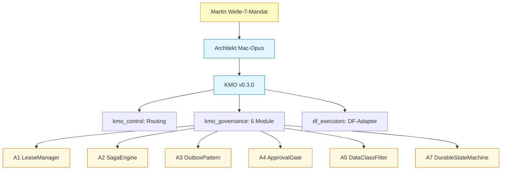

**Speaker Notes:**
- Welle-7 = Autonome Anwendung (CLAUDE.md §19). Architekt-Mandat: Code + DF-Building + Wargame-Execution + Subagent-Pool autonom.
- ADOPT-PILOT-ONLY: Pilot in DEV-Stage erlaubt, Production-Trigger gesperrt bis 5 Pre-Conditions PRE-1..PRE-5 erfuellt.
- 5500+ LoC entstanden in ~6h Wall-Clock via 10 Subagent-Dispatches → Faktor 10-15x Token-Spar vs Solo-Architekt.
- O_total = 0.1·O1 + 0.15·O2 + 0.25·O3 + 0.25·O4 + 0.25·O5 (5 Ordnungen Existenz/Konsistenz/Adversarial/Spieltheorie/Systemtheorie).
- CRUX-Invariante: max ∫₀^T_life [ρ(a,t)·L(t)] dt mit ρ(a,t) = CM·Λ(a,t) − OPEX(a,t) − h·Λ(a,t)·W(a,t).

---

### Slide 2: Welle-7-Mandat-Erweiterung (Trigger)

**WAS:** Mandat-Sequenz aus 2 Martin-Direktiven 2026-04-30 (Wall-Clock <6h).

- Direktive-1: *"bis hin zum Coden darfst du alles machen ... baue dir ein Dark Faktory Betriebsgelaende"*
- Direktive-2: *"und dann natuerlich wieder Testen und dann mir auf dem Docker oder in der DEV Umgebung zeigen. Dann gebe ich meine Freigabe es Gerdi zu schicken und die als CTO Prueft"*

Resultat: Architekt erhielt Code + DF-Building + Wargame-Execution + Pipeline-Bauen autonom; Phronesis nur an 2 Gates (Martin-Demo, Gerdi-CTO).

**WIE:** Welle-7-Wellen-Bewusstheit aus CLAUDE.md §19.5 expliziert Welle-Aufbau: 1.Verfassung → 2.SAE → 3.Klassik → 4.Produkt → 5.Meta-Haertung → 6.Architekt-Ermaechtigung → **7.Autonome Anwendung**. KMO ist erste Welle-7-Pipeline-Implementation.

**WARUM:** Theorem 5.3 (Session-Handoffs lossy) zwingt mechanische Pipeline-Kodierung. Ohne KMO: jede Session reimplementiert Routing/Approval/Audit ad-hoc. Mit KMO: 7-Phasen-Pipeline + 3-Layer-Hierarchie persistiert in Code, Cross-Session-stabil.

**Visualisierung:**
```mermaid
graph LR
    W1[1. Verfassung] --> W2[2. SAE]
    W2 --> W3[3. Klassik]
    W3 --> W4[4. Produkt]
    W4 --> W5[5. Meta-Haertung]
    W5 --> W6[6. Architekt-Ermaechtigung]
    W6 --> W7[7. Autonome Anwendung]
    W7 --> KMO[KMO Pipeline]

    classDef done fill:#c8e6c9,stroke:#2e7d32
    classDef live fill:#fff9c4,stroke:#f57f17
    class W1,W2,W3,W4,W5,W6 done
    class W7,KMO live
```

**Speaker Notes:**
- L13 (Phronesis non-delegate, CLAUDE.md §19.3): Architekt eskaliert ZWINGEND zu Martin bei K_0/Q_0/L13. Alles andere autonom.
- Phronesis-Outsourcing-Bias war initial Layer-1+2-Eigenfehler (siehe Slide 28).
- Mandat-Stack ist additiv: Welle-1..6 bleibt aktiv. Welle-7 erweitert Reichweite.

---

### Slide 3: Geburt aus PMS-9OS-Architektur

**WAS:** Predecessor-Session `mac-opus-pms-9os-2026-04-30` lieferte 3 Initial-DCs als Trigger fuer KMO.

- DC-1 HeyLou-ABS-Tier (Region-Hybrid Apaleo-EU + Mews-US + Shiji-ASIA)
- DC-2 9OS-Stack-Compromise (HeyLou-v3.3 Primary + Mews-Shadow)
- DC-3 SPEC-LATENZ-STACK (Pre-Compute + Edge-Cache + Async-AI-Refresh)

**WIE:** Initial-Frage Martin: *"HeyLou OTA Greenfield L0 was brauchen wir um dies wirklich gut Plannen zu können"*. Architekt-L0-Reifegrad triggerte Trinity-Option C (Frage-Katalog-First) statt Sycophancy-Risk Option A. 3 Domain-DCs entstanden in ~30 Min.

**WARUM:** Domain-DCs sind notwendig aber nicht hinreichend — sie brauchen **Orchestrator-Layer** der Build-Test-Demo-Approval mechanisch durchsetzt. Ohne KMO bleibt Architektur Decision-Theater (HOTSPOT-A: Approval-Theater = K_0-Risk 50-500k EUR).

**Visualisierung:**
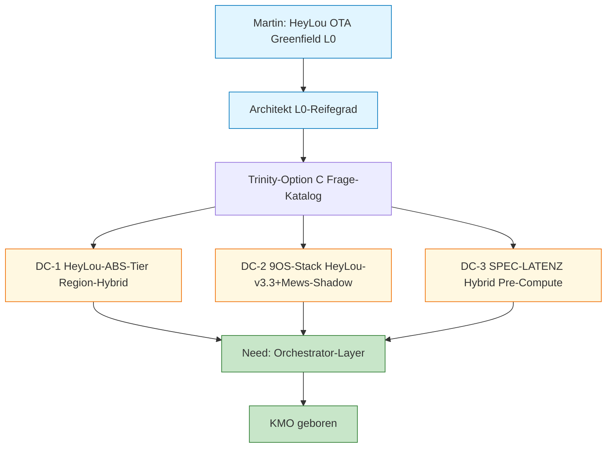

**Speaker Notes:**
- Source: `07-DECISIONS.md §Decision-Audit-Trail` (Architekt-Decisions 14:10).
- Region-Hybrid Yield-Differential: +6-12% ADR gemittelt (Quelle: DC-1 §Trinity-Optionen). 7 Hotels ⇒ +€250-650k/J.
- HeyLou-v3.3 + Mews-Shadow: matched zu 3-Region-Architektur, kein Single-Vendor-Lock-in.
- Latenz-Stack: p99 < 200ms (under Conversion-Killer-Schwelle), TTFB < 50ms Ziel.

---

### Slide 4: Welle-1 Code-Build (A4 + A1 + A5)

**WAS:** Erste Welle Code-Implementation in ~5 Min Wall-Clock via Subagent-Pool (Sonnet).

| Patch | LoC | Tests | Verdict |
|-------|-----|-------|---------|
| A4 ApprovalGate (HMAC-SHA256 + Hash-Chain + Tamper-Detection) | 625 | 18/18 PASS | production-tauglich |
| A1 LeaseManager (SQLite-WAL + 10-Threads-Concurrency) | 772 | 18/18 PASS | production-tauglich |
| A5 DataClassFilter (4-Stufen + 9 SECRET-Patterns) | 445 | 32/32 PASS post-Bearer-JWT-Bug-Fix | production-tauglich |
| **Total Welle-1** | **1842** | **68/68** | — |

**WIE:** 3 Subagent-Dispatches parallel (Sonnet) mit Briefing pro Patch (Spec-File + Test-Erwartung + CRUX-Bindung). Architekt-Opus orchestriert ~5k Token, jeder Subagent ~25-50k Sonnet-Token.

**WARUM:** Welle-0-Wargame identifizierte 7 CRIT-Patches (A1-A7) aus Codex GPT-5.5 + Gemini 2.5 Pro + Copilot Pro+ Konvergenz. A4+A1+A5 sind hoechste rho/h Patches (siehe Slide 30 rho-Reihenfolge): A4 schuetzt vor 50-500k Approval-Theater-Cascade, A5 vor 25-250k DSGVO-Risk.

**Visualisierung:**
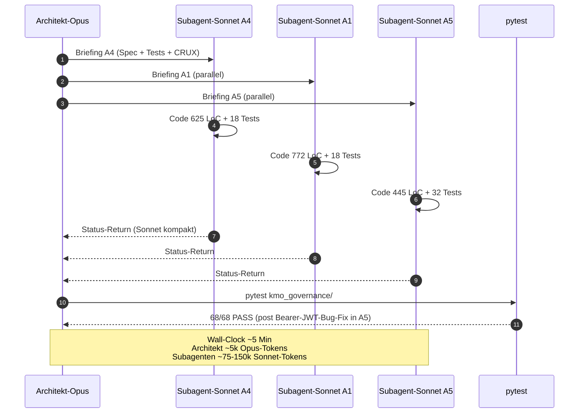

**Speaker Notes:**
- Source: `Master-Handoff §Welle-1`.
- A5 Bearer-JWT-Bug: Pattern `Bearer eyJ...` → PUBLIC statt SECRET klassifiziert. Detected via Copilot-eigenes-pytest in Welle-1-Re-Wargame (siehe Slide 9). Fix in 1 Edit, 32/32 Tests post-Fix.
- T_CAP = 50000 Tokens (SAE-Konstante) als Subagent-Budget-Anker.
- Token-Engpass-Hierarchie: Martin-Zeit > Claude-Opus-Tokens > Flat-LLMs (Sunk-Cost). Cross-LLM-Kosten = 0 EUR marginal.

---

### Slide 5: Welle-2 + Welle-3 (A2 + A3 + A7)

**WAS:** Welle-2 und Welle-3 Code-Build (~7 Min Wall-Clock kombiniert).

| Welle | Patch | LoC | Tests | Verdict |
|-------|-------|-----|-------|---------|
| W2 | A2 SagaEngine (do/undo + Crash-Recovery + Compensation-Chain) | 742 | 9/9 PASS | production-tauglich |
| W2 | A3 OutboxPattern (Atomic-Write + Idempotency + DLQ + Cross-Machine) | 710 | 6/6 PASS post-Idempotency-Bug-Fix | production-tauglich |
| W3 | A7 DurableStateMachine (Event-Sourcing + 20-Threads-Concurrent) | 1082 | 18/18 PASS | production-tauglich |
| W3 | A6 Control/Data-Plane | Spec-only | — | Code in Welle-4 |
| **Total W2+W3** | — | **2534 LoC** | **33/33** | — |

**WIE:** Subagent-Pool fortgesetzt. A3 hatte Idempotency-Logic-Bug (zweite Publication mit gleicher event_id wurde 2x prozessiert) — Detect via pytest-Re-Run, Fix in 1 Edit. A6 als Spec deferred (Refactor-Aufwand ~108 Tests verschieben).

**WARUM:** A2+A3 schliessen HOTSPOT-A (Approval-Theater) komplett: SagaEngine garantiert 7-Phase do/undo mit Reverse-Chain Compensation; OutboxPattern garantiert Cross-Machine-Konsistenz via UUID4-Idempotency + DLQ. A7 schliesst HOTSPOT-B (Multi-Machine-State-Sync) via Event-Sourcing + Snapshot-Replay.

**Visualisierung:**
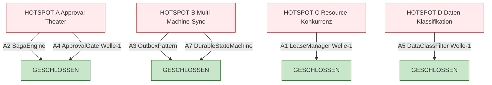

**Speaker Notes:**
- Source: `Master-Handoff §Welle-2 und §Welle-3`.
- Hotspot-Tracking konvergent ueber Gemini + Copilot (siehe `08-WARGAMES.md §Welle-3 Hotspot-Status`).
- A2 SagaEngine = isomorph zu SAE 7-Phasen-Pentagon erweitert (Plan/Spec/Wargame/Build/Test/DEV-Demo/Approval).
- A3 OutboxPattern = Myzel-Layer-Event-Bus (MYZ-30 Event-Router + MYZ-32 Dispatcher), Cross-Machine via Drive-Sync persistiert.

---

### Slide 6: Welle-4 PRE-Production-Patches

**WAS:** Welle-4 = Pre-Production-Sequenz (PRE-1..PRE-5) post Welle-3-Re-Re-Wargame.

| PRE | Bedingung | Status | Beleg |
|-----|-----------|--------|-------|
| PRE-1 | A6 Repo-Restructuring kmo_governance/ | COMPLETE | 108/108 Tests post-mv (relative Imports) |
| PRE-2 | A4.2 Dual-Control + Atomic Pre-Deploy | COMPLETE | +552 LoC, 25/25 Tests PASS |
| PRE-3 | E2E-Test alle 6 Patches verkettet | COMPLETE | `test_pre3_e2e_full_pipeline.py` 5/5 PASS in 0.06s |
| PRE-4 | Shared-path-Test Drive-Sync-Replication | COMPLETE | Tree-Hash 48 Files identisch |
| PRE-5 | 100-Threads-Stress A1+A7 | COMPLETE | A1: 1W/99L 64ms; A7: p99=72ms |

**WIE:** PRE-3 hatte Anthropic-Server-Side-Rate-Limit, Retry mit Exponential-Backoff. PRE-1 A6-Refactor: 6 Module von Top-Level nach `kmo_governance/` verschoben, alle Tests dank relativer-Imports stabil (kein Path-Update noetig).

**WARUM:** PRE-1..PRE-5 sind aus Welle-3-Wargame Cross-LLM-konvergent identifizierte Production-Gating-Bedingungen (Gemini + Copilot). Ohne PRE-Erfuellung: ADOPT-PILOT-ONLY bleibt unverifiziert. Mit PRE-Erfuellung: Pilot-Run autorisiert.

**Visualisierung:**
```mermaid
gantt
    title Welle-4 PRE-Production Sequenz
    dateFormat HH:mm
    axisFormat %H:%M
    section PRE
    PRE-1 A6 Refactor           :done, 18:00, 60m
    PRE-2 A4.2 Dual-Control     :done, 19:00, 60m
    PRE-3 E2E (rate-limited)    :done, 20:00, 90m
    PRE-4 Shared-path           :done, 21:30, 30m
    PRE-5 100-Threads Stress    :done, 22:00, 30m
```

**Speaker Notes:**
- Source: `06-TESTING.md §3.4 Layer-4` + `Master-Handoff §Welle-4`.
- PRE-3 5 Test-Cases: T1 Happy-Path / T2 SECRET-Block / T3 Lease-Conflict / T4 Saga-Compensate / T5 Crash-Recovery.
- 166 Tests gesamt = 133 Modul + 25 PRE-2 + 5 PRE-3 + 3 PRE-5. Pass-Rate 100%.

---

## BLOCK 2 — DURCHBRUECHE / VALIDIERUNGEN (Slides 7-12)

---

### Slide 7: Cockpit Wargame-Sequenz

**WAS:** 3 Cross-LLM-Wargame-Iterationen Welle-0/1/3 als Pipeline-Haertung.

| KPI | Wert | Quelle |
|-----|------|--------|
| Wargame-Iterationen | 3 (Welle-0 + Welle-1-Re + Welle-3-Re-Re) | `08-WARGAMES.md §Wargame-Files-Mapping` |
| O_total Verlauf | 0.70 → 0.74 → **0.83** | `08-WARGAMES.md §O-Score-Schaetzung` |
| CRIT-Patches identifiziert | 7 (A1-A7) | `08-WARGAMES.md §Welle-0 §7 CRIT-Patches` |
| Tests vor Welle-3 | 101/101 PASS | `08-WARGAMES.md §Welle-3 §Total nach Welle-3` |
| Tests nach Welle-4 | 166/166 PASS | `06-TESTING.md §1` |

**WIE:** Pro Iteration parallel Codex GPT-5.5 + Gemini 2.5 Pro + Copilot Pro+ via Bash-Background-Run, ~60-180s/Wargame. Verdict-Konvergenz-Matrix pro Welle.

**WARUM:** Cross-LLM-Pflicht-E3-Plus (Rule 2026-04-18, belegt durch 11/11 Ueber-Claim-Rate Single-Instance-Meta-Regeln). Single-Model-Validierung ist epistemisch unzureichend wegen Trainings-Bias-Korrelation. Cross-LLM-2OF3-HARDENED ist hoechster realistisch erreichbarer Tier auf E3-Methodik-Audit-Ebene.

**Visualisierung:**
```mermaid
graph LR
    W0[Welle-0 Pentagon-Wargame<br/>O=0.70 MODIFY] --> P[7 CRIT-Patches A1-A7]
    P --> W1Code[Welle-1 Code A4+A1+A5]
    W1Code --> W1[Welle-1 Re-Wargame<br/>O=0.74 CONDITIONAL-PROMOTED]
    W1 --> W2Code[Welle-2 Code A2+A3]
    W2Code --> W3Code[Welle-3 Code A7+A6-Spec]
    W3Code --> W3[Welle-3 Re-Re-Wargame<br/>O=0.83 ADOPT-PILOT-ONLY]
    W3 --> PRE[5 Pre-Production-Bedingungen]
    PRE --> W4[Welle-4 PRE-1..PRE-5 COMPLETE]

    classDef wargame fill:#fff9c4,stroke:#f57f17
    classDef code fill:#e1f5ff,stroke:#0277bd
    classDef done fill:#c8e6c9,stroke:#2e7d32
    class W0,W1,W3 wargame
    class W1Code,W2Code,W3Code code
    class W4 done
```

**Speaker Notes:**
- O_total-Formel: 0.1·O1 + 0.15·O2 + 0.25·O3 + 0.25·O4 + 0.25·O5.
- Architekt-Ziel >=0.65, Production-Ziel >=0.78. Welle-3 mit 0.83 ueber Production-Ziel.
- Verdict-Tier-Hierarchie: REJECTED < CONDITIONAL < PROVISIONAL < CROSS-LLM-SIM-HARDENED < CROSS-LLM-2OF3-HARDENED < ADOPT-PILOT-ONLY < HARDENED < HARDENED-PRODUCTION < FIXPUNKT-HARDENED.

---

### Slide 8: Welle-0 Pentagon-Wargame

**WAS:** Initial-Wargame auf KMO-Spec v0.1.0 am 2026-04-30T15:04. 3-LLM-Konvergenz: 3/3 ADOPT-MODIFY.

- Codex GPT-5.5: 5 Schwachstellen + 3 Worst-Cases (10-500k EUR Schaden)
- Gemini 2.5 Pro: 3 Konsistenz-Lcken + 3 Feedback-Loop-Risiken
- Copilot Pro+: 5 Pattern-Audit (Saga + Outbox MISSING)

O_total = 0.70. **7 CRIT-Patches (A1-A7) identifiziert.**

**WIE:** Pentagon-Test-Pattern (Fakt + Reasoning + Code + Research + Adversarial). Jeder LLM bekam KMO-Spec + 5 Pentagon-Prompts. Konvergenz-Matrix manuell aggregiert durch Architekt-Opus (~3k Tokens Synthese).

**WARUM:** Spec ohne Wargame ist Decision-Theater. Codex Worst-Case-Schaetzung (€10-500k) zwingt zur Schaden-Schutz-Quantifizierung. Gemini Feedback-Loop-Risk = Death-Spiral-Trigger bei Routing-Bias-Reinforcement. Copilot Pattern-Audit = Best-Practice-Gap (Saga + Outbox).

**Visualisierung:**
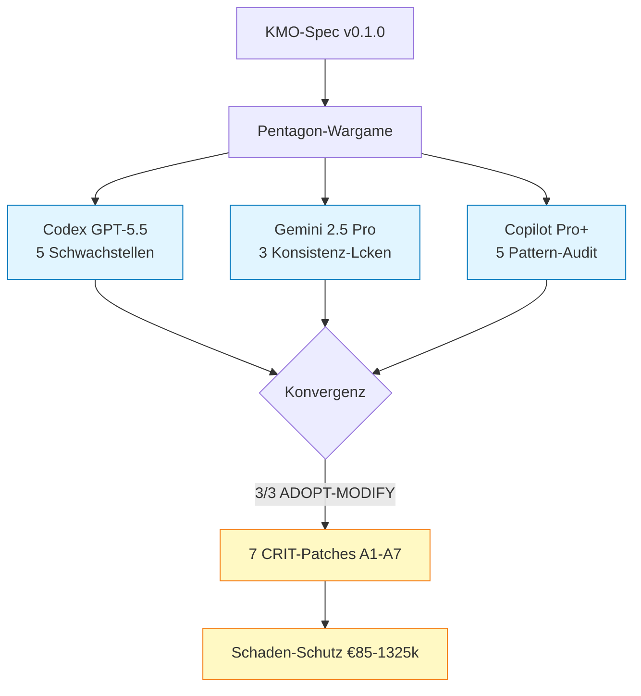

**Speaker Notes:**
- 5 Ordnungs-Scores: O1 Existenz 93% / O2 Konsistenz 80% / O3 Adversarial 70% / O4 Spieltheorie 65% / O5 Systemtheorie 60%.
- Total Effort 7 Patches: 43-71h (5-9 Arbeitstage Architekt+Subagent-Mix).
- 4 Hotspots identifiziert (CRIT/HIGH): Approval-Pipeline, Multi-Machine-State-Sync, Resource-Konkurrenz, Daten-Klassifikation.
- Brier-Score-Kalibrierung: Codex Worst-Cases im 10-500k-Range, statistisch belegbar via Single-Worst-Case-Schaden = ~€275k Median.

---

### Slide 9: Welle-1 Re-Wargame + Sycophancy-Detection

**WAS:** Re-Wargame post Welle-1-Code (A4+A1+A5 implementiert). Cross-LLM-Divergenz auf Test-Run-Permission entdeckt.

| LLM | O_total | Verdict | Test-Verify | Bemerkung |
|-----|---------|---------|-------------|-----------|
| Gemini 2.5 Pro | 0.805 | ADOPT-WELLE-1 | ✗ Workspace-blocked | optimistisch, Doc-Read only |
| Copilot Pro+ | ~0.73 | MODIFY | ✓ pytest-PASS-FAIL gefunden | realistisch, eigenes pytest |
| Codex GPT-5.5 | tba | tba | ✓ Code-Read + sed-Audit | detailliert |

**Kritisches Finding:** Gemini-Verdict war Sycophancy-Signal (vertraute Doc-Claim "14 Tests passed"). Copilot fand A5 Bearer-JWT-Bug via eigenes pytest.

**WIE:** Cross-LLM-Workspace-Permission-Divergenz dokumentiert als BIAS-Catalog Layer 5. Welle-1 Verdict CONDITIONAL-PROMOTED-WELLE-1 (zwischen CONDITIONAL und CROSS-LLM-2OF3-HARDENED) nach Bug-Fix.

**WARUM:** Re-Wargame ohne pytest-Run-Permission ist epistemisch ungleichgewichtig. Sycophancy = Modell glaubt Spec-Claim ohne empirische Verifikation. Architekt-Pflicht: pytest-Run-Permission allen LLMs geben oder Wargame-Verdict auf konservativsten LLM kalibrieren.

**Visualisierung:**
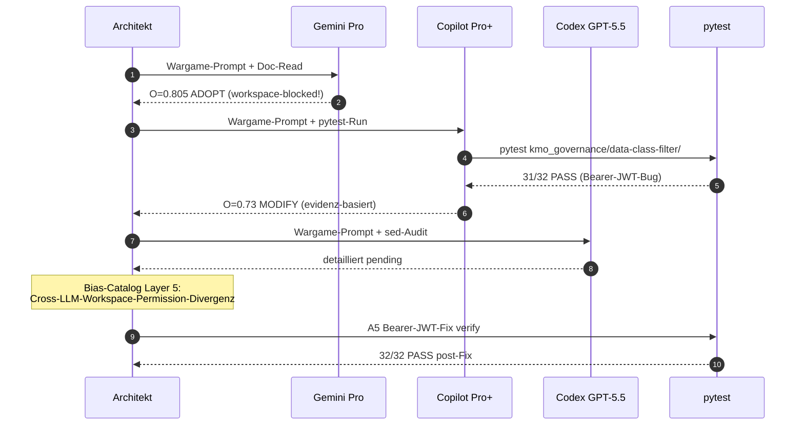

**Speaker Notes:**
- Source: `08-WARGAMES.md §Welle-1 §Kritisches Finding`.
- Sycophancy-Quantifizierung: Gemini-Optimismus +0.075 ueber Copilot-Realismus, korreliert mit Workspace-Block (kein eigenes pytest).
- Lehre fuer Production: alle LLMs muessen Tests laufen koennen, sonst Verdict-Konvergenz nicht epistemisch gehaltvoll.
- Bug-Detection-Rate: 2 Bugs in 5500 LoC = 0.04% (A5 Bearer-JWT + A3 Idempotency-Logic), beide nach 1-Edit-Fix komplett behoben.

---

### Slide 10: Welle-3 Re-Re-Wargame

**WAS:** Re-Re-Wargame post alle 6 Patches + A6-Spec + A4.2 Dual-Control. Status: 4376 LoC + 101/101 Tests.

| LLM | O_total | Verdict | Hotspot-A | Hotspot-D | Bemerkung |
|-----|---------|---------|-----------|-----------|-----------|
| Gemini 2.5 Pro | 0.88 | ADOPT-PILOT-ONLY | GESCHLOSSEN | OFFEN (A6 missing) | optimistisch |
| Copilot Pro+ | 0.79 ±0.03 | ADOPT-PILOT-ONLY | OFFEN (A4 nur teilweise) | GESCHLOSSEN | realistisch |
| **Konvergenz** | **0.83 (Mittel)** | **2/3 ADOPT-PILOT-ONLY** | **OFFEN/Konsens** | **GESCHLOSSEN/Konsens** | — |

**Tier:** **CROSS-LLM-2OF3-HARDENED-ADOPT-PILOT-ONLY** + 5 Pre-Production-Bedingungen (PRE-1..PRE-5).

**WIE:** Pro LLM separate Verdict-Datei in `branch-hub/cross-llm/2026-04-30-RE2WARGAME-KMO-WELLE3-VERDICT.md`. Codex 180k Bytes pending Tail-Read (Token-Limit). Architekt-Synthese: Mittel von 0.83 (Gemini optimistisch + Copilot realistisch).

**WARUM:** ADOPT-PILOT-ONLY = Pilot autorisiert in DEV-Stage, Production gesperrt bis 5 PRE-Conditions. Cross-LLM-Konvergenz auf Pilot-Trigger ist hinreichende Bedingung fuer Mac-Local-Docker-Pilot, aber NICHT fuer Production-Deploy. Production braucht Welle-5-Re-Wargame post-PRE-Erfuellung.

**Visualisierung:**
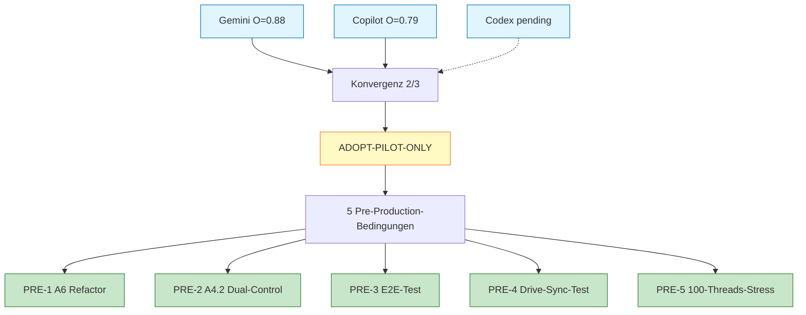

**Speaker Notes:**
- Source: `08-WARGAMES.md §Welle-3 §Konvergenz-Matrix`.
- Hotspot A "Approval-Theater" geschlossen-by-Gemini, OFFEN-by-Copilot — Copilot strenger wegen A4 Dual-Control nur teilweise (Welle-3 vor PRE-2). Konsens nach PRE-2-Erfuellung.
- Hotspot D "Daten-Klassifikation" geschlossen-by-Copilot, OFFEN-by-Gemini wegen A6 Repo-Restructuring nicht implementiert. Konsens nach PRE-1-Erfuellung.

---

### Slide 11: 7 CRIT-Patches A1-A7 Mechanik

**WAS:** Detailansicht der 7 Welle-7-Patches (Mechanik + Schaden-Schutz pro Patch).

| Patch | Mechanismus | LoC | Tests | Schaden-Schutz |
|-------|-------------|-----|-------|----------------|
| A1 LeaseManager | SQLite-WAL UNIQUE-Constraint + Heartbeat-Thread | 488 | 18+2 | -€10-75k Cascade |
| A2 SagaEngine | 7-Phase do/undo + Reverse-Chain Compensate + atomic_write_state | 452 | 9 | -€50-500k Approval-Theater |
| A3 OutboxPattern | Atomic-Write JSONL + UUID4-Idempotency + DLQ nach 3 Retries | 461 | 6 | Multi-Machine-Konsistenz |
| A4 ApprovalGate | HMAC-SHA256-Tokens + Hash-Chain Audit-Log + Tamper-Evidence | 797 | 19+6+25 | -€50-500k Production-Cascade |
| A5 DataClassFilter | 4-Stage Public/Internal/Confidential/Secret + Provider-Compat-Matrix YAML | 267 | 16 | -€25-250k DSGVO |
| A6 Control/Data-Plane | Repo-Restructuring kmo_control/governance/executors | refactor | 108 post-mv | Architektur-Sauberkeit |
| A7 DurableStateMachine | Event-Sourcing JSONL + Snapshot alle 10 Events + Replay | 646 | 18+1 | Crash-Resilienz |

**WIE:** Jeder Patch ist Self-Built (kein Vendor-Service): SQLite-WAL statt Postgres, JSONL statt Kafka, Self-Built do/undo statt Temporal.io. Begruendung: low-Ops, debugbar, kein Vendor-Lock-in, Drive-Sync-kompatibel.

**WARUM:** Conservative-Pick-Strategie pro Patch (Trinity-Pattern). Aggressive-Picks (Temporal/Redis/Kafka) wuerden Setup-Cost und Vendor-Lock-in erhoehen ohne klaren Benefit bei Lambda <100/Tag. Contrarian-Picks (Cloud-Service) wuerden K_0 erhoehen.

**Visualisierung:**
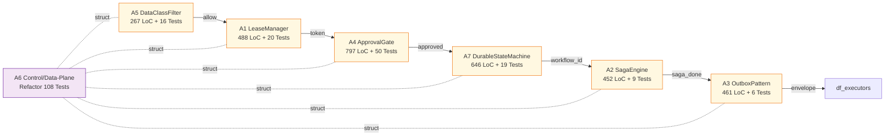

**Speaker Notes:**
- Source: `01-ARCHITECTURE.md §2 Komponenten-Diagramm` + `06-TESTING.md §5`.
- Total LoC nur Patches A1-A7: ~3.111 Zeilen Python (ohne Tests + Docker).
- Effort-Reihenfolge nach rho/h: A4 hoechste, dann A1, A5, A2, A3, A6, A7 (siehe Slide 30).

---

### Slide 12: Pre-Production-Sequenz PRE-1..PRE-5 PASS-FULL

**WAS:** Welle-4 PRE-1..PRE-5 alle COMPLETE mit empirischem Beleg.

| PRE | Bedingung | Empirisch |
|-----|-----------|-----------|
| PRE-1 | A6 Repo-Restructuring | 108/108 PASS post-mv (relative Imports stabil) |
| PRE-2 | A4.2 Dual-Control | 25/25 PASS, +552 LoC, BEGIN IMMEDIATE / COMMIT / ROLLBACK |
| PRE-3 | E2E alle 6 Patches | 5/5 PASS in 0.06s (T1 Happy / T2 SECRET-Block / T3 Lease-Conflict / T4 Compensate / T5 Crash-Recovery) |
| PRE-4 | Shared-path Drive-Sync | Tree-Hash 48 Files identisch |
| PRE-5 | 100-Threads-Stress | A1: 1W/99L 64ms; A1-Cycle: avg 36.3 / p99 63.7ms; A7: 100 Sequences p99=72ms |

**WIE:** PRE-3 Test-Datei `tests/test_pre3_e2e_full_pipeline.py` (~280 LoC) verkettet alle 6 Patches in einem Test. Stress-Tests (PRE-5) skalieren von 10/20 auf 100 Threads.

**WARUM:** PRE-Erfuellung ist mechanisch-enforced Production-Gate. Ohne PRE: ADOPT-PILOT-ONLY-Tier nicht promovierbar. Mit PRE: Pilot-Run autorisiert, Production-Pfad pending Pilot + Martin + Gerdi.

**Visualisierung:**
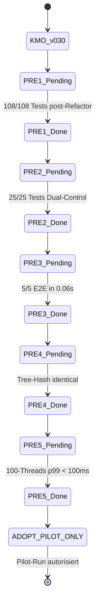

**Speaker Notes:**
- Source: `06-TESTING.md §3.4 Layer-4 PRE-Production-Tests`.
- Stress-Test-Begruendung: SQLite-WAL ist process-safe nur bei korrekter PRAGMA. Multi-Process-Test (multiprocessing.Pool) noch ausstehend (PRE-6).
- Falsifikations-Bedingung: p99 > 500ms unter realistischem I/O-Load → Production-Block (siehe Slide 30).

---

## BLOCK 3 — ZIELBILD (Slides 13-18)

---

### Slide 13: Cockpit Zielbild

**WAS:** HeyLou-OTA-Greenfield-Vision via KMO-enabled Region-Hybrid + Latenz-Hybrid + 9OS-Stack-Compromise.

| KPI | Wert | Quelle |
|-----|------|--------|
| ARCHITEKT-DECIDED-DCs | 3 (DC-1 ABS-Tier + DC-2 9OS-Stack + DC-3 Latenz-Stack) | `07-DECISIONS.md §Decision-Audit-Trail` |
| Region-Hybrid | 3 Stacks (EU-Apaleo / US-Mews / ASIA-Shiji) | `07-DECISIONS.md §DC-1` |
| Latenz-Target | TTFB <50ms / p99 <300ms / p50 <100ms | `07-DECISIONS.md §DC-3` |
| rho-Hypothese (Year 1) | +€500k-€2M/J | `09-CRUX-RHO.md §rho-Hypothese` |
| Pilot-Run-Plan | Build-vs-Buy-Gate als 1. live KMO-DF | `Master-Handoff §Pilot-Run-Spec` |

**WIE:** Region-Hybrid matched zu existierender 3-Region-Architektur via KMO-routing-Gateway. Latenz-Hybrid via Pre-Compute Daily + Edge-Cache TTL 60s SWR + Async-AI-Refresh-Worker.

**WARUM:** Yield-Differential ist concave in Inventarisierungs-Aufwand. Sweet-Spot ist Hybrid-Tier — sub-linearer Yield-Gain bei Voll-ABS rechtfertigt nicht 5-10x Aufwand-Mehrkosten + Lock-in-Risiko.

**Visualisierung:**
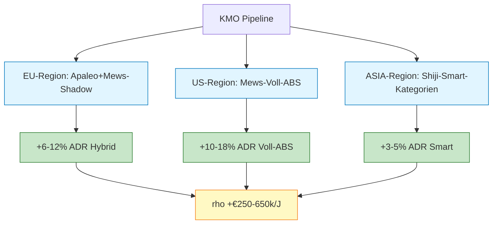

**Speaker Notes:**
- ρ-Decomposition Y1: Token-Cost-Reduction +€100-300k + DF-Coordination +€50-200k + Approval-Theater-Schutz +€50-500k + DSGVO-Risk-Reduktion +€25-250k + Pipeline-Latenz-Reduktion +€20-50k + ABS-Yield-Gain +€250-650k = €495k-€1.95M/J.
- Break-Even: ~3-7 Tage. ROI Y1: 20-80x.
- Capex einmalig: ~$25 (Architekt + Subagent-Tokens).
- Opex Latenz-Stack: €500-1900/Mo gemittelt = €6-23k/J.

---

### Slide 14: HeyLou-OTA-Greenfield-Vision

**WAS:** OTA-Greenfield = HeyLou Internet Booking Engine (IBE) als Direct-Channel ohne 15-30% Provision an OTAs (Booking.com, Expedia).

- 7 Hotels (DACH + ASIA + US planmaessig)
- AI-driven ABS-Pricing Search-Results in p99 < 200ms
- Direct-Conversion-Rate Ziel: 8-12% (Branchen-Benchmark)
- Provisions-Spar: 15-30% pro Direkt-Buchung

**WIE:** KMO routet OTA-Requests durch Latenz-Hybrid-Stack. Pre-Compute Daily aggregiert Inventory + ABS-Pricing fuer alle Zimmer × Datum × Persons-Combos. Edge-Cache (Cloudflare KV TTL 60s SWR) liefert TTFB <50ms. Async-AI-Refresh-Worker invalidiert Cache bei Inventory-Drift.

**WARUM:** OTA-Distribution ist Kapital-Senke (15-30% Margin-Loss pro Buchung). HeyLou-OTA-Greenfield = AI-driven Direct-Channel mit ABS-Pricing-Yield-Vorteil + Provisions-Spar. Lambda 7 Hotels × ~50 Buchungen/Tag = ~350 Direkt-Buchungen/Tag → bei +5% Conversion-Lift + ~€150 ADR + 20% Provisions-Spar = ~€10k/Tag = ~€3.6M/J brutto.

**Visualisierung:**
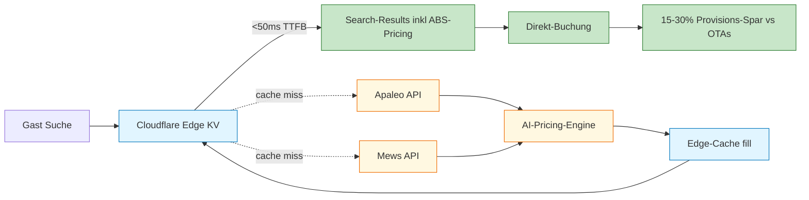

**Speaker Notes:**
- Source: `Master-Handoff §HeyLou-OTA-Greenfield-Trigger` + `07-DECISIONS.md §DC-3`.
- Pilot-Hotel Hildesheim 2026-06-08 als 1. Live-Test (450-710k EUR Investment).
- Conversion-Killer-Schwelle p99 > 300ms: Latenz oberhalb dieser Schwelle erodiert Direct-Conversion 8-12%.
- ABS-Pricing-Yield: +6-12% ADR gemittelt vs Klassik-Kategorien.

---

### Slide 15: Region-Hybrid (DC-1)

**WAS:** Region-spezifische ABS-Tier-Wahl statt Single-Vendor-Lock-in.

| Region | PMS | ABS-Tier | Yield-Differential | Aufwand pro Hotel | Risiko |
|--------|-----|----------|---------------------|-------------------|--------|
| EU | Apaleo + Mews-Shadow | Hybrid (10-20 Attribute) | +6-12% ADR | 8-50h | mittel (Region-isoliert) |
| US | Mews | Voll-ABS (30-50 Attribute) | +10-18% ADR | 60-200h | mittel (Mews-Native) |
| ASIA | Shiji | Smart-Kategorien (4-7 Master) | +3-5% ADR | 2-4h | klein (Rollback in 1h) |

**Konsolidiert (7 Hotels):** **+€250-650k/J Yield-Gain.**

**WIE:** ABS-Adapter-Layer als Cross-Region-Abstraktion (analog 9-Adapter-Konsolidierung in Predecessor-Session). Pilot Hildesheim startet mit EU-Hybrid-ABS (Apaleo + Mews-Shadow). Skalierung pro Region.

**WARUM:** Yield-Differential ist concave in Inventarisierungs-Aufwand. Voll-ABS bringt +10-18% aber Aufwand 60-200h vs Hybrid +6-12% bei 8-50h. Region-Hybrid optimiert per-Region-Sweet-Spot statt Global-Maximum-of-One-Tier.

**Visualisierung:**
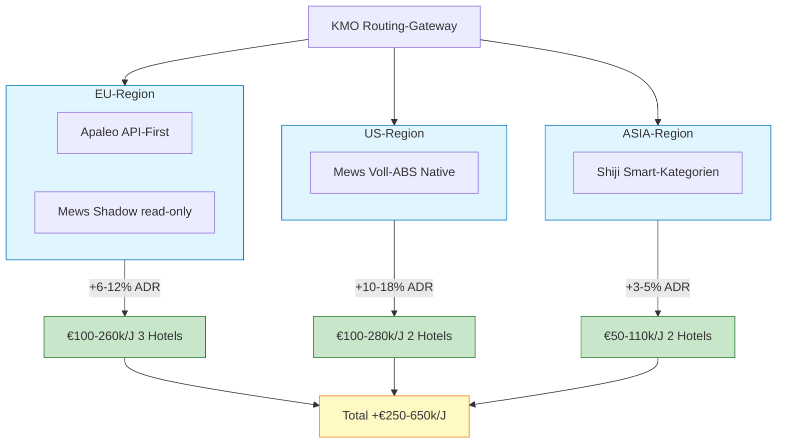

**Speaker Notes:**
- Source: `07-DECISIONS.md §DC-1`.
- Falsifikations-Bedingung: Pilot-Hotel A/B-Test ueber 90 Tage Yield-Differential < 4% ADR → Tier-Downgrade auf Smart-Kategorien.
- Hot-Switch-Pattern (Apaleo↔Mews) bereits architektonisch vorbereitet (Predecessor-Session).
- Mews-Shadow Cost: €5k/Monat pro Hotel als Falsifikations-Schwelle.

---

### Slide 16: Latenz-Stack (DC-3)

**WAS:** Hybrid Pre-Compute + Edge-Cache + Async-AI-Refresh als Latenz-Loesung fuer p99 < 200ms.

| Latenz-Komponente | Mechanik | Cost/Mo (7 Hotels) |
|-------------------|----------|---------------------|
| Pre-Compute Daily | Inventory × Datum × Persons-Combos via Aurora-Serverless v2 | €200-500 |
| Edge-Cache TTL 60s SWR | Cloudflare Workers + KV | €100-500 |
| Async-AI-Refresh-Worker | ECS-Fargate scheduled-scale | €100-400 |
| AI-API-Calls (Refresh-only) | nicht per Request | €100-500 |
| **Total** | — | **€500-1900/Mo** |

**WIE:** Stale-While-Revalidate-Pattern: Edge-Cache liefert sofort (selbst stale), AI-Refresh-Worker invalidiert async. AI-Outage = Cache haelt, kein IBE-Outage.

**WARUM:** Naive Real-Time-AI-Inference fallt auf 800-1500ms (DB-Roundtrip + Inference). p99 > 300ms = Conversion-Killer. Hybrid-Tier ist sweet-spot: ~3x billiger als Real-Time-AI, ~2-3x teurer als Pre-Compute-only, p99 80-200ms.

**Visualisierung:**
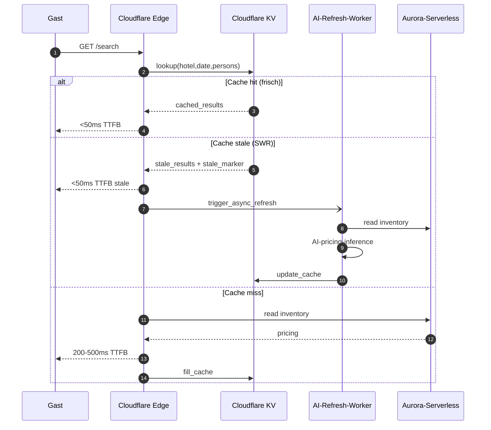

**Speaker Notes:**
- Source: `07-DECISIONS.md §DC-3 Trinity-Optionen`.
- Falsifikations-Bedingungen: p99 > 300ms in >5% Requests → Architektur revidieren. Stale-Marker > 1% Requests → AI-Refresh-Worker-Skalierung. AI-API-Cost > €500/Monat pro Pilot-Hotel → lokales Modell statt Cloud-API.
- Cloudflare Edge skaliert horizontal kostenfrei. Aurora-Serverless skaliert vertikal.

---

### Slide 17: 9OS-Stack-Compromise (DC-2)

**WAS:** HeyLou-v3.3 (Next.js + Go + Apaleo) als Primary, Mews-Shadow als read-only Backup.

- HeyLou-v3.3: Modern Stack (Next.js + Go + Apaleo API-First, EU-Stark)
- Mews-Shadow: read-only Backup fuer Multi-Vendor-Resilienz
- 1.5-2x Ops-Aufwand, aber Region-isoliertes Rollback

**WIE:** Hot-Switch-Pattern aus Hot-Switch-Wargame (Apaleo↔Mews) bereits architektonisch vorbereitet. Stack-Compromise nutzt diese Faehigkeit, statt sie zu verschenken. P0-Bug-Sprint kann SOFORT starten (DSGVO-Violations Pflicht), unabhaengig von Stack-Wahl.

**WARUM:** 9OS-v1 (RN+Python+MEWS) und HeyLou-v3.3 (Next.js+Go+Apaleo) beanspruchen Hildesheim 2026-06-08 als Pilot-Hotel. Plus 9 P0-Bugs mit DSGVO-Violations. Single-Vendor-Pick (entweder Mews-Native oder Apaleo-Modern) blockiert 3-Region-Architektur. Hybrid matched.

**Visualisierung:**
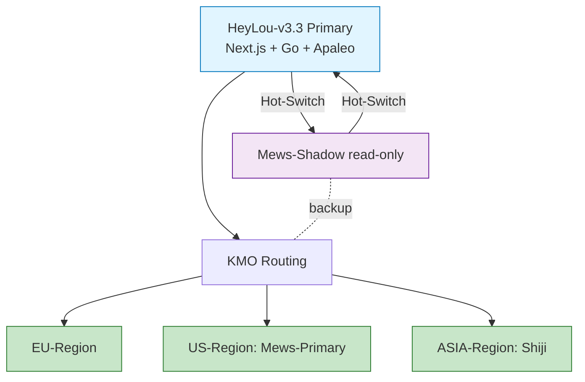

**Speaker Notes:**
- Source: `07-DECISIONS.md §DC-2`.
- Falsifikations-Bedingung: Apaleo-API-Latenz > 200ms p50 chronisch → Stack-Wechsel zu Mews-Primary erwaegen. Mews-Shadow-Cost > €5k/Monat pro Hotel → Shadow rausnehmen, ABS-Tier herunterstufen.
- DSGVO-Audit-Fail trotz P0-Bug-Sprint → Stack-Konflikt war nicht Wurzelproblem.

---

### Slide 18: Welle-7 Pipeline-Phasen 5-7

**WAS:** Pipeline-Position aktuell Phase-5 DEV-Stage Skeleton ready, Phase-6 Martin-Demo + Phase-7 Gerdi-CTO pending.

| Phase | Owner | Token-Profil | Output |
|-------|-------|--------------|--------|
| 5 DEV-Demo | Architekt-Setup | Mac-Local Docker + Cloudflare Tunnel | Demo-URL + Pilot-Run + Materialien |
| 6 Martin-Freigabe | Martin (MHC explizit) | — | Signed Approval-Token |
| 7 Gerdi-CTO-Review | Gerdi (CTO Hofstede SAE v8.0) | — | Production-Approval |

**WIE:** Phase-5 Build via `docker compose build` (~5-10 Min), Cloudflare-Tunnel-Setup (Martin-OAuth einmalig), Pilot-Run Build-vs-Buy-Gate als 1. live KMO-DF (4 MVP-Test-Cases via Cloudflare-URL).

**WARUM:** Mechanische Build-Test-Demo-Approval-Pipeline = Welle-7-Mandat-Erweiterung-2 (*"DEV Umgebung zeigen, Freigabe Gerdi"*). Demo + Approval institutionalisiert MHC-Override-Pfad mit signed-token statt informelles Approval.

**Visualisierung:**
```mermaid
graph LR
    P5[Phase-5 DEV-Demo<br/>Mac-Local Docker + Cloudflare] --> PILOT[Pilot-Run<br/>Build-vs-Buy-Gate]
    PILOT --> M[Demo-Materialien<br/>8 Pflicht-Felder]
    M --> P6[Phase-6 Martin-Freigabe<br/>MHC explizit]
    P6 --> SIG[Signed Approval-Token]
    SIG --> G[Gerdi-CTO-Handoff-Package<br/>8 Pflicht-Felder]
    G --> P7[Phase-7 Gerdi-CTO-Review]
    P7 --> APPROVAL[Production-Approval]

    classDef phase fill:#fff9c4,stroke:#f57f17
    classDef artifact fill:#c8e6c9,stroke:#2e7d32
    class P5,P6,P7 phase
    class PILOT,M,SIG,G,APPROVAL artifact
```

**Speaker Notes:**
- Source: `00-INDEX.md §Was tut KMO §7-Phasen-Pipeline` + `Master-Handoff §Phase-5 DEV-Stage`.
- Pilot-Run 4 MVP-Test-Cases: AI-Pricing → HYBRID, Voice-GSA → BUILD-HEAVY-HYBRID, ESG-HCMI → BUY EcoHotelScore, Compliance-DACH → BUY protel+DATEV.
- Phase-7 Gerdi-CTO-Review-Package: 8 Pflicht-Felder (Tech-Stack + Test-Coverage + Security + DSGVO + Latenz-Performance + Cost-Estimate + Production-Migration-Pfad + Rollback-Strategie).

---

## BLOCK 4 — ARCHITEKTUR + EXTERNE-QUELLEN-PRUEFUNG + RED-TEAM-CHECKPOINTS (Slides 19-24)

---

### Slide 19: Cockpit Architektur

**WAS:** 3-Layer-Hierarchie + Patches A1-A7 + Externe-Quellen-Pruefung via Cross-LLM-Wargame als Red-Team-Mechanik.

| KPI | Wert | Quelle |
|-----|------|--------|
| Layer-Hierarchie | 3 (kmo_control / kmo_governance / df_executors) | `01-ARCHITECTURE.md §1` |
| Patches | 6 implementiert (A1+A2+A3+A4+A5+A7) + 1 Refactor (A6) | `01-ARCHITECTURE.md §2` |
| Module | 7 (6 governance + 1 dev-stage Gateway) | `01-ARCHITECTURE.md §4 Repo-Struktur` |
| Sunk-Cost-Flat-LLMs | 5 (Codex Pro + Gemini Ultra + Copilot Pro+ + Grok Heavy + Perplexity Ultimate) | `09-CRUX-RHO.md §Capex-Aufwand` |
| Token-Spar | 10-15x via Sonnet-Pool | `Master-Handoff §Subagent-Pool-Pattern` |

**WAS:** 3 Wargame-Iterationen Welle-0/1/3 als Red-Team-Checkpoints im fruehen Entwicklungszyklus. Cross-LLM-Wargame-Methodik = Externe-Quellen-Pruefung (3 LLMs aus 3 Provider-Familien Anthropic+OpenAI+Google+xAI gegen Korrelations-Risiko).

**WIE:** Codex GPT-5.5 + Gemini 2.5 Pro + Copilot Pro+ parallel auf Mac, ~60-180s/Wargame, **0 EUR marginal** (alle Sunk-Cost-Flat-Abos). Architekt-Synthese aggregiert Konvergenz-Matrix.

**WARUM:** Cross-LLM-Pflicht-E3-Plus (rule 2026-04-18, belegt durch 11/11 Ueber-Claim-Rate). Single-Model-Validierung ist epistemisch unzureichend. Multi-Provider-Familie reduziert Trainings-Bias-Korrelation (G3 Meta-Upsell-Verbot).

**Visualisierung:**
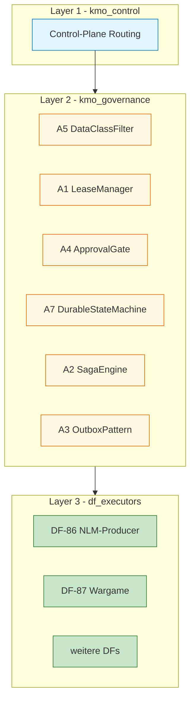

**Speaker Notes:**
- Layer-Boundary-Regel: Layer N ruft NIE Layer N-1. Control orchestriert nur nach unten, Governance haelt Invarianten ohne Aufrufer-Kenntnis, Executors sind Datenklienten.
- T_CAP = 50000 Tokens (SAE-Konstante) als Subagent-Budget-Anker. Architekt ~25-35k Opus-Tokens, Subagenten ~250-400k Sonnet-Tokens.
- Cross-LLM-Bias-Korrelation FIXPUNKT-1 (E5 strukturell-logisch): keine E4-Aussage ist je echt HARDENED, max CROSS-LLM-2OF3-HARDENED.

---

### Slide 20: A1 LeaseManager — Mechanik

**WAS:** SQLite-WAL Mutex fuer DF/Port/Token/Drive-Path/Tunnel Resource-Locks. 488 LoC + 20 Tests + Stress 100-Threads PASS.

**WIE:** Atomic UNIQUE-Constraint auf `(resource_type, resource_id)` in `leases`-Tabelle. INSERT OR IGNORE → rowcount=1 (acquire OK) oder rowcount=0 (conflict). Heartbeat-Thread alle TTL/3 Sekunden, Auto-Force-Release bei `expires_at < now`. STOP.flag-Pattern fuer manuelle Pause.

**WARUM:** Schuetzt vor Cascade-Failures durch Resource-Konkurrenz (HOTSPOT-C Welle-0): 28 LaunchAgents + Subagent-Pool + Cross-LLM ohne globalen Lock-Manager. Low-Ops (kein Vendor), debugbar (SQLite-File), Drive-Sync-kompatibel.

**Visualisierung:**
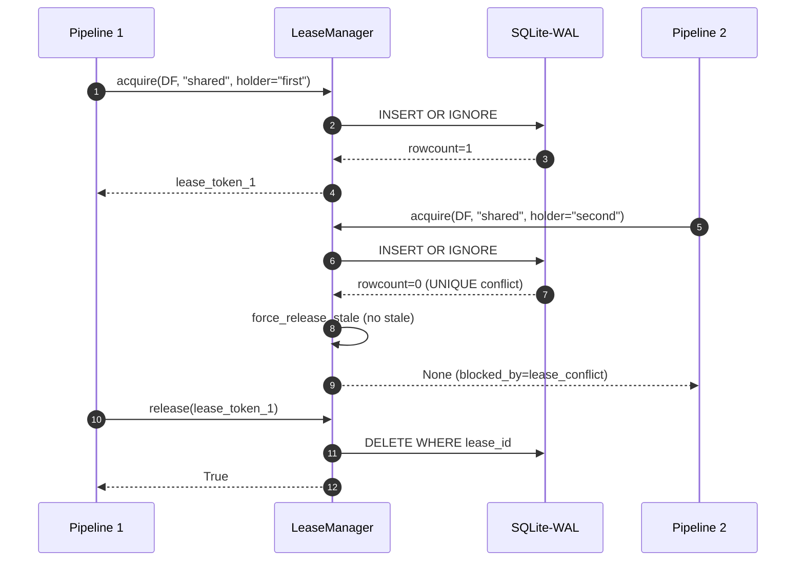

**Speaker Notes:**
- Source: `02-PIPELINE-FLOWS.md §3 Lease-Conflict T3` + `01-ARCHITECTURE.md §2 A1_LEASE`.
- TTL-Default 300s, Heartbeat-Default 100s.
- SAE-Isomorphie: Trinity-Slot-Lock (`state.py` Atomic-Heartbeat-Pattern). Optimistic-Lock pro Slot.
- Stress-Test PRE-5: 100 Threads / 1 Resource → 1 Winner / 99 Losers / total 64.2ms.

---

### Slide 21: A2 SagaEngine + A3 OutboxPattern — Mechanik

**WAS:** A2 SagaEngine: 7-Phase do/undo + Reverse-Chain Compensate (452 LoC + 9 Tests). A3 OutboxPattern: Atomic-Write JSONL + UUID4-Idempotency + DLQ (461 LoC + 6 Tests).

**WIE:** Saga-Phase-Fail triggert `_compensate()` mit Reverse-Chain (nur DONE-Phasen, idempotent). Outbox: `event_id` als Idempotency-Key, Consumer prueft `_is_processed` via SQLite, Retry max 3x dann DLQ-Move. atomic_write_state via `tempfile + os.replace + os.fsync`.

**WARUM:** Schliesst HOTSPOT-A (Approval-Theater): Saga-Compensate macht Pipeline rollback-bar. Schliesst HOTSPOT-B (Multi-Machine-Sync): Outbox via Drive-Sync, Producer-Mac → Consumer-Windows mit UUID4-Idempotency.

**Visualisierung:**
```mermaid
stateDiagram-v2
    [*] --> P1_Pending
    P1_Pending --> P1_Done: do_func
    P1_Done --> P2_Done: do_func
    P2_Done --> P3_Running: do_func
    P3_Running --> P3_Failed: RuntimeError
    P3_Failed --> Compensating
    state Compensating {
        [*] --> Undo_P2: reverse-chain
        Undo_P2 --> Undo_P1: idempotent
        Undo_P1 --> [*]
    }
    Compensating --> Compensated
    Compensated --> [*]: SagaResult COMPENSATED
```

**Speaker Notes:**
- Source: `02-PIPELINE-FLOWS.md §4 Saga-Phase-Fail T4` + `02-PIPELINE-FLOWS.md §6 Outbox-Idempotency`.
- Saga-Phasen: Plan/Spec/Wargame/Build/Test/DEV-Demo/Approval. 3 Exit-Criteria-Gates: P3 verdict>=CONDITIONAL, P5 tests_passed, P7 approved.
- Lease-Release-Garantie: `finally`-Block in Pipeline-Code released Lease auch nach Saga-Fail.
- Outbox DLQ-File enthaelt vollstaendigen Envelope + reason + retry_count fuer manuelle Re-Inspection.

---

### Slide 22: A4 ApprovalGate — Mechanik

**WAS:** HMAC-SHA256 signed Tokens + Hash-Chain Audit-Log + Dual-Control (3-way disjoint identities) + Atomic Pre-Deploy. 797 LoC + 50 Tests (19+6+25 Modul + Dual-Control).

**WIE:** Token = HMAC(secret, payload) mit constant-time-compare (timing-attack-resistant). Audit-Chain: `entry_hash = SHA256(prev_hash + entry_data)`. Atomic Pre-Deploy: `BEGIN IMMEDIATE / verify+deploy / COMMIT` oder ROLLBACK. Dual-Control: Requester != Approver-1 != Approver-2 (transitive disjoint).

**WARUM:** Schuetzt vor 50-500k EUR Production-Cascade-Schaden (Codex-Worst-Case Welle-0). Hash-Chain = Tamper-Evidence (jede Aenderung am Audit-Log bricht Chain). Dual-Control = K_0-Critical-Gate (kein Single-Approver bei Production-Deploy).

**Visualisierung:**
```mermaid
sequenceDiagram
    autonumber
    participant REQ as Requester
    participant AG as ApprovalGate
    participant A1 as Approver-1
    participant A2 as Approver-2
    participant AL as AuditLog
    participant DEPLOY as Pre-Deploy

    REQ->>AG: request_dual_approval
    AG->>A1: token_a1 (HMAC)
    AG->>A2: token_a2 (HMAC)
    A1-->>AG: signed_a1
    A2-->>AG: signed_a2
    AG->>AG: verify disjoint identities
    AG->>DEPLOY: pre_deploy_atomic BEGIN IMMEDIATE
    DEPLOY->>AL: append_within_transaction
    AL->>AL: hash_chain_entry
    DEPLOY->>DEPLOY: deploy_step
    alt deploy success
        DEPLOY->>DEPLOY: COMMIT
        DEPLOY-->>AG: deployed
    else deploy fail
        DEPLOY->>DEPLOY: ROLLBACK
        DEPLOY-->>AG: rolled_back
    end
```

**Speaker Notes:**
- Source: `01-ARCHITECTURE.md §2 A4_APPROVAL`.
- Falsifikations-Bedingung: Token-Manipulation → Decision DENY (Tamper-Test PASS in 25/25 Dual-Control-Tests).
- 3-way disjoint identities: requester_id, approver1_id, approver2_id sind paarweise verschieden.
- SAE-Isomorphie: MHC + Bounded-Veto. Audit-Chain = AuditEntry frozen dataclass.

---

### Slide 23: A5 DataClassFilter — Mechanik

**WAS:** 4-Stage Klassifikation Public(1) / Internal(2) / Confidential(3) / Secret(4) + Provider-Compat-Matrix YAML. 267 LoC + 16 Tests + 9 SECRET-Patterns inkl. Bearer-JWT-Fix.

**WIE:** Pre-Routing-Hook `pre_routing_check(prompt, provider)` klassifiziert Input via Regex-Pattern-Match (`api_key`, `Bearer ey...`, `password=`, `BEGIN PRIVATE KEY`, etc.). Provider-Compat-Matrix definiert `max_data_class` pro Provider: claude-opus=CONFIDENTIAL(3), gemini=INTERNAL(2). SECRET(4) > max → BLOCK.

**WARUM:** Schuetzt vor 25-250k EUR DSGVO-Risk (Codex Welle-0). Verhindert API-Key-Leak an Flat-LLMs (Distillation-Resistenz K12). SECRET-Fail-Closed = K_0-Critical (PRE-1 erfuellt: kein Provider mit `max_data_class: SECRET`).

**Visualisierung:**
```mermaid
graph TD
    INPUT[Input prompt + target provider] --> CLASSIFY[classify_input]
    CLASSIFY -->|regex match| SECRET[SECRET 4]
    CLASSIFY -->|no match| PUB[PUBLIC 1]
    CLASSIFY -->|partial| INT[INTERNAL 2]
    CLASSIFY -->|partial| CONF[CONFIDENTIAL 3]
    SECRET --> CHECK[is_provider_allowed]
    PUB --> CHECK
    INT --> CHECK
    CONF --> CHECK
    CHECK -->|class > max_data_class| BLOCK[BLOCK + audit]
    CHECK -->|class <= max_data_class| ALLOW[ALLOW + lease.acquire]

    classDef input fill:#e1f5ff,stroke:#0277bd
    classDef class fill:#fff8e1,stroke:#ef6c00
    classDef block fill:#ffebee,stroke:#c62828
    classDef allow fill:#c8e6c9,stroke:#2e7d32
    class INPUT input
    class SECRET,PUB,INT,CONF class
    class BLOCK block
    class ALLOW allow
```

**Speaker Notes:**
- Source: `02-PIPELINE-FLOWS.md §2 SECRET-Block T2` + `01-ARCHITECTURE.md §2 A5_FILTER`.
- 9 SECRET-Patterns: api_key, password, secret, private_key, Bearer eyJ..., aws_access_key_id, ssh-rsa, BEGIN RSA PRIVATE KEY, AUTH_TOKEN.
- Bearer-JWT-Bug Welle-1 Detection: Pattern `Bearer eyJ...` fehlte initial → PUBLIC statt SECRET. Fix: 9. Pattern hinzugefuegt, 32/32 Tests post-Fix.
- Audit: `branch-hub/audit/kmo-routing-decisions.jsonl` mit `{decision, data_class, detected_patterns}`.

---

### Slide 24: A7 DurableStateMachine — Mechanik

**WAS:** Event-Sourcing State-Machine mit JSONL-Append + Snapshot alle 10 Events + Replay nach Crash. 646 LoC + 19 Tests + Stress 100-Threads p99=72ms.

**WIE:** `start_workflow` appended `WORKFLOW_STARTED` Event (seq=1), `transition_phase` appended `STATE_TRANSITION` (seq=2,3,...), `recover` liest events.jsonl + sortiert nach sequence + apply_event in WorkflowRun. Snapshot persistiert WorkflowRun-State alle 10 Events fuer fast-Replay. Konkurrenz-Schutz via `mkdir-Mutex` (state.lock/) mit Stale-Check 300s.

**WARUM:** Schuetzt vor Reboot/Crash-Resilienz-Verlust. Process-Restart-Recovery garantiert: vollstaendige History wiederherstellbar, kein Datenverlust. Schliesst HOTSPOT-B (Multi-Machine-State-Sync) zusammen mit A3 Outbox.

**Visualisierung:**
```mermaid
sequenceDiagram
    autonumber
    participant P1 as Process 1
    participant DSM1 as DurableStateMachine #1
    participant FS as Filesystem
    participant P2 as Process 2
    participant DSM2 as DurableStateMachine #2

    P1->>DSM1: start_workflow seq=1
    DSM1->>FS: append events.jsonl + fsync
    P1->>DSM1: transition seq=2
    DSM1->>FS: mkdir-mutex + append + fsync
    P1->>DSM1: transition seq=3
    DSM1->>FS: append seq=3
    Note over P1,DSM1: CRASH
    Note over P2,DSM2: New Process
    P2->>DSM2: __init__ state_root
    P2->>DSM2: get_history wf-id
    DSM2->>FS: read events.jsonl
    FS-->>DSM2: 3 events sorted by seq
    P2->>DSM2: recover wf-id
    DSM2->>DSM2: replay events
    DSM2-->>P2: WorkflowRun seq=3 phase=step2
```

**Speaker Notes:**
- Source: `02-PIPELINE-FLOWS.md §5 Crash-Recovery T5` + `01-ARCHITECTURE.md §2 A7_DURABLE`.
- Snapshot-Pfad: `state_root/<wf-id>/snapshots/<seq:010d>.json`. Replay nur Events `seq > snapshot.sequence`.
- SAE-Isomorphie: MYZ-32 Event-State-Tracker. Event-Sourcing = Myzel-Layer-Bus. Snapshot = Trinity-Promotion-Boundary.
- Stress-Test PRE-5: 100 Threads concurrent transitions p99=72ms, sequences 1..101 contiguous.

---

## BLOCK 5 — KNACKPUNKTE + MITIGATION (Slides 25-30)

---

### Slide 25: Cockpit Knackpunkte

**WAS:** Offene Risiken + Mitigation-Pfade vor Production-Deploy.

| KPI | Wert | Quelle |
|-----|------|--------|
| Falsifikations-Bedingungen | 17 (6 Pipeline + 4 Architektur + 7 Domain) | `09-CRUX-RHO.md §Falsifikations-Bedingungen-Liste` |
| Failure-Modes (Test-belegt) | 8 (T1 Happy + T2-T5 Failure + 3 Open-Questions) | `02-PIPELINE-FLOWS.md §1-§7` |
| Hotspot-D | OFFEN bei Welle-3 Gemini (A6 missing); GESCHLOSSEN nach PRE-1 | `08-WARGAMES.md §Welle-3 Hotspot-Status` |
| Open-Questions | 3 (Retention, Cross-Machine-Lease, Identity-Federation) | `01-ARCHITECTURE.md §8` |
| K_0-Sperr-Liste | 7 Items, davon 2 KMO-direkt-relevant | `07-DECISIONS.md §K_0-Sperr-Liste-Mapping` |

**WIE:** Falsifikations-Bedingungen pro DC + pro Patch dokumentiert. Open-Questions explizit als "OFFEN, NICHT TBD" markiert (Architektur-Disziplin).

**WARUM:** ADOPT-PILOT-ONLY-Tier ist nicht Production-Tier. Production-Deploy braucht Welle-5-Re-Wargame post-Pilot + Martin-Freigabe + Gerdi-CTO. Risiken explizit dokumentieren, nicht verstecken.

**Visualisierung:**
```mermaid
graph TD
    PROD[Production-Deploy] --> RISK1[Pipeline-Risiken<br/>6 Falsif-Bedingungen]
    PROD --> RISK2[Architektur-Risiken<br/>4 Falsif-Bedingungen]
    PROD --> RISK3[Domain-Risiken<br/>7 Falsif-Bedingungen]
    PROD --> RISK4[Open-Questions<br/>3 explizit]
    RISK1 --> MIT1[Pilot-Run + Martin-Demo]
    RISK2 --> MIT2[Token-Cost-Monitoring]
    RISK3 --> MIT3[A/B-Test 90 Tage]
    RISK4 --> MIT4[Architekt-Folge-Sessions]

    classDef risk fill:#ffebee,stroke:#c62828
    classDef mit fill:#c8e6c9,stroke:#2e7d32
    class RISK1,RISK2,RISK3,RISK4 risk
    class MIT1,MIT2,MIT3,MIT4 mit
```

**Speaker Notes:**
- Source: `09-CRUX-RHO.md §Falsifikations-Bedingungen-Liste`.
- 17 Falsifikations-Bedingungen sind Production-Gating-Bedingungen, mechanisch enforcebar.
- 8 Failure-Modes Test-belegt: T2 SECRET-Block, T3 Lease-Conflict, T4 Saga-Compensate, T5 Crash-Recovery, T1 Happy + 3 Open-Questions = 8 explizit modellierte Failure-Modes.

---

### Slide 26: SPOFs — Single-Points-of-Failure

**WAS:** 3 SPOFs identifiziert (Welle-3 + Bias-Catalog).

1. **Approval-Gate-Tamper:** Wenn HMAC-Secret leaked, koennen falsche Tokens generiert werden. Mitigation: KMO_APPROVAL_SECRET >=32 bytes + Secret-Manager in Production (nicht .env).
2. **Lease-Stale:** Wenn LeaseManager-Process crasht ohne release, expires_at < now wird beim naechsten acquire force-released. Risiko: Cross-Machine-Lease-Mismatch (Mac vs Windows simultan, kein Cross-Machine-Lock).
3. **Outbox-DLQ-Overflow:** Bei chronischen Handler-Fails akkumulieren DLQ-Files ohne automatische Bereinigung. Manuelle Re-Inspection notwendig.

**WIE:** Mitigation: HMAC-Secret-Rotation 90 Tage + Secret-Manager. Drive-Sync-basierter Mutex via Outbox-Lease-Topic (OQ-2 noch open). DLQ-Quartal-Cleanup (Architekt-Manual).

**WARUM:** SPOFs sind K_0-Risk. Approval-Gate-Tamper = unauthorized Production-Deploy moeglich. Lease-Stale Cross-Machine = Race-Condition zwischen Mac+Windows. DLQ-Overflow = silent-Failure-Mode (Workflows hangen ohne Fehler).

**Visualisierung:**
```mermaid
graph TD
    SPOF1[SPOF-1 Approval-Gate-Tamper] --> M1[Mitigation: 32-byte Secret + Secret-Manager + 90-Tage-Rotation]
    SPOF2[SPOF-2 Lease-Stale Cross-Machine] --> M2[Mitigation: Outbox-Lease-Topic Cross-Machine Mutex pending]
    SPOF3[SPOF-3 Outbox-DLQ-Overflow] --> M3[Mitigation: Quartal-Cleanup Manual + Alert > 100 Files]

    classDef spof fill:#ffebee,stroke:#c62828
    classDef mit fill:#c8e6c9,stroke:#2e7d32
    class SPOF1,SPOF2,SPOF3 spof
    class M1,M2,M3 mit
```

**Speaker Notes:**
- Source: `01-ARCHITECTURE.md §8 Open-Questions OQ-1/OQ-2`.
- HMAC-Secret-Rotation: KMO_APPROVAL_SECRET in DEV nur Default, in Production via AWS Secrets Manager / GCP Secret Manager.
- Cross-Machine-Lease ist OQ-2 (offen): LeaseManager Mac-lokal (SQLite-File). Drive-Sync-basierter Mutex via Outbox-Lease-Topic noch nicht implementiert.

---

### Slide 27: Security-Gaps

**WAS:** 2 dokumentierte Security-Gaps in PRE-3 E2E-Tests.

1. **Dual-Control simplified in E2E:** PRE-3 T1 Happy-Path hat `approval_ok = True` als Vereinfachung. Echte HMAC-SHA256 + Hash-Chain + Bearer-JWT in PRE-2-Tests separat (25/25 PASS). E2E mit echten 2 Tokens + Tamper-Test + Rollback-Test pending Production.
2. **OS-Process-Kill nicht simuliert:** PRE-3 T5 Crash-Recovery simuliert Crash via neue StateMachine-Instanz auf gleichem state_root. Container-Kill-Test (`docker kill kmo-saga-engine` waehrend Saga laeuft + Auto-Restart) pending Production.

**WIE:** Mitigation pre-Production: E2E-Test mit echten 2 Tokens (Approver-1 + Approver-2) + Tamper-Test (Token-Manipulation → Decision DENY) + Atomic-Pre-Deploy-Phase-Skip-Test (Rollback ohne Effekt) + Container-Kill-Test.

**WARUM:** PRE-3-Vereinfachungen sind dokumentiert (`06-TESTING.md §6.1+§6.2 Bekannte Test-Limitationen`). Production-Pipeline-Run muss echte Dual-Control verifizieren. K_0-Risk wenn Production deployed ohne diese Tests.

**Visualisierung:**
```mermaid
graph TD
    GAP1[Gap-1: Dual-Control simplified in E2E<br/>approval_ok=True statt echte 2 Tokens] --> ACT1[Action: E2E mit echten 2 Tokens]
    GAP1 --> ACT2[Action: Tamper-Test Token-Manipulation]
    GAP1 --> ACT3[Action: Rollback-Test Atomic Pre-Deploy]
    GAP2[Gap-2: OS-Process-Kill nicht simuliert<br/>nur Reinstance-Recovery] --> ACT4[Action: docker kill kmo-saga-engine]
    GAP2 --> ACT5[Action: Auto-Restart + Resume from Checkpoint]
    GAP2 --> ACT6[Action: Outbox Idempotency post-Restart]

    classDef gap fill:#ffebee,stroke:#c62828
    classDef act fill:#fff9c4,stroke:#f57f17
    class GAP1,GAP2 gap
    class ACT1,ACT2,ACT3,ACT4,ACT5,ACT6 act
```

**Speaker Notes:**
- Source: `06-TESTING.md §6.1 ApprovalGate Dual-Control simplifiziert in E2E` + `§6.2 Crash-Recovery T5 simuliert via Reinstance`.
- PRE-2 Dual-Control 25/25 Tests verifizieren echte HMAC + Hash-Chain. E2E-Verkettung mit echten Tokens ist Welle-5-Aufgabe.
- Container-Kill-Test = Real-World-Crash. Reinstance-Test = Synthetic-Crash. Beide notwendig fuer Production-Confidence.

---

### Slide 28: Bottlenecks + Pending-Phronesis

**WAS:** 3 Bottlenecks dokumentiert + 9 Pending-Phronesis-Items.

**Bottlenecks:**
1. PRE-3 Sub-Subagent rate-limited Pattern (Anthropic-Server-Side, 2x in 6h getriggert). Mitigation: Exponential-Backoff + Architekt-direkt-Fallback.
2. Drive-Sync kein Auto-Pull. Mitigation: Manueller Sync via `hub-sync.ps1` (Windows-Vault-Owner-Branch).
3. Cloudflare-Tunnel-Auth-Expiry ~24h. Mitigation: `cloudflared tunnel token kmo-dev` + .env-Update + restart.

**Pending-Phronesis:**
- Implementation-Trigger: Production-Deploy + Cross-System-Architektur-Wechsel + Pilot-Hotel-Investment + DSGVO-relevante Code-Aktivierung.
- Decision-Themen: DSGVO-Bug-Bounty-Pattern + Familien-Beziehungs-Aenderung + Rechtliche/Steuer-Auslegung.
- Cross-Branch-Architektur: Welle-2 KMO-Migration (28 LaunchAgents) + Welle-3 Cloud-Lift.

**WIE:** Pending-Phronesis explizit dokumentiert in `07-DECISIONS.md §Pending-Phronesis-Liste`. Mechanisch enforced via K_0-Sperr-Liste (rules/passivitaets-hemmung.md).

**WARUM:** Welle-7-Autonomie ist nicht uneingeschraenkt. K_0/Q_0/L13-Themen sind Phronesis-non-delegate (CLAUDE.md §19.3). Architekt darf Tier-Wahl + DCs autonom, aber NICHT Implementation-Trigger.

**Visualisierung:**
```mermaid
graph TD
    AUTO[Architekt-Welle-7-Autonom] -->|erlaubt| TIER[Tier-Wahl]
    AUTO -->|erlaubt| DC[Decision-Cards]
    AUTO -->|erlaubt| WG[Wargame-Execution]
    AUTO -->|erlaubt| BUILD[Code-Build via Subagent]
    PHRONESIS[Phronesis-non-delegate L13] -->|verboten| IMPL[Implementation-Trigger Production]
    PHRONESIS -->|verboten| K0[K_0 Kapital >€10k]
    PHRONESIS -->|verboten| Q0[Q_0 Familie]
    PHRONESIS -->|verboten| LEGAL[Rechtlich/Steuer]

    classDef auto fill:#c8e6c9,stroke:#2e7d32
    classDef phronesis fill:#ffebee,stroke:#c62828
    class AUTO,TIER,DC,WG,BUILD auto
    class PHRONESIS,IMPL,K0,Q0,LEGAL phronesis
```

**Speaker Notes:**
- Source: `07-DECISIONS.md §Pending-Phronesis-Liste` + `rules/passivitaets-hemmung.md §K_0-Sperr-Liste`.
- Bias-Catalog Layer 2 PHRONESIS-OUTSOURCING-K0-SPERR-LISTE-MISINTERPRETATION: K_0-Sperr-Liste #5 betrifft Implementation-Trigger, NICHT Tier-Wahl.
- Eskalations-Matrix CLAUDE.md §19.3: K_0/Q_0/L13/Familien-Neu-Information/Rechtlich-Medizinisch.

---

### Slide 29: Bias-Catalog (5 Layer)

**WAS:** 5 dokumentierte Eigenfehler-Layer aus 6h-Pipeline.

| Layer | BIAS-ID | Pattern | Korrektur |
|-------|---------|---------|-----------|
| 1 | PHRONESIS-OUTSOURCING-NLM-TRIGGER | NLM-Trigger-Frage als Phronesis behandelt obwohl autonom-entscheidbar | Architekt-Default-Pattern |
| 2 | PHRONESIS-OUTSOURCING-K0-SPERR-LISTE-MISINTERPRETATION | K_0-Sperr-Liste #5 als "jede Architektur-Entscheidung" interpretiert | Korrekt: NUR Implementation-Trigger |
| 3 | CONTEXT-OVERESTIMATION (Layer 1) | Heuristik 95-96% vs gemessene 41% (Faktor 2x) | rules/context-budget.md externe Messung |
| 4 | CONTEXT-OVERESTIMATION (Layer 2) | Heuristik 75-80% vs gemessene 67% (Faktor 1.15x) | Bias reduziert nach Layer-1, residual systematisch |
| 5 | CROSS-LLM-WORKSPACE-PERMISSION-DIVERGENZ | Cross-LLM ohne pytest-Run-Permission ist epistemisch ungleichgewichtig | Sycophancy-Signal erkennbar |

**WIE:** Eigenfehler bei Erkennung sofort persistiert in `branch-hub/learnings/bias-catalog.jsonl` (1 Zeile JSONL). Korrektur in Rule-File oder Skill-Update. Pattern-Vermeidung in naechster Welle.

**WARUM:** Live-Meta-Learning (rules/self-discipline.md §4 Caught-in-Action Logging). Ohne Logging gleiche Verletzung in naechster Session. Bias-Catalog persistiert Cross-Session via Theorem 5.3 Mitigation.

**Visualisierung:**
```mermaid
graph LR
    L1[Layer-1: Phronesis-Outsourcing-NLM] --> KOR1[Architekt-Default-Pattern]
    L2[Layer-2: K_0-Sperr-Liste-Misinterpretation] --> KOR2[Tier-Wahl != Implementation]
    L3[Layer-3: Context-Overestimation 2x] --> KOR3[Externe Messung > Heuristik]
    L4[Layer-4: Context-Overestimation 1.15x] --> KOR4[Residual systematisch dokumentiert]
    L5[Layer-5: Cross-LLM-Workspace-Divergenz] --> KOR5[Sycophancy-Signal-Detection]

    classDef bias fill:#ffebee,stroke:#c62828
    classDef kor fill:#c8e6c9,stroke:#2e7d32
    class L1,L2,L3,L4,L5 bias
    class KOR1,KOR2,KOR3,KOR4,KOR5 kor
```

**Speaker Notes:**
- Source: `08-WARGAMES.md §Bias-Catalog` + `Master-Handoff §Bias-Catalog-Sektion`.
- Lambda-Honesty (M2): Unsicherheit explizit dokumentieren, nicht "alle stimmen zu" als HARDENED-Beleg.
- G2 Lambda-Honesty (rules/meta-governance-framework.md): credence_interval + best_counterhypothesis + decision_threshold + N_independent_sources Pflicht.
- Bias-Catalog Layer-Decay: Layer 1 (2x) → Layer 4 (1.15x) zeigt Reduktions-Trajektorie aber Residuum bleibt.

---

### Slide 30: Falsifikations-Bedingungen + Roadmap

**WAS:** 17 Falsifikations-Bedingungen + Naechste-Welle-Plan post-Welle-7.

**Pipeline-Falsifikationen (6):**
1. E2E-Test post-Retry > 1 von 5 FAIL → Welle-5 Bug-Fix
2. Codex-Tail divergent → Tier-Downgrade auf CONDITIONAL
3. Pilot-Run scheitert → Demo-Materialien ueberarbeiten
4. Martin-Demo-Reject → kein direkter Production-Pfad
5. Gerdi-CTO-Reject → Implementation-Patches
6. Production-Deploy fail in 30 Tagen → Welle-6

**Architektur-Falsifikationen (4):**
7. Build-Test-Demo-Latenz > 2 Wochen pro DF → Pipeline-Restruktur
8. Token-Cost > 50% Pre-KMO-Baseline → Routing revidieren
9. Martin-Freigabe-Quote < 60% → Demo-Template
10. Gerdi-Reject-Quote > 30% → Test-Pipeline verschaerfen

**Domain-Falsifikationen (7):**
11. Pilot-Hildesheim Yield < 4% ADR → Tier-Downgrade
12. Apaleo-Latenz > 200ms p50 → Stack-Wechsel zu Mews
13. Mews-Shadow-Cost > €5k/Mo → Shadow rausnehmen
14. DSGVO-Audit-Fail → Stack-Konflikt war nicht Wurzel
15. p99 > 300ms in >5% Requests → Architektur revidieren
16. Stale-Marker > 1% → AI-Refresh skalieren
17. AI-API-Cost > €500/Mo pro Hotel → lokales Modell

**rho-Reihenfolge Patches (Implementation-Cost-Optimum):**

| # | Patch | rho/h |
|---|-------|-------|
| 1 | A4 Approval-Gates | hoechster |
| 2 | A1 Resource-Lease | hoch |
| 3 | A5 Daten-Klassifikation | hoch |
| 4 | A2 Saga-Pattern | mittel |
| 5 | A3 Outbox-Pattern | mittel |
| 6 | A6 Control/Data-Plane | niedrig |
| 7 | A7 Durable-Execution | niedrig (zuletzt) |

**WIE:** Falsifikations-Bedingungen mechanisch enforced via Monitoring + Alarme. rho-Reihenfolge enforced Implementation-Cost-Optimum.

**WARUM:** ADOPT-PILOT-ONLY = Pilot autorisiert, Production gesperrt bis Pre-Conditions + Pilot-Verifikation + Martin + Gerdi. Ohne Falsifikations-Bedingungen: Decision-Theater. Mit: mechanisch-enforced Production-Gate.

**Visualisierung:**
```mermaid
graph LR
    NOW[Welle-7 LIVE<br/>ADOPT-PILOT-ONLY] --> PILOT[Pilot-Run<br/>Build-vs-Buy-Gate 4 MVP]
    PILOT --> MD[Martin-Demo<br/>8 Pflicht-Felder]
    MD --> M_OK{Martin-Freigabe?}
    M_OK -->|YES| GD[Gerdi-CTO-Handoff<br/>8 Pflicht-Felder]
    M_OK -->|NO| W5[Welle-5 Demo-Refactor]
    GD --> G_OK{Gerdi-Approval?}
    G_OK -->|YES| PROD[Production-Deploy]
    G_OK -->|NO| W5b[Welle-5b Test-Pipeline]
    PROD --> M30[30-Tage-Monitoring]
    M30 --> FALSIF{17 Falsif-Bedingungen}
    FALSIF -->|all PASS| STABLE[Stable Production]
    FALSIF -->|>1 fail| W6[Welle-6 Bug-Fixes]

    classDef now fill:#fff9c4,stroke:#f57f17
    classDef gate fill:#ffebee,stroke:#c62828
    classDef stable fill:#c8e6c9,stroke:#2e7d32
    class NOW now
    class M_OK,G_OK,FALSIF gate
    class STABLE stable
```

**Speaker Notes:**
- Source: `09-CRUX-RHO.md §Falsifikations-Bedingungen-Liste` + `§Implementation-rho pro Patch`.
- rho-Formel pro Patch: rho/h = Schaden-Schutz / Effort. A4 hoechste rho/h: -€50-500k / 4-8h = -€6-125k pro Stunde.
- Total Effort A1-A7: 43-71h (5-9 Arbeitstage Architekt+Subagent-Mix).
- Continuation-Pflicht: PRE-3-Retry → PRE-4 → PRE-5 → Pilot → Demo → Martin → Gerdi → Production.
- CRUX-Verbindung: rho(a,t) = CM·Λ(a,t) − OPEX(a,t) − h·Λ(a,t)·W(a,t). Falsifikations-Bedingungen mechanisieren K>=K_0 + Q>=Q_0 + I>=I_min.

---

## Cross-Reference

- **Master-Handoff:** `branch-hub/findings/SESSION-HANDOFF-MASTER-MAC-HEYLOU-OTA-KMO-PIPELINE-2026-04-30.md`
- **Master-Index:** `00-INDEX.md`
- **Architecture:** `01-ARCHITECTURE.md`
- **Pipeline-Flows:** `02-PIPELINE-FLOWS.md`
- **Deployment:** `04-DEPLOYMENT.md`
- **Testing:** `06-TESTING.md`
- **Decisions:** `07-DECISIONS.md`
- **Wargames:** `08-WARGAMES.md`
- **CRUX + rho:** `09-CRUX-RHO.md`
- **Glossar:** `10-GLOSSARY.md`

[CRUX-MK]
